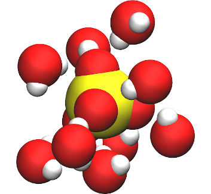

# GROMACS tutorials

This is the script of the webpage [GROMACS Tutorials](https://gromacstutorials.github.io/). 
All the files generated during the tutorials can be found in the [input/](inputs) folder. 

  

  

