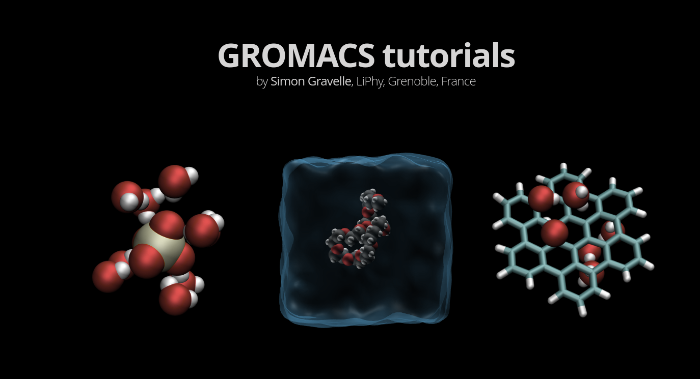

# GROMACS tutorials

This is the script of the [GROMACS Tutorials](https://gromacstutorials.github.io/) webpage. 
All the GROMACS input files used or generated during the tutorials can be found
in the [docs/input/](docs/inputs) folder. 

  

  

### You noticed a mistake in one of the tutorial?

You can report issue here on Github, or send me an [email](https://simongravelle.github.io/).

### About me

I am a computer physicist in soft matter and fluids at interfaces. You can 
find more information on my [personal webpage](https://simongravelle.github.io/).

### License

All the inputs, scripts, and data files are released under the 
GNU general public license v3.0.

