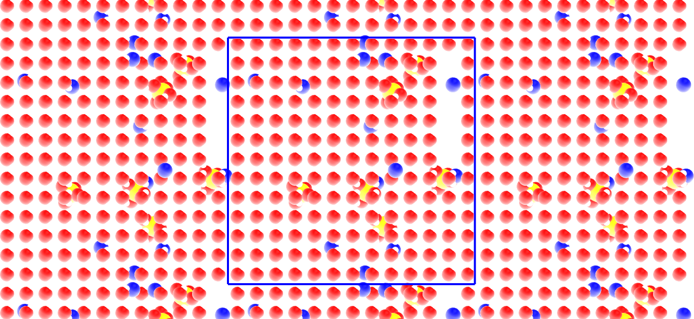

.. _create-conf-label:

Write topology using Python
***************************

.. container:: hatnote

    Use Python to write topology files compatible with GROMACS 

..  container:: justify

    The objective of this extra tutorial is to use Python and write
    simple topology files that are compatible with GROMACS. The system consists
    in molecules and ions randomly placed in an empty box, and is used as a 
    starting point in :ref:`bulk-solution-label`.

Creating the GRO file
=====================

..  container:: justify

    If you are only interested in learning GROMACS, jump directly
    to the actual GROMACS tutorial :ref:`bulk-solution-label`.

.. include:: ../contact/needhelp.rst

What is a GRO file?
-------------------

..  container:: justify

    A *.gro* file contains the initial positions and names of all the atoms 
    of a simulation. The *.gro* file also contains the initial box size, and
    it can be read by GROMACS. 
    
..  container:: justify

    The typical structure of a *.gro* file is the following:

..  code-block:: bw

    Name of the system
    number-of-atoms
    residue-number residue-name atom-name atom-number atom-positions (x3) # first atom
    residue-number residue-name atom-name atom-number atom-positions (x3) # second atom
    residue-number residue-name atom-name atom-number atom-positions (x3) # third atom
    (...)
    residue-number residue-name atom-name atom-number atom-positions (x3) # penultimate atom
    residue-number residue-name atom-name atom-number atom-positions (x3) # last atom
    box-size (x3)

..  container:: justify

    One particularity of *.gro* file format is that each column must be located
    at a fixed position, see |conf.gro-manual|.

.. |conf.gro-manual| raw:: html

    <a href="https://manual.gromacs.org/documentation/current/reference-manual/file-formats.html#gro" target="_blank">the GROMACS manual</a>

Residue definition
------------------

.. admonition:: About residue
    :class: info

    In GROMACS, a residue refers to a group of one or more atoms that are
    covalently linked and considered as a single unit within a molecule, ion, etc.

..  container:: justify

    Open a blank Python script, call it *molecules.py*, and copy the
    following lines in it:

..  code-block:: python

    import numpy as np

    # define SO4 ion
    def SO4_ion():
        Position = np.array([[0.1238,  0.0587,   0.1119], \
            [0.0778,   0.1501,  -0.1263], \
            [-0.0962,   0.1866,   0.0623], \
            [-0.0592,  -0.0506,  -0.0358],\
            [0.0115,   0.0862,   0.0030]])
        Type = ['OS', 'OS', 'OS', 'OS', 'SO']
        Name = ['O1', 'O2', 'O3', 'O4', 'S1']
        Resname = 'SO4'
        return Position, Type, Resname, Name

    # define Na ion
    def Na_ion():
        Position = np.array([[0, 0, 0]])
        Type = ['Na']
        Name = ['Na1']
        Resname = 'Na'
        return Position, Type, Resname, Name

    # define water molecule
    def H20_molecule():
        Position = np.array([[ 0.    ,  0.    ,  0.    ], \
            [ 0.05858,  0.0757 ,  0.    ], \
            [ 0.05858, -0.0757 ,  0.    ], \
            [ 0.0104 ,  0.    ,  0.    ]])
        Type = ['OW', 'HW', 'HW', 'MW']
        Name = ['OW1', 'HW1', 'HW2', 'MW1']
        Resname = 'Sol'
        return Position, Type, Resname, Name

..  container:: justify

    Each function corresponds to a residue, and contains the positions, types,
    and names of all the atoms, as well as the names of the residues. These
    functions will be called every time we will need to place a residue in
    our system.

..  container:: justify

    The water molecule contains a massless point (TIP4P model) in addition to
    the oxygen and hydrogens atoms :cite:`abascal2005general`.

.. figure:: figures/creategrofile/molecule-light.png
    :alt: Gromacs tutorial : Initial water molecule, sodium, and sulfide ions.
    :class: only-light

.. figure:: figures/creategrofile/molecule-dark.png
    :alt: Gromacs tutorial : Initial water molecule, sodium, and sulfide ions.
    :class: only-dark

..  container:: figurelegend

    From left to right, the sulfide ion (:math:`\text{SO}_4^{2-}`),
    the sodium ion (:math:`\text{Na}^{+}`), and the water
    molecules (:math:`\text{H}_2\text{O}`). Oxygen atoms are in red, hydrogen
    atoms in white, sodium atom in blue, and sulfur atom in yellow. The fourth
    massless point (MW) of the water molecule is not visible.

Creating the GRO file
---------------------

..  container:: justify

    Here, we define some of the basic parameters of the simulation, such as 
    the number of residues and the box size.

..  container:: justify

    Next to *molecule.py*, create a new Python file called
    *generategro.py*, and copy the following lines into it:

..  code-block:: python

    import numpy as np
    from molecules import SO4_ion, Na_ion, H20_molecule

    # define the box size
    Lx, Ly, Lz = [3.36]*3
    box = np.array([Lx, Ly, Lz])

..  container:: justify

    Here, *box* is an array containing the box size along all 3 coordinates of space,
    respectively *Lx*, *Ly*, and *Lz*. A cubic box of lateral dimension 
    :math:`3.6 ~ \text{nm}` is used.

..  container:: justify

    Let us choose a salt concentration, and calculate the number of
    ions and water molecules accordingly, while also choosing the total
    number of residues (here I call residue either a molecule or an ion).
    Add the following to *generategro.py*:

..  code-block:: python

    Mh2o = 0.018053 # kg/mol - water
    ntotal = 720 # total number of molecule
    c = 1.5 # desired concentration in mol/L
    nion = c*ntotal*Mh2o/(3*(1+Mh2o*c)) # desired number for the SO4 ion
    nwater = ntotal - 3*nion # desired number of water
    
..  container:: justify

    Let us also choose typical cutoff distances (in nanometer) for each
    species. These cutoffs will be used to ensure that no species are inserted
    too close from one another, as it would make the simulation crashed later:

..  code-block:: python

    dSO4 = 0.45
    dNa = 0.28
    dSol = 0.28

..  container:: justify

    Let us initialized several counters and several lists. The lists will be
    used for storing all the data about the atoms:

..  code-block:: python

    cpt_residue = 0
    cpt_atoms = 0
    cpt_SO4 = 0
    cpt_Na = 0
    cpt_Sol = 0
    all_positions = []
    all_resnum = []
    all_resname = []
    all_atname = []
    all_attype = []

..  container:: justify

    Let us first add a number *nion* of :math:`\text{SO}_4^{2-}` ions at random locations.
    To avoid overlap, let us only insert ion if no other ions is already located at 
    a distance closer than *dSO4*:

..  code-block:: python

    # add SO4 randomly
    atpositions, attypes, resname, atnames = SO4_ion()
    while cpt_SO4 < np.int32(nion):
        x_com, y_com, z_com = generate_random_location(box)
        d = search_closest_neighbor(np.array(all_positions), atpositions + np.array([x_com, y_com, z_com]), box)
        if d < dSO4:
            add_residue = False
        else:
            add_residue = True
        if add_residue == True:
            cpt_SO4 += 1
            cpt_residue += 1
            for atposition, attype, atname in zip(atpositions, attypes, atnames):
                cpt_atoms += 1
                x_at, y_at, z_at = atposition
                all_positions.append([x_com+x_at, y_com+y_at, z_com+z_at])
                all_resnum.append(cpt_residue)
                all_resname.append(resname)
                all_atname.append(atname)
                all_attype.append(attype)

..  container:: justify

    Here, two functions are used: *generate_random_location* and *search_closest_neighbor*.
    Let us define those two functions. Create a new Python script, call it *utils.py*,
    and copy the following lines in it:

..  code-block:: python

    import numpy as np
    from numpy.linalg import norm

    def generate_random_location(box):
        """Generate a random location within a given box."""  
        return np.random.rand(3)*box

    def search_closest_neighbor(XYZ_neighbor, XYZ_molecule, box):
        """Search neighbor in a box and return the closest distance.
            
        If the neighbor list is empty, then the box size is returned.
        Periodic boundary conditions are automatically accounted
        """
        if len(np.array(XYZ_neighbor)) == 0:
            min_distance = np.max(box)
        else:
            min_distance = np.max(box)
            for XYZ_atom in XYZ_molecule:
                dxdydz = np.remainder(XYZ_neighbor - XYZ_atom + box/2., box) - box/2.
                min_distance = np.min([min_distance,np.min(norm(dxdydz,axis=1))])
        return min_distance

..  container:: justify

    The *generate_random_location* function simply generates 3 random values 
    within the box. The *search_closest_neighbor* looks for the minimum distance 
    between existing atoms (if any) and the new residue. 

..  container:: justify

    Let us do the same for the :math:`\text{Na}^{+}`
    ion :

..  code-block:: python

    # Import the functions from the utils file
    from utils import generate_random_location, search_closest_neighbor

    # add Na randomly
    atpositions, attypes, resname, atnames = Na_ion()
    while cpt_Na < np.int32(nion*2):
        x_com, y_com, z_com = generate_random_location(box)
        d = search_closest_neighbor(np.array(all_positions), atpositions + np.array([x_com, y_com, z_com]), box)
        if d < dNa:
            add_residue = False
        else:
            add_residue = True
        if add_residue == True:
            cpt_Na += 1
            cpt_residue += 1
            for atposition, attype, atname in zip(atpositions, attypes, atnames):
                cpt_atoms += 1
                x_at, y_at, z_at = atposition
                all_positions.append([x_com+x_at, y_com+y_at, z_com+z_at])
                all_resnum.append(cpt_residue)
                all_resname.append(resname)
                all_atname.append(atname)
                all_attype.append(attype)

..  container:: justify

    Let us also insert water molecules on a 3D regular grid with 
    spacing of *dSol* (only if no overlap exists):

..  code-block:: python

    # add water randomly
    atpositions, attypes, resname, atnames = H20_molecule()
    for x_com in np.arange(dSol/2, Lx, dSol):
        for y_com in np.arange(dSol/2, Ly, dSol):
            for z_com in np.arange(dSol/2, Lz, dSol):
                d = search_closest_neighbor(np.array(all_positions), atpositions + np.array([x_com, y_com, z_com]), box)
                if d < dSol:
                    add_residue = False
                else:
                    add_residue = True
                if (add_residue == True) & (cpt_Sol < np.int32(nwater)):
                    cpt_Sol += 1
                    cpt_residue += 1
                    for atposition, attype, atname in zip(atpositions, attypes, atnames):
                        cpt_atoms += 1
                        x_at, y_at, z_at = atposition
                        all_positions.append([x_com+x_at, y_com+y_at, z_com+z_at])
                        all_resnum.append(cpt_residue)
                        all_resname.append(resname)
                        all_atname.append(atname)
                        all_attype.append(attype)
                if cpt_Sol >= np.int32(nwater):
                    break
    print(cpt_Sol, 'out of', np.int32(nwater), 'water molecules created')

..  container:: justify

    Let us ask Python to print a few information such as the 
    actual concentration:

..  code-block:: python

    print('Lx = '+str(Lx)+' nm, Ly = '+str(Ly)+' nm, Lz = '+str(Lz)+' nm')
    print(str(cpt_Na)+' Na ions') 
    print(str(cpt_SO4)+' SO4 ions')
    print(str(cpt_Sol)+' Sol mols')
    Vwater = cpt_Sol/6.022e23*0.018 # kg or litter
    Naddion = (cpt_Na+cpt_SO4)/6.022e23 # mol
    cion = Naddion/Vwater
    print('The ion concentration is '+str(np.round(cion,2))+' mol per litter')

..  container:: justify

    Finally, let us write the configuration (.gro) file:

..  code-block:: python
    :caption: *to be copied in generategro.py*

    # write conf.gro
    f = open('conf.gro', 'w')
    f.write('Na2SO4 solution\n')
    f.write(str(cpt_atoms)+'\n')
    cpt = 0
    for resnum, resname, atname, position  in zip(all_resnum, all_resname, all_atname, all_positions):
        x, y, z = position
        cpt += 1
        f.write("{: >5}".format(str(resnum))) # residue number (5 positions, integer) 
        f.write("{: >5}".format(resname)) # residue name (5 characters) 
        f.write("{: >5}".format(atname)) # atom name (5 characters) 
        f.write("{: >5}".format(str(cpt))) # atom number (5 positions, integer)
        f.write("{: >8}".format(str("{:.3f}".format(x)))) # position (in nm, x y z in 3 columns, each 8 positions with 3 decimal places)
        f.write("{: >8}".format(str("{:.3f}".format(y)))) # position (in nm, x y z in 3 columns, each 8 positions with 3 decimal places) 
        f.write("{: >8}".format(str("{:.3f}".format(z)))) # position (in nm, x y z in 3 columns, each 8 positions with 3 decimal places) 
        f.write("\n")
    f.write("{: >10}".format(str("{:.5f}".format(Lx)))) # box size
    f.write("{: >10}".format(str("{:.5f}".format(Ly)))) # box size
    f.write("{: >10}".format(str("{:.5f}".format(Lz)))) # box size
    f.write("\n")
    f.close()

Final system
------------

..  container:: justify

    Run the *generategro.py* file using Python.
    This is what appear in the terminal:

..  code-block:: bw

    701 out of 701 water molecules created
    Lx = 3.36 nm, Ly = 3.36 nm, Lz = 3.36 nm
    12 Na ions
    6 SO4 ions
    701 Sol mols
    The ion concentration is 1.43 mol per litter

..  container:: justify

    You can check the final system using VMD by typing in a terminal:

..  code-block:: bash

    vmd conf.gro

.. figure:: figures/creategrofile/system-light.png
    :alt: Gromacs tutorial - generated topology
    :class: only-light

..  container:: figurelegend

    The primary system is located within the blue box. The replicated periodic 
    images are also represented. 

..  container:: justify

    There is some vacuum left in the box. It is not an issue as energy
    minimization and molecular dynamics will help equilibrate the system.

Creating the TOP file
=====================

..  container:: justify

    A topology (.top) file defines the parameters required
    for the simulation, such as masses, Lennard-Jones parameters,
    or bonds.

..  container:: justify

    Within the same Python script, write:

..  code-block:: python

    # write topol.top
    f = open('topol.top', 'w')
    f.write('#include "ff/forcefield.itp"\n')
    f.write('#include "ff/h2o.itp"\n')
    f.write('#include "ff/na.itp"\n')
    f.write('#include "ff/so4.itp"\n\n')
    f.write('[ System ]\n')
    f.write('Na2SO4 solution\n\n')
    f.write('[ Molecules ]\n')
    f.write('SO4 '+ str(cpt_SO4)+'\n')
    f.write('Na '+ str(cpt_Na)+'\n')
    f.write('SOL '+ str(cpt_Sol)+'\n')
    f.close()

Write parameters
----------------

..  container:: justify

    Here, the force field parameters (i.e. the *.itp* files) are written.

Default parameters
------------------

..  container:: justify

    Create a folder called *ff/*. Within *ff/*, create a new empty file named 
    *forcefield.itp*, and copy the following in it:

..  code-block:: bw

    [ defaults ]
    ; nbfunc  comb-rule  gen-pairs  fudgeLJ  fudgeQQ
      1       2          no         1.0      0.833

    [ atomtypes ]
    ; name  at.num  mass      charge  ptype  sigma    epsilon
      Na    11      22.9900   1.0000  A      0.23100  0.45000
      OS     8      15.9994  -1.0000  A      0.38600  0.12
      SO    16      32.0600   2.0000  A      0.35500  1.0465
      HW     1       1.0079   0.5270  A      0.00000  0.00000
      OW     8      15.9994   0.0000  A      0.31650  0.77323
      MW     0       0.0000  -1.0540  D      0.00000  0.00000

    [ bondtypes ]
    ; i   j   func  b0    kb
      SO  OS  1     0.15  3.7656e4

    [ angletypes ]
    ; i   j   k   func  theta  k0          
      OS  SO  OS  1     109.5  520

..  container:: justify

    The |forcefield.itp| file is used to define basic combination rules, as well as 
    atom types, bond types, and angle types. 

.. |forcefield.itp| raw:: html

    <a href="../../../../inputs/bulksolution/ff/forcefield.itp" target="_blank">forcefield.itp</a>

..  container:: justify

    With comb-rule = 2, the mixing rule is calculated as 
    :math:`\epsilon_{ij} = \sqrt{\epsilon_{ii} \epsilon_{jj}}`,
    :math:`\sigma_{ij} = (\sigma_{ii}+\sigma_{jj})/2`.
    FudgeLJ and fudgeQQ are the factors by which to multiply Lennard-Jones
    and Coulomb 1-4 interactions, respectively. 
    You can refer to the |gromacs-manual| for more information.

.. |gromacs-manual| raw:: html

    <a href="https://manual.gromacs.org/current/reference-manual/topologies/parameter-files.html" target="_blank">GROMACS manual</a>

..  container:: justify

    The |forcefield.itp| file also contains information about the atoms, 
    such their masses and Lennard-Jones parameters sigma and epsilon,
    as well as some parameters for the bond and angle constraints that will be 
    necessary for the SO4 ions.

..  container:: justify

    Notice that the particle with name MW is of type 'D' when all the other particles 
    are of type 'A' for atoms. This is because MW is the virtual massless site of our 4 points
    rigid water model, see this |tip4p-wiki| page for details.

.. |tip4p-wiki| raw:: html

    <a href="http://www.sklogwiki.org/SklogWiki/index.php/TIP4P_model_of_water" target="_blank">wiki</a>

Sodium ion
----------

..  container:: justify

    Let us create a file named *na.itp* for the Sodium ion (|na.itp|):

.. |na.itp| raw:: html

    <a href="../../../../inputs/bulksolution/ff/na.itp" target="_blank">na.itp</a>

..  code-block:: bw

    [ moleculetype ]
    ; molname nrexcl
      Na      1

    [ atoms ]
    ; id  at-type  res-nr  res-name  at-name  cg-nr  charge  mass
      1   Na       1       Na        Na1      1      1.000   22.9900

..  container:: justify

    The 'molecule' named *Na* for a residue with one single atom,
    of type *Na* and name *Na1*, charge +1.0 and mass 22.990 g/mol.

Sulfate ion
-----------

..  container:: justify

    The file *so4.itp* for the sulfate ion is more complex than the one for the sodium ion,
    as the residue is made of 5 atoms that are bonded together
    and maintained by angular constrained (|so4.itp|).

.. |so4.itp| raw:: html

    <a href="../../../../inputs/bulksolution/ff/so4.itp" target="_blank">so4.itp</a>

..  container:: justify

    The *exclusions* ensures that atoms from the same residue do not 
    interact through LJ and Coulomb interactions. 

..  code-block:: bw

    [moleculetype]
    ; name  nrexcl
      SO4   1

    [ atoms ]
    ; id  at-type  res-nr  res-name  at-name  cg-nr  charge  mass
      1   OS       1       SO4       O1       1     -1.000   15.9994
      2   OS       1       SO4       O2       1     -1.000   15.9994
      3   OS       1       SO4       O3       1     -1.000   15.9994
      4   OS       1       SO4       O4       1     -1.000   15.9994
      5   SO       1       SO4       S1       1      2.000   32.0600

    [ bonds ]
    ;  ai   aj  funct   c0         c1
       1    5   1       0.1520     3.7656e4
       2    5   1       0.1520     3.7656e4
       3    5   1       0.1520     3.7656e4
       4    5   1       0.1520     3.7656e4

    [ angles ]
    ;  ai   aj   ak  funct   angle     fc
       1    5    2    1    109.5  520
       1    5    3    1    109.5  520
       1    5    4    1    109.5  520
       2    5    3    1    109.5  520
       2    5    4    1    109.5  520
       3    5    4    1    109.5  520
        
    [exclusions]
    1       2       3       4       5
    2       1       3       4       5
    3       1       2       4       5
    4       1       2       3       5
    5       1       2       3       4

Water molecule
--------------

..  container:: justify

    Finally, create a file named *h2o.itp* for the water molecule (|h2o.itp|).
    Settle parameters are added to ensure that the water molecule remains 
    rigid:

.. |h2o.itp| raw:: html

    <a href="../../../../inputs/bulksolution/ff/h2o.itp" target="_blank">h2o.itp</a>

..  code-block:: bw

    [ moleculetype ]
    ; molname  nrexcl
    SOL      2

    [ atoms ]
    ; id  at-type  res-nr  res-name  at-name  cg-nr  charge  mass
      1   OW	   1       SOL       OW1      1      0.000    15.9994
      2   HW       1       SOL       HW1      1      0.527     1.0079
      3   HW       1       SOL       HW2      1      0.527     1.0079
      4   MW       1       SOL       MW1      1     -1.054     0.0000

    [ settles ]
    ; i  funct  doh      dhh
      1  1      0.09572  0.15139

    [ virtual_sites3 ]
    ; Vsite from          funct        a               b
      4     1     2     3     1       0.089608       0.089608

    [ exclusions ]
    1 2 3 4
    2 1 3 4
    3 1 2 4
    4 1 2 3

..  container:: justify

    To continue and use those files for running a molecular dynamics simulation 
    with GROMACS, go to :ref:`bulk-solution-label`.
