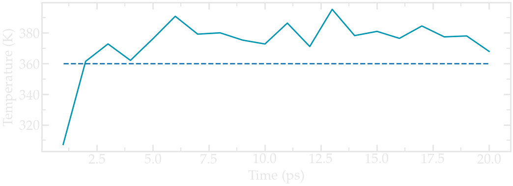
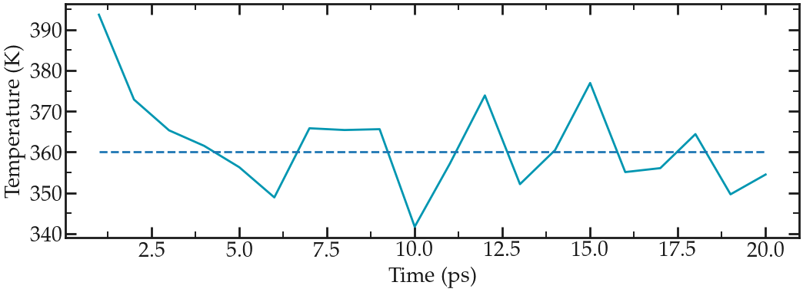
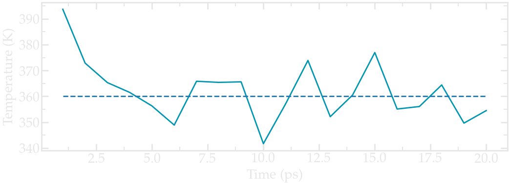
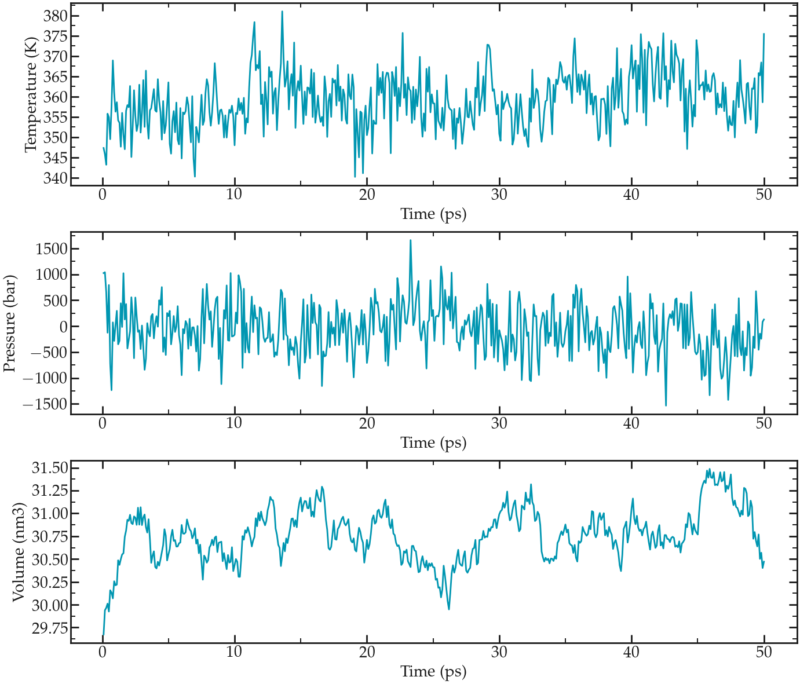

.. _bulk-solution-label:

Bulk salt solution
******************

.. container:: hatnote

    The very basics of GROMACS through a
    simple example

..  container:: justify

    The objective of this tutorial is to use the
    open-source code GROMACS to perform a simple molecular
    dynamics simulation: a liquid solution of water mixed
    with sodium (Na\ :sup:`+`) and sulfate
    (SO\ :sub:`4`\ :sup:`2-`) ions. 
    
    This tutorial illustrates several major ingredients of molecular
    dynamics simulations, such as energy minimization,
    thermostating, NVT and NPT equilibration, and
    trajectory visualisation.

    There are no prerequisite to follow this tutorial.

.. include:: ../contact/needhelp.rst

Required softwares
==================

..  container:: justify

    GROMACS must be installed on your machine. You can
    install it following the instructions of the |gromacs-manual|.

    Alternatively, if you are using Ubuntu OS, you can
    simply execute the following command in a terminal:

.. |gromacs-manual| raw:: html

   <a href="https://manual.gromacs.org/current/index.html" target="_blank">GROMACS manual</a>

..  code-block:: bw

    sudo apt-get install gromacs
   
..  container:: justify

    You can verify that GROMACS is indeed installed on your
    computer by typing in a terminal :

..  code-block:: bw

    gmx

..  container:: justify

    You should see the version of GROMACS that has been
    installed. On my computer I see

..  code-block:: bw

    :-) GROMACS - gmx, 2023 (-:

    Executable:   /usr/bin/gmx
    Data prefix:  /usr

    (...)

..  container:: justify

    as well as a quote (at the bottom), such as

..  code-block:: bw

    (...)

    GROMACS reminds you: "Computers are like humans - they do everything except think." (John von Neumann)

..  container:: justify

    In addition to GROMACS, you will also need 
    
    - |(1) a basic text editing software| such as Vim, Gedit, or Notepad++,
    - |(2) a visualization software|, here I will use VMD (note: VMD is free but you have to register to the uiuc website in order to download it. If you don't want to, you can also use Ovito.),
    - |(3) a plotting tool| like XmGrace or pyplot.

.. |LAMMPS website| raw:: html

   <a href="https://lammps.sandia.gov" target="_blank">LAMMPS website</a>

.. |(1) a basic text editing software| raw:: html

   <a href="https://help.gnome.org/users/gedit/stable/" target="_blank">(1) a basic text editing software</a>

.. |(2) a visualization software| raw:: html

   <a href="https://www.ks.uiuc.edu/Research/vmd/" target="_blank">(2) a visualization software</a>

.. |(3) a plotting tool| raw:: html

   <a href="https://plasma-gate.weizmann.ac.il/Grace/" target="_blank">(3) a plotting tool</a>

The input files
===============

..  container:: justify

    In order to run the present simulation using GROMACS,
    we need the 3 following files (or sets of files):

    - 1) a **configuration file** (.gro) containing the
         initial positions of the atoms and the box
         dimensions,
    - 2) a **topology file** (.top) specifying the
         location of the force field files (.itp),
    - 3) an **input file** (.mdp) containing the
         parameters of the simulation (e.g. temperature, timestep).

1) The configuration file (.gro)
--------------------------------

..  container:: justify

    If you already followed the previous tutorial, :ref:`create-conf-label`,
    simply skip this part.

    For the present simulation, the initial atom
    positions and box size are given in a conf.gro file
    (Gromos87 format) that you can download by clicking |conf-SO4.gro|.

    Save the conf.gro file in a folder. The file looks like that:

.. |conf-SO4.gro| raw:: html

    <a href="../../../../inputs/bulksolution/conf.gro" target="_blank">here</a>

..  code-block:: bw

    Na2SO4 solution
    2846
       1  SO4   O1    1   2.608   3.089   2.389
       1  SO4   O2    2   2.562   3.181   2.150
       1  SO4   O3    3   2.388   3.217   2.339
       1  SO4   O4    4   2.425   2.980   2.241
       1  SO4   S1    5   2.496   3.117   2.280
    (...)
     719  Sol  OW1 2843   3.220   2.380   1.540
     719  Sol  HW1 2844   3.279   2.456   1.540
     719  Sol  HW2 2845   3.279   2.304   1.540
     719  Sol  MW1 2846   3.230   2.380   1.540
   3.36000   3.36000   3.36000

..  container:: justify

    The first line 'Na2SO4 solution' is just a comment, the
    second line is the total number of atoms, and the last
    line is the box dimension in nanometer, here 3.36 nm
    by 3.36 nm by 3.36 nm. Between the second and the
    last lines, there is one line per
    atom. Each line indicates, from left to right, the
    residue Id (the atoms of the same
    SO\ :sub:`4`\ :sup:`2-` ion have the same residue
    Id), the residue name, the atom name, the atom Id,
    and finally the atom position (x, y, and z
    coordinate in nm).
    
    Note that the format of conf.gro file is fixed,
    all columns are in a fixed position. For example,
    the first five columns are for the residue number.

    A conf.gro file can be visualized using VMD by
    typing in the terminal:

..  code-block:: bash

     vmd conf.gro

..  container:: justify

    This is what I see:

.. figure:: figures/bulksolution/step0-light.png
    :alt: Gromacs initial configuration of SO\ :sub:`4`\ :sup:`2-` and Na\ :sup:`+` ions visualized with VMD
    :class: only-light

.. figure:: figures/bulksolution/step0-dark.png
    :alt: Gromacs initial configuration of SO\ :sub:`4`\ :sup:`2-` and Na\ :sup:`+` ions visualized with VMD
    :class: only-dark

    Figure: SO\ :sub:`4`\ :sup:`2-` ions (in yellow and
    red) and Na\ :sub:`+` ions (blue) in water (red and
    white).

..  container:: justify

    You have to play with atoms' representation and color
    to make it look better than it is by default. I wrote a 
    small |vmd-tutorial| that explains how to obtain nice looking image.

.. |vmd-tutorial| raw:: html

    <a href="https://lammpstutorials.github.io/sphinx/build/html/miscellaneous/vmd.html" target="_blank">VMD tutorial</a>

..  container:: justify

    As can be seen in this figure, the water molecules are
    arranged in a quite unrealistic and regular manner, with
    all dipoles facing in the same direction, and possibly
    wrong distances between some of the molecules and ions.

    This will be fixed during energy minimization, see below.

2) The topology file (.top)
---------------------------

..  container:: justify

    If you already followed the previous tutorial, :ref:`create-topol-label`,
    you can also skip this part.

    The topology file contains information about the
    interactions of the different atoms and molecules. You
    can download it by clicking |topol-SO4.top|.
    Place it in the same folder as the conf.gro file. The
    topol.top file looks like that:

.. |topol-SO4.top| raw:: html

    <a href="../../../../inputs/bulksolution/topol.top" target="_blank">here</a>

..  code-block:: bw

    #include "ff/forcefield.itp"
    #include "ff/h2o.itp"
    #include "ff/na.itp"
    #include "ff/so4.itp"

    [ System ]
    Na2SO4 solution

    [ Molecules ]
    SO4 6
    Na 12
    SOL 701

..  container:: justify

    The 4 first lines are used to include the values of the
    parameters that are given in 4 separate files (see below). 
    
    The rest of the topol.top file contains the system
    name (Na2SO4 solution), and a list of the molecules. It is important
    that the order of the molecules in the topology file
    (here SO4 first, Na second, and SOL (H2O) last)
    matches the order of the conf.gro file, otherwise the simulation
    will fail.
    
    Create a folder named 'ff/' next to the conf.gro and the topol.top files, and copy
    |forcefield.itp|, |h2o.itp|, |na.itp|, and |so4.itp|
    in it. These four files contain information about
    the atoms (names, masses, changes, Lennard-Jones
    coefficients) and residues (bond and angular
    constraints) for all the species that will be involved here.

.. |forcefield.itp| raw:: html

    <a href="../../../../inputs/bulksolution/ff/forcefield.itp" target="_blank">forcefield.itp</a>

.. |h2o.itp| raw:: html

    <a href="../../../../inputs/bulksolution/ff/h2o.itp" target="_blank">h2o.itp</a>

.. |na.itp| raw:: html

    <a href="../../../../inputs/bulksolution/ff/na.itp" target="_blank">na.itp</a>

.. |so4.itp| raw:: html

    <a href="../../../../inputs/bulksolution/ff/so4.itp" target="_blank">so4.itp</a>

3) The input file (.mdp)
------------------------

..  container:: justify

    The input file contains instructions about the
    simulation, such as

    - the number of steps to perform,
    - the thermostat to be used (e.g. Langevin, Berendsen),
    - the cut-off for the interactions (e.g. Lennard-Jones),
    - the molecular dynamics integrator (e.g. steep-decent, molecular dynamics).

    In this tutorial, 4 different input files will be
    written in order to perform respectively an energy
    minimization of the salt solution, an equilibration
    in the NVT ensemble (with fixed box sized), an equilibration in the NPT
    ensemble (with changing box size), and finally a production run.
    Input files will be placed in a 'inputs/' folder. 

    At this point, your folder should look like that:

.. figure:: figures/bulksolution/gromacs_inputs-light.png
    :alt: Gromacs files and structure folder
    :height: 200
    :class: only-light

.. figure:: figures/bulksolution/gromacs_inputs-dark.png
    :alt: Gromacs files and structure folder
    :height: 200
    :class: only-dark

..  container:: justify

    The rest of the tutorial focusses on writing the input files and performing the
    molecular dynamics simulation. 

.. include:: ../contact/supportme.rst

Energy minimization
===================

..  container:: justify

    It is clear from the configuration (.gro) file that the molecules and ions are currently in a
    quite unphysical configuration (i.e. too regularly aligned). It would be risky to
    directly perform a molecular dynamics simulation;
    atoms would undergo huge forces, accelerate, and the system could
    eventually explode.

    In order to bring the system into a favorable state,
    let us perform an energy minimization which
    consists in moving the atoms until the forces between
    them are reasonable.

    Open a blank file, call it min.mdp, and save it in the
    'inputs/' folder. Copy the following lines into min.mdp:

..  code-block:: bw
    :caption: *to be copied in inputs/min.mdp*

    integrator = steep
    nsteps = 5000

..  container:: justify

    These commands specify to GROMACS that the algorithm
    to be used is the |speepest-descent|, which moves the
    atoms following the direction of the largest forces
    until one of the stopping criterial is reached. The 'nsteps' command 
    specifies the maximum number of steps to perform.

.. |speepest-descent| raw:: html

    <a href="https://manual.gromacs.org/current/reference-manual/algorithms/energy-minimization.html" target="_blank">speepest-descent</a>

..  container:: justify

    In order to visualize
    the trajectory of the atoms during the minimization,
    let us add the following command to the input
    file in order to print the atom positions every 10 steps in a .trr trajectory file:

..  code-block:: bw
    :caption: *to be copied in inputs/min.mdp*

    nstxout = 10

..  container:: justify

    We now have a very minimalist input script, let us try
    it. From the terminal, type:

..  code-block:: bash

    gmx grompp -f inputs/min.mdp -c conf.gro -p topol.top -o min -pp min -po min
    gmx mdrun -v -deffnm min

..  container:: justify

    The grompp command is used to preprocess the
    files in order to prepare the simulation. The grompp
    command also checks the validity of the files. By using
    the '-f', '-c', and '-p' keywords, we specify which
    input, configuration, and topology files must be
    used, respectively. The other keywords '-o', '-pp', and '-po' are
    used to specify the names of the output that will be
    produced during the run. 
    
    The mdrun command calls the engine
    performing the computation from the preprocessed
    files (which is recognized thanks to the -deffnm keyword). The
    '-v' option is here to enable verbose and have more
    information printed in the terminal.

    If everything works, you should see something like :

..  code-block:: bw

    (...)

    Steepest Descents converged to machine precision in 824 steps,
    but did not reach the requested Fmax < 10.
    Potential Energy  = -6.8990930e+04
    Maximum force     =  2.4094606e+02 on atom 1654
    Norm of force     =  4.6640654e+01

..  container:: justify

    The information printed in the terminal indicates us
    that energy minimization has been performed, even
    though the precision that was asked from the default
    parameters was not reached. We can ignore this
    message, as long as the final energy is large and negative,
    the simulation will work just fine. 
    
    The final potential energy is large and
    negative, and the maximum force is small: 240
    kJ/mol/nm (about 0.4 pN). Everything seems alright.
    Let us visualize the atoms' trajectories during the
    minimization step using VMD by typing in the terminal:

..  code-block:: bash

    vmd conf.gro min.trr

..  container:: justify

    This is what I see:

.. figure:: figures/bulksolution/solution-light.webp
    :alt: Gromacs tutorial : Movie showing the motion of the atoms during the energy minimization.
    :class: only-light
    :height: 330

..  container:: justify

    Note for VMD user: You can avoid having
    molecules 'cut in half' by the periodic boundary
    conditions by rewriting the trajectory using 'gmx
    trjconv -f min.trr -s min.tpr -o min_whole.trr -pbc whole'

    One can see that the molecules reorient themselves
    into more energetically favorable positions, and that
    the distances between the atoms are being
    progressively homogeneized.
    
    Let us have a look at the
    evolution of the potential energy of the system. To do
    so, we can use the internal 'energy' command of
    GROMACS. In the terminal, type:

..  code-block:: bash

    gmx energy -f min.edr -o epotmin.xvg

..  container:: justify

    choose 'potential' by typing '5' (or any number that is in front of 'potential'), 
    then press enter twice. 
    
    Here the edr file produced
    by Gromacs during the last run is used, and the
    result is saved in the epotmin.xvg file.
    Let us plot it (xvg files can be easily opened
    using XmGrace, here I use pyplot and jupyter-notebook):

    Evolution of the potential energy as a function of the
    number of steps during energy minimization.

..  container:: justify

    One can see from the energy plot that
    the potential energy is initially huge and positive,
    which is the consequence of atoms being too close from
    one another, as well as molecules being wrongly oriented.
    As the minimization progresses, the potential energy
    rapidly decreases and reaches a large and negative
    value, which is usually a good sign as it indicates
    that the atoms are now at appropriate distances from each others. 

    The system is ready for the molecular dynamics simulation.

Minimalist NVT input file
=========================

..  container:: justify

    Let us first perform a small (20 picoseconds)
    equilibration in the NVT ensemble. In the NVT ensemble, the number of
    atom (N) and volume (V) are maintained fixed, and the
    temperature (T) is adjusted using a thermostat.
    
    Let use write a new input script
    called nvt.mdp, and save it in the 'inputs/' folder.
    Copy the following lines into it:

..  code-block:: bw
    :caption: *to be copied in inputs/nvt.mdp*

    integrator = md
    nsteps = 20000
    dt = 0.001

..  container:: justify

    Here the molecular dynamics (md) integrator is used
    (leapfrog algorithm), and a number of 20000 steps with
    timestep (dt) 0.001 ps is requested, so the total
    requested duration is 20 ps. Let us print the
    trajectory in a xtc file every 1 ps by adding:

..  code-block:: bw
    :caption: *to be copied in inputs/nvt.mdp*

    nstxout-compressed = 1000

..  container:: justify

    Let us control the temperature over the course of the
    simulation using the v-rescale thermostat, which is
    the Berendsen thermostat with an additional stochastic
    term (it is known to give proper canonical ensemble):

..  code-block:: bw
    :caption: *to be copied in inputs/nvt.mdp*

    tcoupl = v-rescale
    ref-t = 360
    tc-grps = system
    tau-t = 0.5

..  container:: justify

    Here we also specified that the thermostat is
    applied to the entire system (we could choose to
    apply it only to a certain group of atom, which we
    will do later), and that the damping constant for
    the thermostat is 0.5 ps.

    Note that the relatively high temperature of 360 K
    has been chosen here in order to reduce the
    viscosity of the solution and converge toward
    the desired result (i.e. the diffusion coefficient) faster.
    We now have a minimalist input file for performing
    the NVT step. Run it by typing in the terminal:

..  code-block:: bw

    gmx grompp -f inputs/nvt.mdp -c min.gro -p topol.top -o nvt -pp nvt -po nvt
    gmx mdrun -v -deffnm nvt

..  container:: justify

    Here '-c min.gro' ensures that the previously
    minimized configuration is used as a starting point.
    
    After the completion of the simulation, we can
    ensure that the system temperature indeed reached
    the value of 360 K by using the energy command of
    GROMACS. Type:

..  code-block:: bw

    gmx energy -f nvt.edr -o Tnvt.xvg

..  container:: justify

    and choose 'temperature'.
    
    From the generated file, we can see that temperature
    started from 0, which was expected since the atoms
    have no velocity during a minimization step, and
    reaches a temperature slightly larger than the
    requested 360 K after a duration of a few
    picoseconds:

    Evolution of the temperature as a function of the time
    during the NVT equilibration. Dashed line is the
    requested temperature of 360 K.

..  container:: justify

    A better control of the temperature is achieved in the next section.

Improving the NVT
=================

..  container:: justify

    So far, a very few commands have been placed in the
    NVT input file, meaning that most of the instruction
    have been taken by GROMACS from the default
    parameters. You can find what parameters were used
    during the last nvt run by opening the new nvt.mdp
    file that has been created (i.e. not the one in the
    'inputs/' folder, but the one in the main folder).
    Exploring this new nvt.mdp file shows us that, for
    instance, plain cut-off Coulomb interactions have
    been used:

..  code-block:: bw

    ; Method for doing electrostatics
    coulombtype = Cut-off

..  container:: justify

    For this system, long range Coulomb interaction is a
    better choice. We could also improve the thermostating of the
    system by applying a separate thermostat to water molecules and ions.
    Therefore, let us improve the NVT step by specifying
    more options in the input file.
    First, in the nvt.mdp file, let us impose the use of the
    long-range Fast smooth Particle-Mesh Ewald (SPME)
    electrostatics with Fourier spacing of 0.1 nm, order
    of 4, and cut-off of 4:

..  code-block:: bw
    :caption: *to be copied in inputs/nvt.mdp*

    coulombtype = pme
    fourierspacing = 0.1
    pme-order = 4
    rcoulomb = 1.0

..  container:: justify

    Note that with PME, the cut-off specifies which
    interactions are treated with Fourier transforms.
    Let us also specify the van der Waals interaction:

..  code-block:: bw
    :caption: *to be copied in inputs/nvt.mdp*

    vdw-type = Cut-off
    rvdw = 1.0

..  container:: justify

    as well as the constraint algorithm for the hydrogen
    bonds of the water molecules:

..  code-block:: bw
    :caption: *to be copied in inputs/nvt.mdp*

    constraint-algorithm = lincs
    constraints = hbonds
    continuation = no

..  container:: justify

    Let us also use separate temperature baths for
    water and ions (here corresponding to the gromacs group called non-water) respectively
    by replacing:

..  code-block:: bw
    :caption: *to be removed from inputs/nvt.mdp*

    tcoupl = v-rescale
    ref-t = 360
    tc-grps = system
    tau-t = 0.5

..  container:: justify

    by:

..  code-block:: bw
    :caption: *to be copied in inputs/nvt.mdp*

    tcoupl = v-rescale
    tc-grps = Water non-Water
    tau-t = 0.5 0.5
    ref-t = 360 360

..  container:: justify

    Let us specify neighbor searching parameters:

..  code-block:: bw
    :caption: *to be copied in inputs/nvt.mdp*

    cutoff-scheme = Verlet
    nstlist = 10
    ns_type = grid

..  container:: justify

    Let us give an initial kick to the atom (so that the initial
    total velocities give the desired temperature instead of 0):

..  code-block:: bw
    :caption: *to be copied in inputs/nvt.mdp*

    gen-vel = yes
    gen-temp = 360

..  container:: justify

    and let us remove center of mass translational
    velocity of the whose system:

..  code-block:: bw
    :caption: *to be copied in inputs/nvt.mdp*

    comm_mode = linear
    comm_grps = system

..  container:: justify

    Run the new version of the input script. One obvious
    difference with the previous (minimalist) NVT run is
    the temperature at the beginning of the run (orange
    curve). The final temperature is also closer
    to the desired temperature:

    Evolution of the temperature as a function of the time
    during the NVT equilibration.

Adjust the density using NPT
============================

..  container:: justify

    Now that the system is properly equilibrated in the
    NVT ensemble, let us perform an equilibration in the
    NPT ensemble, where the pressure is imposed and the
    volume of the box is free to relax. NPT relaxation ensures that the
    density of the fluid converges toward its equilibrium value.
    Create a new input script, call it 'npt.mdp', and
    copy the following lines in it:

..  code-block:: bw
    :caption: *to be copied in inputs/npt.mdp*

    integrator = md
    nsteps = 50000
    dt = 0.001

    comm_mode = linear
    comm_grps = system

    cutoff-scheme = Verlet
    nstlist = 10
    ns_type = grid

    nstlog = 100
    nstenergy = 100
    nstxout-compressed = 1000

    vdw-type = Cut-off
    rvdw = 1.0

    coulombtype = pme
    fourierspacing = 0.1
    pme-order = 4
    rcoulomb = 1.0

    constraint-algorithm = lincs
    constraints = hbonds

    tcoupl = v-rescale
    ld-seed = 48456
    tc-grps = Water non-Water
    tau-t = 0.5 0.5
    ref-t = 360 360

    pcoupl = C-rescale
    Pcoupltype = isotropic
    tau_p = 1.0
    ref_p = 1.0
    compressibility = 4.5e-5

..  container:: justify

    The main difference with the previous NVT script, is
    the addition of the isotropic C-rescale pressure
    coupling with a target pressure of 1 bar. Some other
    differences are the addition of the 'nstlog' and
    'nstenergy' commands to control the frequency at
    which information are printed in the log file and in
    the energy file (edr), and the removing the
    'gen-vel' commands. Run it using:

..  code-block:: bash 

    gmx grompp -f inputs/npt.mdp -c nvt.gro -p topol.top -o npt -pp npt -po npt
    gmx mdrun -v -deffnm npt

..  container:: justify

    Let us have a look a both temperature, pressure and
    volume during the NPT step using the 'gmx energy'
    command 3 times:

..  code-block:: bash 

    gmx energy -f npt.edr -o Tnpt.xvg
    gmx energy -f npt.edr -o Pnpt.xvg
    gmx energy -f npt.edr -o Vnpt.xvg

..  container:: justify

    Choose respectively 'temperature', 'pressure' and 'volume'.
    This is what I see:

    From top to bottom: evolution of the temperature,
    pressure, and volume of the simulation box as a
    function of the time during the NPT equilibration.

..  container:: justify

    The results show that the temperature remains well
    controlled during the NPT run. The results also show
    that the volume was initially too small for the
    desired pressure, and equilibrated itself at a
    slightly larger value after a few pico-seconds.
    Finally, the pressure curve reveal that large oscillations of the
    pressure with time. These large oscillations are
    typical in molecular dynamics, particularly with
    liquid water that is almost uncompressible.

    Exact results may differ depending on the actual *.gro* file geenrated.

Measurement diffusion coefficient
=================================

..  container:: justify

    Now that the system is fully equilibrated, we can
    perform a longer simulation and extract quantities of
    interest.
    
    Here, as an illustration, the diffusion
    coefficients of all 3 species (water and the two ions) will be
    measured. First, let us perform a longer run in the
    NVT ensemble. Create a new input file, call it
    'pro.mdp' ('pro' is short for 'production'), and copy the
    following lines into it:

..  code-block:: bw 
    :caption: *to be copied in inputs/pro.mdp*

    integrator = md
    nsteps = 200000
    dt = 0.001

    comm_mode = linear
    comm_grps = system

    cutoff-scheme = Verlet
    nstlist = 10
    ns_type = grid

    nstlog = 100
    nstenergy = 100
    nstxout-compressed = 1000

    vdw-type = Cut-off
    rvdw = 1.0

    coulombtype = pme
    fourierspacing = 0.1
    pme-order = 4
    rcoulomb = 1.0

    constraint-algorithm = lincs
    constraints = hbonds

    tcoupl = v-rescale
    ld-seed = 48456
    tc-grps = Water non-Water
    tau-t = 0.5 0.5
    ref_t = 360 360

..  container:: justify

    Run it using:

..  code-block:: bash 

    gmx grompp -f inputs/pro.mdp -c npt.gro -p topol.top -o pro -pp pro -po pro
    gmx mdrun -v -deffnm pro

..  container:: justify

    When its completed, compute the mean square
    displacement using:

..  code-block:: bash 

    gmx msd -f pro.xtc -s pro.tpr -o SO4.xvg

..  container:: justify

    and select the SO4 ions by typing 'SO4', and then press 'ctrl D'.
    
    Fitting the slope of the
    MSD gives a value of 1.3e-5 cm\ :sup:`2`/s for the
    diffusion coefficient. 
    
    Repeat the same for Na and water. 
    
    For Na, the value is 1.5e-5
    cm\ :sup:`2`/s, and for water 5.2e-5 cm\ :sup:`2`/s
    (not too far from the experimental value of ~ 7e-5
    cm\ :sup:`2`/s at temperature T=360 K).
    
.. admonition:: About MSD in molecular simulations
    :class: info

    In principle, diffusion coefficients obtained from
    molecular dynamics simulations in a finite-sized box
    must be corrected, but this is beyond the scope of
    the present tutorial, see this
    `paper <https://pubs.acs.org/doi/pdf/10.1021/acs.jpcb.1c05303>`__
    for more details.

..  container:: justify

    The final MSDs plots look like this:

    MSDs for the three species, respectively.

Going further
=============

..  container:: justify

    Take advantage of the generated production run to extract more 
    equilibrium quantities. For instance, Gromacs allows you to
    extract Radial Distribution Functions (RDF) using the *gmx rdf* commands.

.. include:: ../contact/contactme.rst
