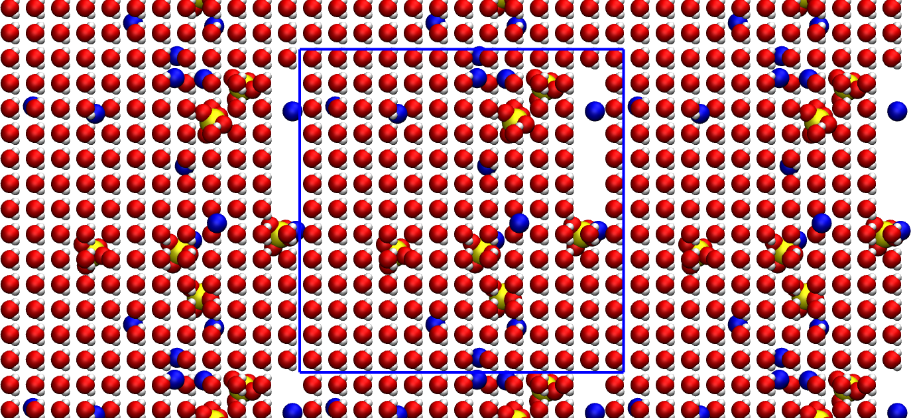

.. _create-conf-label:

Create conf.gro
***************

.. container:: hatnote

    Writing the .gro file for GROMACS. 

..  container:: justify

    The objective of this tutorial is to write a 
    simple topology file using python, by placing
    molecules and ions in an empty box. 

    The topology file will be used in :ref:`bulk-solution-label`. 
    If you are only interested in learning GROMACS, jump directly
    in :ref:`bulk-solution-label`.

.. include:: ../contact/needhelp.rst

What is a .gro file?
====================

A .gro file contains the initial positions of all the atoms 
of a simulation, and can be read by GROMACS. Its structure 
is the following:

..  code-block:: bw

    Name of the system
    number-of-atoms
    residue-number residue-name atom-name atom-number atom-positions (x3) # first atom
    residue-number residue-name atom-name atom-number atom-positions (x3) # second atom
    residue-number residue-name atom-name atom-number atom-positions (x3) # third atom
    (...)
    residue-number residue-name atom-name atom-number atom-positions (x3) # penultimate atom
    residue-number residue-name atom-name atom-number atom-positions (x3) # last atom
    box-size (x3)

..  container:: justify

    One particularity of .gro file format, each column must be located at a fixed position, see |conf.gro-manual|.

.. |conf.gro-manual| raw:: html

    <a href="https://manual.gromacs.org/documentation/current/reference-manual/file-formats.html#gro" target="_blank">the GROMACS manual</a>

Molecule/ions definitions
=========================

Open a blank python script, call it *molecules.py*, and copy the following lines in it:

..  code-block:: python
    :caption: *to be copied in molecules.py*

    import numpy as np

    # define SO4 ion
    def SO4_ion():
        Position = np.array([[0.1238,  0.0587,   0.1119], \
            [0.0778,   0.1501,  -0.1263], \
            [-0.0962,   0.1866,   0.0623], \
            [-0.0592,  -0.0506,  -0.0358],\
            [0.0115,   0.0862,   0.0030]])
        Type = ['OS', 'OS', 'OS', 'OS', 'SO']
        Name = ['O1', 'O2', 'O3', 'O4', 'S1']
        Resname = 'SO4'
        return Position, Type, Resname, Name

    # define Na ion
    def Na_ion():
        Position = np.array([[0, 0, 0]])
        Type = ['Na']
        Name = ['Na1']
        Resname = 'Na'
        return Position, Type, Resname, Name

    # define water molecule
    def H20_molecule():
        Position = np.array([[ 0.    ,  0.    ,  0.    ], \
            [ 0.05858,  0.0757 ,  0.    ], \
            [ 0.05858, -0.0757 ,  0.    ], \
            [ 0.0104 ,  0.    ,  0.    ]])
        Type = ['OW', 'HW', 'HW', 'MW']
        Name = ['OW1', 'HW1', 'HW2', 'MW1']
        Resname = 'Sol'
        return Position, Type, Resname, Name

..  container:: justify

    Each function corresponds to a residue, and contains 
    the positions, type, and name of all the atoms, as well as the name of the residue. 
    These function will be called every time we will need to place a residue in
    our system.

    The sulfide (:math:`\text{SO}_4^{2-}`), sodium (:math:`\text{Na}^{+}`) and water
    molecules (:math:`\text{H}_2\text{O}`) look like that, respectively:

.. figure:: figures/creategrofile/molecule-light.png
    :alt: Gromacs tutorial : Initial water molecule, sodium, and sulfide ions.
    :class: only-light

.. figure:: figures/creategrofile/molecule-dark.png
    :alt: Gromacs tutorial : Initial water molecule, sodium, and sulfide ions.
    :class: only-dark

    Oxygen atoms are in red, hydrogen atoms in white, sodium atom in blue, and 
    sulfur atom in yellow. The fourth point (MW) of the water molecule is not 
    visible.

Creating the gro file
=====================

..  container:: justify

    We first need to define the basic parameters, such as 
    the number of residue we want, or the box size, and
    initialize some lists and counters. 

    Next to *molecule.py*, create a nez Python file called
    *generategro.py*, and copy the following lines into it:

..  code-block:: python
    :caption: *to be copied in generategro.py*

    import numpy as np
    from molecules import SO4_ion, Na_ion, H20_molecule

    # define the box size
    Lx, Ly, Lz = [3.36]*3
    box = np.array([Lx, Ly, Lz])

..  container:: justify

    Here box is an array containing the box size along all 3 coordinates of space,
    respectively Lx, Ly, and Lz. Here a cubic box of lateral dimension 3.6 nm is used.

    Now, let us choose a salt concentration, and calculate the number of ions and water molecules
    accordingly, while also choosing the total number of residue (here I call residue
    either a molecule or an ion):

..  code-block:: python
    :caption: *to be copied in generategro.py*

    Mh2o = 0.018053 # kg/mol - water
    ntotal = 720 # total number of molecule
    c = 1.5 # desired concentration in mol/L
    nion = c*ntotal*Mh2o/(3*(1+Mh2o*c)) # desired number for the SO4 ion
    nwater = ntotal - 3*nion # desired number of water
    
..  container:: justify

    Let us also choose typical cutoff distances for each species. These
    cutoffs will be used to ensure that no species are inserted too close 
    from one another:

..  code-block:: python
    :caption: *to be copied in generategro.py*

    dSO4 = 0.45
    dNa = 0.28
    dSol = 0.28

..  container:: justify

    Let us initialized counters and lists for storing
    all the necessary data:

..  code-block:: python
    :caption: *to be copied in generategro.py*

    cpt_residue = 0
    cpt_atoms = 0
    cpt_SO4 = 0
    cpt_Na = 0
    cpt_Sol = 0
    all_positions = []
    all_resnum = []
    all_resname = []
    all_atname = []
    all_attype = []

..  container:: justify

    Let us add a number *nion* of :math:`\text{SO}_4^{2-}` ions at random locations.
    To avoid overlap, let us only insert ion if no other ions is located at 
    a distance closer than *dSO4*:

..  code-block:: python
    :caption: *to be copied in generategro.py*

    # add SO4 randomly
    atpositions, attypes, resname, atnames = SO4_ion()
    while cpt_SO4 < np.int32(nion):
        x_com, y_com, z_com = generate_random_location(box)
        d = search_closest_neighbor(np.array(all_positions), atpositions + np.array([x_com, y_com, z_com]), box)
        if d < dSO4:
            add_residue = False
        else:
            add_residue = True
        if add_residue == True:
            cpt_SO4 += 1
            cpt_residue += 1
            for atposition, attype, atname in zip(atpositions, attypes, atnames):
                cpt_atoms += 1
                x_at, y_at, z_at = atposition
                all_positions.append([x_com+x_at, y_com+y_at, z_com+z_at])
                all_resnum.append(cpt_residue)
                all_resname.append(resname)
                all_atname.append(atname)
                all_attype.append(attype)

..  container:: justify

    Here, two functions are used: *generate_random_location* and *search_closest_neighbor*.
    Let us define those two functions. Create a new Python script, call it *utils.py*,
    and copy the following lines in it:

..  code-block:: python
    :caption: *to be copied in utils.py*

    import numpy as np
    from numpy.linalg import norm

    def generate_random_location(box):
        """Generate a random location within a given box."""  
        return np.random.rand(3)*box

    def search_closest_neighbor(XYZ_neighbor, XYZ_molecule, box):
        """Search neighbor in a box and return the closest distance.
            
        If the neighbor list is empty, then the box size is returned.
        Periodic boundary conditions are automatically accounted
        """
        if len(np.array(XYZ_neighbor)) == 0:
            min_distance = np.max(box)
        else:
            min_distance = np.max(box)
            for XYZ_atom in XYZ_molecule:
                dxdydz = np.remainder(XYZ_neighbor - XYZ_atom + box/2., box) - box/2.
                min_distance = np.min([min_distance,np.min(norm(dxdydz,axis=1))])
        return min_distance

..  container:: justify

    The *generate_random_location* function simply generates 3 random values 
    within the box. The *search_closest_neighbor* looks for the minimum distance 
    between existing atoms (if any) and the new residue. 

    Let us do the same for the :math:`\text{Na}^{+}` ion :

..  code-block:: python
    :caption: *to be copied in generategro.py*

    # add Na randomly
    atpositions, attypes, resname, atnames = Na_ion()
    while cpt_Na < np.int32(nion*2):
        x_com, y_com, z_com = generate_random_location(box)
        d = search_closest_neighbor(np.array(all_positions), atpositions + np.array([x_com, y_com, z_com]), box)
        if d < dNa:
            add_residue = False
        else:
            add_residue = True
        if add_residue == True:
            cpt_Na += 1
            cpt_residue += 1
            for atposition, attype, atname in zip(atpositions, attypes, atnames):
                cpt_atoms += 1
                x_at, y_at, z_at = atposition
                all_positions.append([x_com+x_at, y_com+y_at, z_com+z_at])
                all_resnum.append(cpt_residue)
                all_resname.append(resname)
                all_atname.append(atname)
                all_attype.append(attype)

..  container:: justify

    Let us also insert water molecules on a 3D regular grid with 
    spacing of *dSol* (only if no overlap exists):

..  code-block:: python
    :caption: *to be copied in generategro.py*

    # add water randomly
    atpositions, attypes, resname, atnames = H20_molecule()
    for x_com in np.arange(dSol/2, Lx, dSol):
        for y_com in np.arange(dSol/2, Ly, dSol):
            for z_com in np.arange(dSol/2, Lz, dSol):
                d = search_closest_neighbor(np.array(all_positions), atpositions + np.array([x_com, y_com, z_com]), box)
                if d < dSol:
                    add_residue = False
                else:
                    add_residue = True
                if (add_residue == True) & (cpt_Sol < np.int32(nwater)):
                    cpt_Sol += 1
                    cpt_residue += 1
                    for atposition, attype, atname in zip(atpositions, attypes, atnames):
                        cpt_atoms += 1
                        x_at, y_at, z_at = atposition
                        all_positions.append([x_com+x_at, y_com+y_at, z_com+z_at])
                        all_resnum.append(cpt_residue)
                        all_resname.append(resname)
                        all_atname.append(atname)
                        all_attype.append(attype)
                if cpt_Sol >= np.int32(nwater):
                    break
    print(cpt_Sol, 'out of', np.int32(nwater), 'water molecules created')

..  container:: justify

    Let us ask Python to print a few information such as the 
    actual concentration:

..  code-block:: python
    :caption: *to be copied in generategro.py*

    print('Lx = '+str(Lx)+' nm, Ly = '+str(Ly)+' nm, Lz = '+str(Lz)+' nm')
    print(str(cpt_Na)+' Na ions') 
    print(str(cpt_SO4)+' SO4 ions')
    print(str(cpt_Sol)+' Sol mols')
    Vwater = cpt_Sol/6.022e23*0.018 # kg or litter
    Naddion = (cpt_Na+cpt_SO4)/6.022e23 # mol
    cion = Naddion/Vwater
    print('The ion concentration is '+str(np.round(cion,2))+' mol per litter')

..  container:: justify

    Finally, let us write the configuration (.gro) file:

..  code-block:: python
    :caption: *to be copied in generategro.py*

    # write conf.gro
    f = open('conf.gro', 'w')
    f.write('Na2SO4 solution\n')
    f.write(str(cpt_atoms)+'\n')
    cpt = 0
    for resnum, resname, atname, position  in zip(all_resnum, all_resname, all_atname, all_positions):
        x, y, z = position
        cpt += 1
        f.write("{: >5}".format(str(resnum))) # residue number (5 positions, integer) 
        f.write("{: >5}".format(resname)) # residue name (5 characters) 
        f.write("{: >5}".format(atname)) # atom name (5 characters) 
        f.write("{: >5}".format(str(cpt))) # atom number (5 positions, integer)
        f.write("{: >8}".format(str("{:.3f}".format(x)))) # position (in nm, x y z in 3 columns, each 8 positions with 3 decimal places)
        f.write("{: >8}".format(str("{:.3f}".format(y)))) # position (in nm, x y z in 3 columns, each 8 positions with 3 decimal places) 
        f.write("{: >8}".format(str("{:.3f}".format(z)))) # position (in nm, x y z in 3 columns, each 8 positions with 3 decimal places) 
        f.write("\n")
    f.write("{: >10}".format(str("{:.5f}".format(Lx)))) # box size
    f.write("{: >10}".format(str("{:.5f}".format(Ly)))) # box size
    f.write("{: >10}".format(str("{:.5f}".format(Lz)))) # box size
    f.write("\n")
    f.close()

Final system
============

..  container:: justify

    Run the *generategro.py* file using Python.
    I see the following in the terminal:

..  code-block:: bw

    701 out of 701 water molecules created
    Lx = 3.36 nm, Ly = 3.36 nm, Lz = 3.36 nm
    12 Na ions
    6 SO4 ions
    701 Sol mols
    The ion concentration is 1.43 mol per litter

..  container:: justify

    You can look at the final system by typing in a terminal:

..  code-block:: bash

    vmd conf.gro

.. figure:: figures/creategrofile/system-dark.png
    :alt: Gromacs tutorial - generated topology
    :class: only-dark

    The primary system is located within the blue box. The replicated periodic 
    images are also represented. 

..  container:: justify

    Note that there is some vacuum left in the box. Its not a big problem and
    the initial configuration we created is good enough. 
    The topology file *conf.gro* will be used as the initial 
    configuration for the :ref:`bulk-solution-label` tutorial.

Writing a .top file
===================

A topology (.top) file defines the parameters required
for the simulation, such as masses, Lennard-Jones parameters,
or bonds.

..  container:: justify

    Within the same Python script, write:

..  code-block:: python
    :caption: *to be copied in generategro.py*

    # write topol.top
    f = open('topol.top', 'w')
    f.write('#include "ff/forcefield.itp"\n')
    f.write('#include "ff/h2o.itp"\n')
    f.write('#include "ff/na.itp"\n')
    f.write('#include "ff/so4.itp"\n\n')
    f.write('[ System ]\n')
    f.write('Na2SO4 solution\n\n')
    f.write('[ Molecules ]\n')
    f.write('SO4 '+ str(cpt_SO4)+'\n')
    f.write('Na '+ str(cpt_Na)+'\n')
    f.write('SOL '+ str(cpt_Sol)+'\n')
    f.close()

..  container:: justify

    All the parameter files located in the *ff* folder
    will be written in the :ref:`create-topol-label` tutorial.

.. include:: ../contact/contactme.rst
