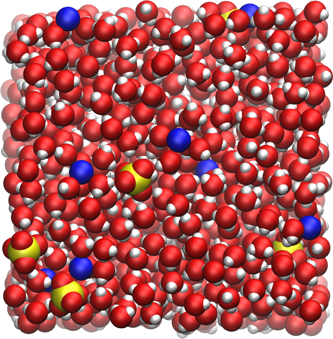
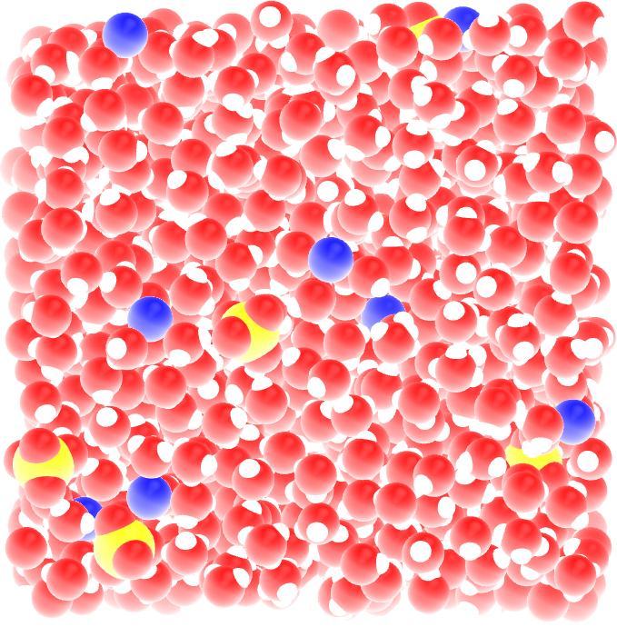
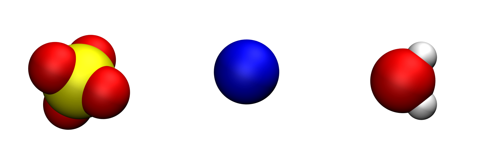

.. _create-system-label:

Create topology
***************

.. container:: hatnote

    Writing the topology file. 

..  container:: justify

    The objective of this tutorial is to write a 
    simple topology file using python, by placing
    molecules and ions in an empty box. 

    The topology file will be used in ref:`bulk-solution-label`. 
    If you are only interested in learning GROMACS, jump directly
    in ref:`bulk-solution-label`.

.. include:: ../contact/needhelp.rst

What is a .gro file?
====================

A .gro file contains the initial positions of all the atoms 
of a simulation, and can be read by GROMACS. Its structure 
is the following:

..  code-block:: bw

    Name of the system
    number-of-atoms
    residue-number residue-name atom-name atom-number atom-positions (x3) # first atom
    residue-number residue-name atom-name atom-number atom-positions (x3) # second atom
    residue-number residue-name atom-name atom-number atom-positions (x3) # third atom
    (...)
    residue-number residue-name atom-name atom-number atom-positions (x3) # penultimate atom
    residue-number residue-name atom-name atom-number atom-positions (x3) # last atom
    box-size (x3)

..  container:: justify

    One particularity of .gro file format, each column must be located at a fixed position, see |conf.gro-manual|.

.. |conf.gro-manual| raw:: html

    <a href="https://manual.gromacs.org/documentation/current/reference-manual/file-formats.html#gro" target="_blank">the GROMACS manual</a>

Molecule/ions definitions
=========================

Open a blank python script, call it *molecules.py*, and copy the following lines in it:

..  code-block:: python
    :caption: *to be copied in molecules.py*

    import numpy as np

    # define SO4 ion
    def SO4_ion():
        Position = np.array([[1.238,   0.587,   1.119], \
            [0.778,   1.501,  -1.263], \
            [-0.962,   1.866,   0.623], \
            [-0.592,  -0.506,  -0.358],\
            [0.115,   0.862,   0.030]])
        Type = ['O1', 'O2', 'O3', 'O4', 'S']
        Resname = 'SO4'
        return Position, Type, Resname

    # define Na ion
    def Na_ion():
        Position = np.array([[0, 0, 0]])
        Type = ['Na']
        Resname = 'Na'
        return Position, Type, Resname

    def H20_molecule():
        Position = np.array([[ 0.    ,  0.    ,  0.    ], \
            [ 0.5858,  0.757 ,  0.    ], \
            [ 0.5858, -0.757 ,  0.    ], \
            [ 0.104 ,  0.    ,  0.    ]])
        Type = ['OW', 'HW1', 'HW2', 'MW']
        Resname = 'Sol'
        return Position, Type, Resname

..  container:: justify

    Each residue, namely SO4_ion(), Na_ion(), and H20_molecule(), contains 
    the positions and type of all the atoms, as well as the name of the residue. 
    These function will be called every time we will need to place a residue in
    our system.

    The sulfide (:math:`\text{SO}_4^{2-}`), sodium (:math:`\text{Na}^{+}`) and water
    molecules (:math:`\text{H}_2\text{O}`) look like that, respectively:

.. figure:: figures/createsystem/molecule-dark.png
    :alt: Gromacs tutorial : Initial water molecule, sodium, and sulfide ions.
    :class: only-dark

    Oxygen atoms are in red, hydrogen atoms in white, sodium atom in blue, and 
    sulfur atom in yellow. The fourth point (MW) of the water molecule is not 
    visible. 

.. include:: ../contact/contactme.rst
