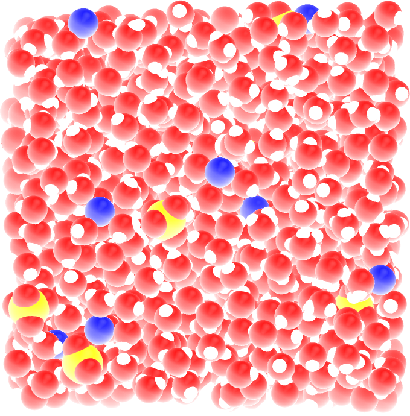

.. _create-topol-label:

Write parameters
****************

.. container:: hatnote

    Writing the topology file.

.. figure:: figures/bulksolution/first-light.png
    :alt: Water solution of SO\ :sub:`4`\ :sup:`2-` and Na\ :sup:`+` ions visualized with VMD
    :class: only-light
    :height: 250
    :align: right

..  container:: justify

    The objective of this tutorial is to write
    the force field parameters (.itp files) for a simple system.
    If follows directly the writing of the gro file in :ref:`create-conf-label` tutorial.

    The parameter files created here will be used in :ref:`bulk-solution-label`. 
    If you are only interested in running GROMACS, jump directly
    in :ref:`bulk-solution-label`.

Default parameters
==================

.. include:: ../contact/needhelp.rst

..  code-block:: bw
    :caption: *to be copied in ff/forcefield.itp*

    [ defaults ]
    ; nbfunc  comb-rule  gen-pairs  fudgeLJ  fudgeQQ
    1       2          no         1.0      0.833

    [ atomtypes ]
    ; name  at.num  mass      charge  ptype  sigma    epsilon
    Na    11      22.9900   1.0000  A      0.23100  0.45000
    OS     8      15.9994  -1.0000  A      0.38600  0.12
    SO    16      32.0600   2.0000  A      0.35500  1.0465
    HW     1       1.0079   0.5270  A      0.00000  0.00000
    OW     8      15.9994   0.0000  A      0.31650  0.77323
    MW     0       0.0000  -1.0540  D      0.00000  0.00000

    [ bondtypes ]
    ; i   j   func  b0    kb
    SO  OS  1     0.15  3.7656e4

    [ angletypes ]
    ; i   j   k   func  theta  k0          
    OS  SO  OS  1     109.5  520

Sodium ion
==========

..  code-block:: bw
    :caption: *to be copied in ff/na.itp*

    [ moleculetype ]
    ; molname nrexcl
    Na      1

    [ atoms ]
    ; id  at-type  res-nr  res-name  at-name  cg-nr  charge  mass
    1   Na       1       Na        Na1      1      1.000   22.9900

Sulfate ion
===========

..  code-block:: bw
    :caption: *to be copied in ff/so4.itp*

    [moleculetype]
    ; name  nrexcl
    SO4   1

    [ atoms ]
    ; id  at-type  res-nr  res-name  at-name  cg-nr  charge  mass
    1   OS       1       SO4       O1       1     -1.000   15.9994
    2   OS       1       SO4       O2       1     -1.000   15.9994
    3   OS       1       SO4       O3       1     -1.000   15.9994
    4   OS       1       SO4       O4       1     -1.000   15.9994
    5   SO       1       SO4       S1       1      2.000   32.0600

    [ bonds ]
    ;  ai   aj  funct   c0         c1
        1    5    1   0.1520   3.7656e4
        2    5    1   0.1520   3.7656e4
        3    5    1   0.1520   3.7656e4
        4    5    1   0.1520   3.7656e4

    [ angles ]
    ;  ai   aj   ak  funct   angle     fc
        1    5    2    1    109.5  520
        1    5    3    1    109.5  520
        1    5    4    1    109.5  520
        2    5    3    1    109.5  520
        2    5    4    1    109.5  520
        3    5    4    1    109.5  520
        
    [exclusions]
    1       2       3       4       5
    2       1       3       4       5
    3       1       2       4       5
    4       1       2       3       5
    5       1       2       3       4

Water molecule
==============

..  code-block:: bw
    :caption: *to be copied in ff/h2O.itp*

    [ moleculetype ]
    ; molname  nrexcl
    SOL      2

    [ atoms ]
    ; id  at-type  res-nr  res-name  at-name  cg-nr  charge  mass
    1   OW	   1       SOL       OW1      1      0.000    15.9994
    2   HW       1       SOL       HW1      1      0.527     1.0079
    3   HW       1       SOL       HW2      1      0.527     1.0079
    4   MW       1       SOL       MW1      1     -1.054     0.0000

    [ settles ]
    ; i  funct  doh      dhh
    1  1      0.09572  0.15139

    [ virtual_sites3 ]
    ; Vsite from          funct        a               b
    4     1     2     3     1       0.089608       0.089608

    [ exclusions ]
    1 2 3 4
    2 1 3 4
    3 1 2 4
    4 1 2 3

.. include:: ../contact/contactme.rst