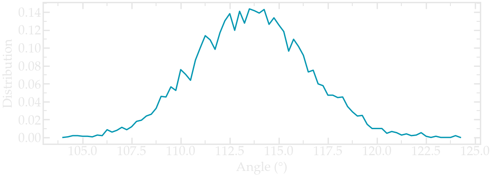
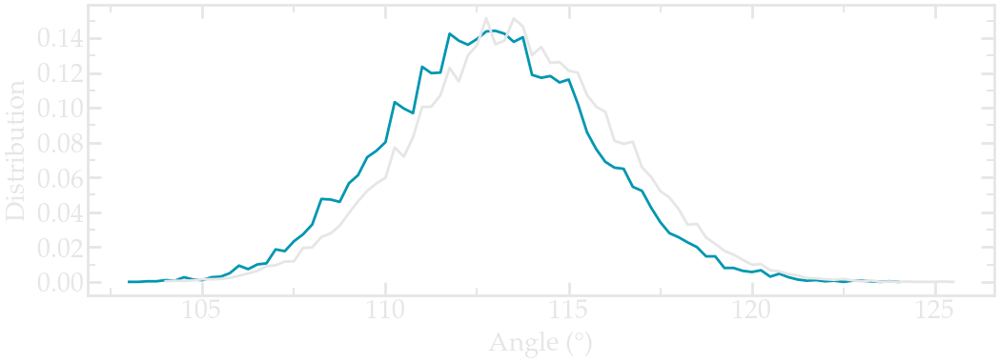

.. _stretching-polymer-label:

Polymer in water
****************

.. container:: hatnote

    Solvating and stretching a small polymer molecule

..  container:: justify

    The goal of this tutorial is to use GROMACS and solvate a small
    hydrophilic polymer (PEG - PolyEthylene Glycol) in a reservoir of water. 

..  container:: justify

    An all-atom description is used for both PEG (GROMOS 54A7 force
    field :cite:`schmid2011definition`) and water
    (SPC flexible model :cite:`wu2006flexible`) and the long
    range Coulomb interactions are solved using the PPPM solver :cite:`luty1996calculating`.    
    Once the water reservoir is properly
    equilibrated at the desired temperature and pressure, the polymer molecule
    is added and a constant stretching force is applied to both
    ends of the polymer. The evolution of the polymer length
    is measured as a function of time.

..  container:: justify

    This tutorial was inspired by a |Liese2017| by Liese and coworkers, in which
    molecular dynamics simulations are
    compared with force spectroscopy experiments :cite:`liese2017hydration`.

.. |Liese2017| raw:: html

   <a href="https://doi.org/10.1021/acsnano.6b07071" target="_blank">publication</a>

.. include:: ../non-tutorials/recommand-salt.rst

.. include:: ../contact/needhelp.rst

PEG molecule in vacuum
======================

..  container:: justify

    Download the *peg.gro* file for the PEG molecule by clicking |download_H2O.data|.

.. |download_H2O.data| raw:: html

   <a href="../../../../inputs/polymerstretching/free-peg-in-vacuum/peg.gro" target="_blank">here</a> 

.. figure:: figures/stretchingpolymer/light-PEG.png
   :alt: PEG polymer for molecular dynamics simulation in GROMACS
   :class: only-light
   :width: 500

.. figure:: figures/stretchingpolymer/dark-PEG.png
   :alt: PEG polymer for molecular dynamics simulation in GROMACS
   :class: only-dark
   :width: 500

.. container:: figurelegend

    The PEG molecule as visualized using VMD. It consists of 
    a rather long polymer chain main of carbon atoms (in gray),
    oxygen atoms (in red), and hydrogen atoms (in white).

..  container:: justify

    Create a folder named *free-peg-in-vacuum/*, and copy
    *peg.gro* in it. Next to *peg.gro* create an empty
    file named *topol.top*, and copy the following lines in it:

..  code-block:: bw

    [ defaults ]
    ; nbfunc	comb-rule	gen-pairs	fudgeLJ	fudgeQQ
      1         1           no          1.0     1.0

    ; Include forcefield parameters
    #include "ff/charmm35r.itp"
    #include "ff/peg.itp"

    [ system ]
    ; Name
      PEG

    [ molecules ]
    ; Compound        #mols
      PEG             1

..  container:: justify

    Next to *conf.gro* and *topol.top*, create a folder named *ff/*, and copy the
    following files into it: |download_charmm35r.itp| and |download_peg.itp|

.. |download_charmm35r.itp| raw:: html

   <a href="../../../../inputs/polymerstretching/free-peg-in-vacuum/ff/charmm35r.itp" target="_blank">charmm35r.itp</a>
   
.. |download_peg.itp| raw:: html

   <a href="../../../../inputs/polymerstretching/free-peg-in-vacuum/ff/peg.itp" target="_blank">peg.itp</a>

..  container:: justify

    These 2 files contain the parameters for the PEG molecules, as well as extra
    parameters for the water molecules that will be added later. 

..  container:: justify

    Create an *inputs/* folder next to *ff/*, and create a new empty file
    called nvt.mdp. Copy the following lines into it:

..  code-block:: bw

    integrator = md 
    dt = 0.002
    nsteps = 500000

    nstenergy = 1000
    nstlog = 1000
    nstxout = 1000

    constraints = hbonds 

    coulombtype = pme
    rcoulomb = 1.0
    rlist = 1.0

    vdwtype = Cut-off 
    rvdw = 1.0

    tcoupl = v-rescale
    tau_t = 0.1
    ref_t = 300
    tc_grps = PEG

    gen_vel = yes
    gen-temp = 300
    gen-seed = 65823

    comm-mode = angular

..  container:: justify

    Run the simulation using GROMACS by typing in a terminal:

..  code-block:: bash

    gmx grompp -f inputs/nvt.mdp -c peg.gro -p topol.top -o nvt -maxwarn 1
    gmx mdrun -v -deffnm nvt

..  container:: justify

    After the simulation is over, open the trajectory file with VMD by typing
    in a terminal:

..  code-block:: bash

    vmd peg.gro nvt.trr

..  container:: justify

    The PEG molecule can be seen moving due to thermal agitation. See
    the corresponding |video_peg_youtube|.

.. |video_peg_youtube| raw:: html

   <a href="https://www.youtube.com/watch?v=8ldIHP175TI&t=9s" target="_blank">video</a>

Angle distribution
------------------

..  container:: justify

    Let us use the tools of GROMACS to extract the angular distribution
    between triplets of atoms during the run. First, let us create an index
    file from the *peg.gro* file:

..  code-block:: bash

    gmx mk_angndx -s nvt.tpr -n index.ndx -hyd no

..  container:: justify

    The first group created contains all the carbon and oxygen atoms
    (a total of 36 atoms), as can be seen from the *index.ndx* file:

..  code-block:: bw

    [ Theta=109.7_795.49 ]
        2     5     7    10    12    14    17    19    21    24    26    28
        31    33    35    38    40    42    45    47    49    52    54    56
        59    61    63    66    68    70    73    75    77    80    82    84

..  container:: justify

    Here each number corresponds to the atom index, as can be seen from the 
    *peg.gro* file. For instance, the atom of *id 2* is a carbon atom, and 
    the atom id *id 5* is an oxygen:

..  code-block:: bw

    PEG in water
    86
        1PEG      H    1   2.032   1.593   1.545  0.6568  2.5734  1.2192
        1PEG      C    2   1.929   1.614   1.508  0.1558 -0.2184  0.8547
        1PEG     H1    3   1.902   1.721   1.523 -3.6848 -0.3932 -3.0658
        1PEG     H2    4   1.921   1.588   1.400 -1.5891  1.4960  0.5057
        1PEG      O    5   1.831   1.544   1.576  0.0564 -0.5300 -0.6094
        1PEG     H3    6   1.676   1.665   1.494 -2.6585 -0.5997  0.3128
        1PEG     C1    7   1.699   1.559   1.519  0.6996  0.0066  0.2900
        1PEG     H4    8   1.699   1.500   1.425  4.2893  1.6837 -0.9462

..  container:: justify

    Using the index file, one can extract the angle distribution between 
    all the species in the group *Theta=109.7_795.49*, by typing:

..  code-block:: bash

    gmx angle -n index.ndx  -f nvt.trr -od angdist.xvg -binwidth 0.25

..  container:: justify

    Select the first group by typing *0*. A file named *angdist.xvg*
    was created, it looks like it:

.. container:: figurelegend

   Angle distribution for the Carbon and oxygen atoms of the PEG molecule in
   vacuum as extracted using *gmx angle*.

Pull on the PEG
---------------

..  container:: justify

    Let us apply a force and pull on the PEG polymer. 
    Duplicate the *free-peg-in-vacuum/* folder, and call the 
    copy *pulled-peg-in-vacuum/*.

..  container:: justify

    First, change the box size to make room for the pulling by replacing
    the last line of *peg.gro* from

..  code-block:: bw

    3.00000   3.00000   3.00000

..  container:: justify

    to

..  code-block:: bw

    3.00000   3.00000   8.00000

..  container:: justify

    Then, for convenience, let us center the PEG molecule
    in the box by using *gmx trjconv*:

..  code-block:: bash

    gmx trjconv -f peg.gro -o peg-centered.gro -s nvt.tpr -center -pbc mol

..  container:: justify

    Choose *System* for both centering and output. Then, let us
    specify to GROMACS which atoms are going to be pulled. This can be done
    by adding 2 additional groups named *End1* and *End2*
    to the index file *index.ndx*:

..  container:: justify

    Create an index file by typing:

..  code-block:: bash

    gmx make_ndx -f peg-centered.gro -o index.ndx

..  container:: justify

    And create the 2 additional groups by typing:

..  code-block:: bw

    a 82
    a 5
    name 3 End1
    name 4 End2

..  container:: justify

    Then press *q* to save and quit. The index file *index.ndx*
    contains 2 additional groups, with one oxygen atom each:

..  code-block:: bw

    (...)
    [ PEG ]
    1    2    3    4    5    6    7    8    9   10   11   12   13   14   15
    16   17   18   19   20   21   22   23   24   25   26   27   28   29   30
    31   32   33   34   35   36   37   38   39   40   41   42   43   44   45
    46   47   48   49   50   51   52   53   54   55   56   57   58   59   60
    61   62   63   64   65   66   67   68   69   70   71   72   73   74   75
    76   77   78   79   80   81   82   83   84   85   86
    [ End1 ]
    82
    [ End2 ]
    5

..  container:: justify

    Then, duplicate the *nvt.mdp* file, name the duplicate *pull.mdp*.
    Remove the *comm-mode = angular* line, and add the following lines
    to *pull.mdp*:

..  code-block:: bw

    pull = yes
    pull-coord1-type = constant-force
    pull-ncoords = 1
    pull-ngroups = 2
    pull-group1-name = End1
    pull-group2-name = End2
    pull-coord1-groups = 1 2
    pull-coord1-geometry = direction-periodic
    pull-coord1-dim = N N Y
    pull-coord1-vec = 0 0 1
    pull-coord1-k = 50
    pull-coord1-start = yes
    pull-print-com = yes

..  container:: justify

    These lines ensure that a force is applied along the *z* direction
    to both groups *End1* and *End2*. Turn off the velocity generator
    as well:

..  code-block:: bw

    gen_vel = no

..  container:: justify

    Re-equilibrate the system using the previous *npt.mdp* script, and then 
    run the *pull.mdp* file:

..  code-block:: bash

    gmx grompp -f inputs/nvt.mdp -c peg-centered.gro -p topol.top -o nvt -maxwarn 1
    gmx mdrun -v -deffnm nvt

    gmx grompp -f inputs/pull.mdp -c nvt.gro -p topol.top -o pull -n index.ndx
    gmx mdrun -v -deffnm pull -px position.xvg -pf force.xvg

..  container:: justify

    Here, the *-n index.ndx* command is used to refer to the previously created 
    index file, so that GROMACS finds the *End1* and *End2* groups.
    The *-px position.xvg* and *-pf force.xvg* are used 
    to print positions and forces of the 2 end groups in files. 

..  container:: justify

    Looking at the evolution of the position with time, one can see
    that the polymer stretches very quickly.

.. container:: figurelegend

    Evolution of the end-to-end distance with time. 

..  container:: justify

    You can also visualize the PEG molecule during the stretching, this is
    what I see.

.. container:: figurelegend

   The PEG molecule under stretching in a vacuum.

PEG molecule in water
=====================

..  container:: justify

    The PEG molecule is now going to be solvated in water.
    Duplicate the *free-peg-in-vacuum/* folder, and call the 
    copy *free-peg-in-water/*.

..  container:: justify

    Add water molecules to the system by using *gmx solvate*:

..  code-block:: bash

    gmx solvate -cp peg.gro -cs spc216.gro -o peg_h2o.gro -p topol.top

..  container:: justify

    Here *spc216.gro* is a default GROMACS file containing a pre-equilibrated
    water reservoir.

    Note the differences between *peg.gro* and *peg_h2o.gro*,
    as well as the new line in *topol.top*:

..  code-block:: bw

    [ molecules ]
    ; Compound      #mols
    PEG             1
    SOL             853

..  container:: justify

    Add the line *#include "ff/tip3p.itp"* to the *topol.top* file:

..  code-block:: bw

    ; Include forcefield parameters
    #include "ff/charmm35r.itp"
    #include "ff/peg.itp"
    #include "ff/tip3p.itp

..  container:: justify

    The *tip3p.itp* contains the information about the water molecule,
    and can be downloaded by clicking |download_tip3p.itp|, and then placed 
    within the *ff/* folder. 

.. |download_tip3p.itp| raw:: html

    <a href="../../../../inputs/polymerstretching/free-peg-in-water/ff/tip3p.itp" target="_blank">here</a>

Equilibrating the system
------------------------

..  container:: justify

    Here we perform a 3-step equilibration of the solvated PEG system, starting with
    an energy minimization, followed by a NVT run, and finally with a NPT run.

..  container:: justify

    First, let us perform an energy minimization of the system:

..  code-block:: bash

      gmx grompp -f inputs/em.mdp -c peg_h2o.gro -p topol.top -o em
      gmx mdrun -deffnm em -v

..  container:: justify

    The *em.mdp* file contains the following commands:

..  code-block:: bw

    integrator = steep
    emtol = 10
    emstep = 0.0001
    nsteps = 5000

    nstenergy = 1000
    nstxout = 100

    cutoff-scheme = Verlet
    coulombtype = PME
    rcoulomb = 1
    rvdw = 1
    pbc = xyz

    define = -DFLEXIBLE

..  container:: justify

    The *define = -DFLEXIBLE* commands triggers the *if* condition
    within the *tip3p.itp* file. Therefore the water molecules 
    behave as flexible during the minimization (rigid molecules and 
    energy minimization usually don't go along well). For the next steps,
    rigid water molecules will be used by not including this command.

    Then, let us perform a NVT (constant number of particles, constant volume,
    constant temperature) run:

..  code-block:: bash

    gmx grompp -f inputs/nvt.mdp -c em.gro -p topol.top -o nvt
    gmx mdrun -deffnm nvt -v

..  container:: justify

    Here the *nvt.mdp* file can be downloaded by clicking |download_nvt.mdp|.

.. |download_nvt.mdp| raw:: html

    <a href="../../../../inputs/polymerstretching/free-peg-in-water/inputs/nvt.mdp" target="_blank">here</a>

..  container:: justify

    Finally, perform a NPT (constant number of particles, constant pressure,
    constant temperature) equilibration run, using this |download_npt.mdp|:

..  code-block:: bash

    gmx grompp -f inputs/npt.mdp -c nvt.gro -p topol.top -o npt
    gmx mdrun -deffnm npt -v

.. |download_npt.mdp| raw:: html

    <a href="../../../../inputs/polymerstretching/free-peg-in-water/inputs/npt.mdp" target="_blank">npt file</a>

..  container:: justify

    Extract the angular distribution again, and compare it to the
    previous vacuum simulation. Here I increased the duration of both 
    simulations to 1 ns (for the PEG in water) and 2 ns (for PEG in vacuum)
    to improve the statistic (feel free to do the same if your
    computer allows it):

   Angle distribution comparing the PEG molecule in vacuum (gray) and 
   the PEG molecule in water (blue).

..  container:: justify

    Notice that the angle distribution is slightly shifted in water, compared to
    when the peg molecule is in vacuum. This indicates that the polymer has a slightly 
    different conformation when in contact with a solvent.

Pull on the PEG
---------------

..  container:: justify

    Using the same procedure as previously, apply a force to
    the polymer ends and pull it inside water. Do not forget to 
    extend the box to make space for the pulling.

.. include:: ../contact/contactme.rst
