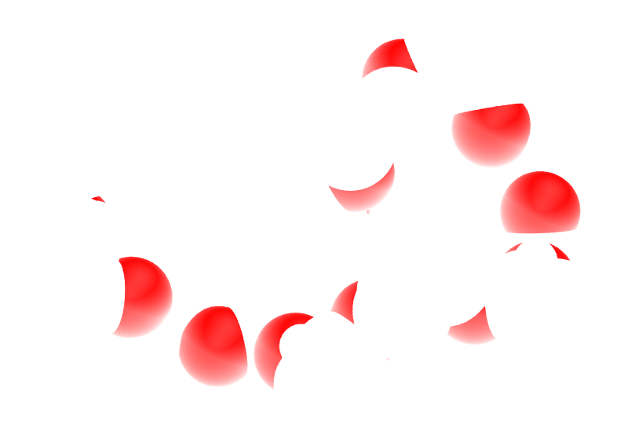

.. _stretching-polymer-label:

Polymer in water
****************

.. container:: hatnote

    Solvating a small molecule in water before stretching it

.. figure:: figures/stretchingpolymer/main-dark.png
    :alt: peg molecule in water
    :height: 250
    :align: right
    :class: only-dark

.. figure:: figures/stretchingpolymer/main-light.png
    :alt: peg molecule in water
    :height: 250
    :align: right
    :class: only-light

..  container:: justify

    The goal of this tutorial is to use GROMACS and
    create a small hydrophilic polymer (PEG -
    PolyEthylene Glycol) in a reservoir of water. 
    An all-atom description is used, therefore all species considered here
    are made of charged atoms connected by bonds constraints.

    Once the system is created, a constant stretching force will be applied to both
    ends of the polymer, and its length will be measured with time.

    This tutorial was inspired by a very nice |Liese2017| by Liese and coworkers, in which
    they compare MD simulations with force spectroscopy experiments.

.. |Liese2017| raw:: html

    <a href="https://doi.org/10.1021/acsnano.6b07071" target="_blank">publication</a>

.. include:: ../contact/needhelp.rst

PEG molecule in vacuum
======================

..  container:: justify

    Download the *peg.gro* file for the PEG molecule by clicking |download_H2O.data|.

.. |download_H2O.data| raw:: html

   <a href="../../../../inputs/stretchingpolymer/peg.gro" target="_blank">here</a>

..  container:: justify

    Opening *peg.gro* using VMD, one can see that it consists of 
    a rather long polymer chain main of carbon atoms (in gray),
    oxygen atoms (in red), and hydrogen atoms (in white):

.. figure:: figures/stretchingpolymer/light-PEG.png
   :alt: PEG polymer for molecular dynamics simulation in GROMACS
   :class: only-light
   :width: 500

   This PEG molecule contains 24 carbon atoms, 12 oxygen atoms,
   and 50 hydrogen atoms.

..  container:: justify

    Create a folder named *peg-in-vacuum/*, and copy
    *peg.gro* in it. Next to *peg.gro* create an empty
    file named *topol.top*, and copy the following lines in it:

..  code-block:: bw
    :caption: *to be copied in topol.top*

    [ defaults ]
    ; nbfunc	comb-rule	gen-pairs	fudgeLJ	fudgeQQ
      1         1           no          1.0     1.0

    ; Include forcefield parameters
    #include "ff/charmm35r.itp"
    #include "ff/peg.itp"

    [ system ]
    ; Name
      PEG

    [ molecules ]
    ; Compound        #mols
      PEG             1

..  container:: justify

    Next to *conf.gro* and *topol.top*, create a folder named *ff/*, and copy the
    following files into it: |download_charmm35r.itp| and |download_peg.itp|

.. |download_charmm35r.itp| raw:: html

   <a href="../../../../inputs/stretchingpolymer/ff/charmm35r.itp" target="_blank">charmm35r.itp</a>
   
.. |download_peg.itp| raw:: html

   <a href="../../../../inputs/stretchingpolymer/ff/peg.itp" target="_blank">peg.itp</a>

..  container:: justify

    These 2 files contain the parameters for the PEG molecules, as well as extra parameters for the water molecules 
    that will be added later. 

    Create an *inputs/* folder next to *ff/*, and create a new empty file called nvt.mdp.
    Copy the following lines into it:

..  code-block:: bw
    :caption: *to be copied in nvt.mdp*

    integrator = md 
    dt = 0.002
    nsteps = 500000

    nstenergy = 1000
    nstlog = 1000
    nstxout = 1000

    constraints = hbonds 

    coulombtype = pme
    rcoulomb = 1.0
    rlist = 1.0

    vdwtype = Cut-off 
    rvdw = 1.0

    tcoupl = v-rescale
    tau_t = 0.1
    ref_t = 300
    tc_grps = PEG

    gen_vel = yes
    gen-temp = 300
    gen-seed = 65823

    comm-mode = angular

..  container:: justify

    Run the simulation using GROMACS by typing in a terminal:

..  code-block:: bash

    gmx grompp -f inputs/nvt.mdp -c peg.gro -p topol.top -o nvt -maxwarn 1
    gmx mdrun -v -deffnm nvt

..  container:: justify

    After the simulation is over, open the trajectory file with VMD by typing:

..  code-block:: bash

    vmd peg.gro nvt.trr

..  container:: justify

    You should see the PEG molecule moving. 

Angle distribution
==================

..  container:: justify

    Let us use the power of GROMACS to extract the angular 
    distribution between triplets of atoms during the run.
    First, let us create an index file from the *peg.gro* file:

..  code-block:: bash

    gmx mk_angndx -s nvt.tpr -n index.ndx -hyd no

..  container:: justify

    The first group created contains all the carbon and oxygen atoms
    (a total of 36 atoms), as can be seen from the *index.ndx* file:

..  code-block:: bw

    [ Theta=109.7_795.49 ]
        2     5     7    10    12    14    17    19    21    24    26    28
        31    33    35    38    40    42    45    47    49    52    54    56
        59    61    63    66    68    70    73    75    77    80    82    84

..  container:: justify

    Here each number corresponds to the atom index, as can be seen from the 
    *peg.gro* file. For instance, atom of id 2 is a carbon atom, and 
    five in an oxygen:

..  code-block:: bw

    PEG in water
    86
        1PEG      H    1   2.032   1.593   1.545  0.6568  2.5734  1.2192
        1PEG      C    2   1.929   1.614   1.508  0.1558 -0.2184  0.8547
        1PEG     H1    3   1.902   1.721   1.523 -3.6848 -0.3932 -3.0658
        1PEG     H2    4   1.921   1.588   1.400 -1.5891  1.4960  0.5057
        1PEG      O    5   1.831   1.544   1.576  0.0564 -0.5300 -0.6094
        1PEG     H3    6   1.676   1.665   1.494 -2.6585 -0.5997  0.3128
        1PEG     C1    7   1.699   1.559   1.519  0.6996  0.0066  0.2900
        1PEG     H4    8   1.699   1.500   1.425  4.2893  1.6837 -0.9462

..  container:: justify

    Using the index file, one can extract the angle distribution between 
    all the species in the group *Theta=109.7_795.49*, by typing:

..  code-block:: bash

    gmx angle -n index.ndx  -f nvt.trr -od angdist.xvg -binwidth 0.25

..  container:: justify

    Select the first group by typing *0*. A file named *angdist.xvg*
    was created, it looks like it:

.. figure:: figures/stretchingpolymer/angle-distribution-light.png
   :alt: Angle distribution from molecular dynamics simulation in GROMACS
   :class: only-light

.. figure:: figures/stretchingpolymer/angle-distribution-dark.png
   :alt: Angle distribution from molecular dynamics simulation in GROMACS
   :class: only-dark

   Angle distribution for the Carbon and oxygen atoms of the PEG molecule in
   vacuum.

.. include:: ../contact/contactme.rst
