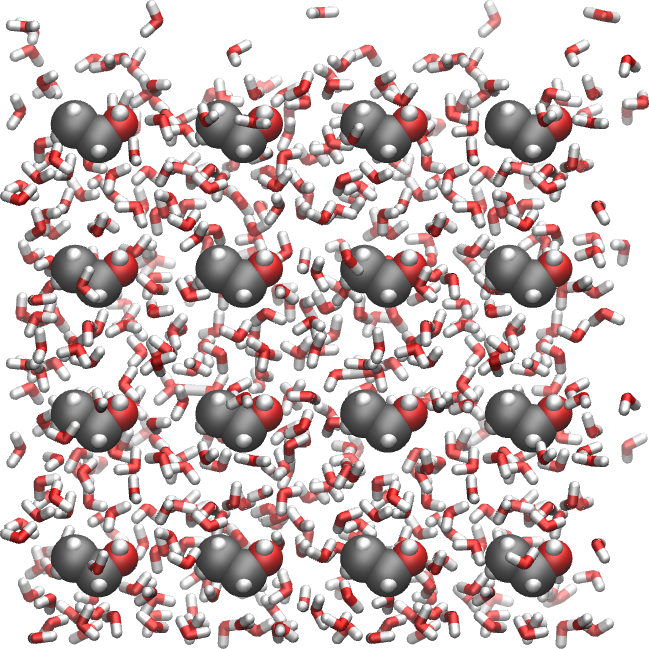
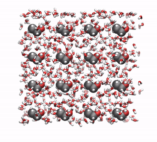
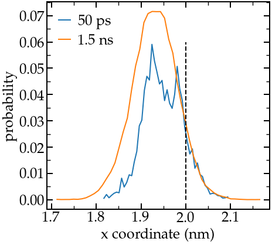
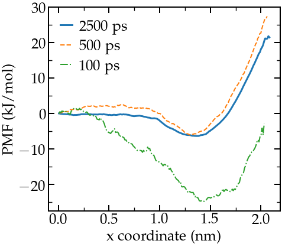

.. _ethanol-adsorption-label:

Free energy profile
*******************

.. container:: hatnote

    Free energy profile calculation using umbrella sampling and WHAM

..  container:: justify

    **The objective of this tutorial** is to use GROMACS to perform
    a molecular dynamics simulation, and to calculate the free energy of adsorption of a ethanol at the water-vapor interface. 

.. include:: ../../contact/recommand-lj.rst

.. include:: ../../contact/needhelp.rst

Input files
===========

..  container:: justify

    Create 3 folders named 'preparation/', 'adsorption',
    and 'singleposition' in the same directory. Go to 'preparation/'.

    Download the configuration files for the ethanol molecule from
    the atb repository: click `here <https://atb.uq.edu.au/molecule.py?molid=902261#panel-md>`__,
    click on 'All-Atom PDB (optimised geometry)'
    and place the file |BIPQ_allatom_optimised_geometry.pdb| in the 'preparation/' folder. 

.. |BIPQ_allatom_optimised_geometry.pdb| raw:: html

    <a href="../../../../inputs/03-EthanolAdsorption/preparation/BIPQ_allatom_optimised_geometry.pdb" target="_blank">BIPQ_allatom_optimised_geometry.pdb</a>

Create the configuration file
-----------------------------

..  container:: justify

    First, let us convert the pdb file into a gro file
    consisting of a single ethanol molecule at the center
    of a small box using trjconv:

..  code-block:: bash

    gmx trjconv -f BIPQ_allatom_optimised_geometry.pdb -s BIPQ_allatom_optimised_geometry.pdb  -box 0.8 0.8 0.8 -o single_ethanol.gro -center

..  container:: justify

    Select 'system' for both centering and output. If you
    open the single_ethanol.gro file with VMD, you will
    see (after some aesthetical improvement):

    Ethanol molecule with carbon atoms in gray, oxygen
    atom in red, and hydrogen atoms in white.

Replicate the ethanol molecule
------------------------------

..  container:: justify

    In order to create a system with several ethanol
    molecules, let us replicate the single molecule (4x4x4
    times) using genconf:

..  code-block:: bash

    gmx genconf -f single_ethanol.gro -o replicated_ethanol.gro -nbox 4 4 4

..  container:: justify

    If you open the replicated_ethanol.gro file with VMD,
    you will see:

    Replicated ethanol molecules with carbon atoms in
    gray, oxygen atom in red, and hydrogen atoms in white.

Create the topology file
------------------------

..  container:: justify

    From the `same atb
    page <https://atb.uq.edu.au/molecule.py?molid=902261#panel-md>`__,
    copy the `'GROMACS G54A7FF All-Atom (ITP
    file)' <https://raw.githubusercontent.com/gromacstutorials/gromacstutorials.github.io/main/inputs/03-EthanolAdsorption/preparation/ff/BIPQ_GROMACS_G54A7FF_allatom.itp>`__
    and place it in a folder named 'ff/' and located
    within the 'preparation/' folder. Within 'ff/',
    download as well the GROMACS top file named `Gromacs
    4.5.x-5.x.x
    54a7 <https://atb.uq.edu.au/forcefield_files/atb_gromacs/5/gromos54a7_atb.ff.tar.gz>`__
    containing all the force field parameters. Copy as
    well the |ethanol-h2o.itp| file for the water molecules in the 'ff/' folder.
    Then, let us write the topology file by simply
    creating a blank file named 'topol.top' within the
    'preparation/' folder, and copying in it:

.. |ethanol-h2o.itp| raw:: html

    <a href="../../../../inputs/03-EthanolAdsorption/preparation/ff/h2o.itp" target="_blank">h2o.itp</a>

..  code-block:: bash

    #include "ff/gromos54a7_atb.ff/forcefield.itp"
    #include "ff/BIPQ_GROMACS_G54A7FF_allatom.itp"
    #include "ff/h2o.itp"

    [ system ]
    Ethanol molecules

    [ molecules ]
    BIPQ 64

Add the water
-------------

..  container:: justify

    Let us add water molecules. First download the tip4p
    water configuration file |ethanol-tip4p.gro|
    and copy it in the 'preparation/' folder. Then, in
    order to add (tip4p) water molecules to both gro and
    top files, use the gmx solvate command as follow:

.. |ethanol-tip4p.gro| raw:: html

    <a href="../../../../inputs/03-EthanolAdsorption/preparation/tip4p.gro" target="_blank">here</a>

..  code-block:: bash

    gmx solvate -cs tip4p.gro -cp replicated_ethanol.gro -o solvated.gro -p topol.top

..  container:: justify

    In my case, 858 water molecules with residue name
    'SOL' were added.

    There should be a new line 'SOL 858' in the topology
    file 'topol.top':

..  code-block:: bash

    [ molecules ]
    BIPQ 64
    SOL 858

..  container:: justify

    The created 'solvated.gro' file contains the positions
    of both Ethanol and water molecules, it looks like that:

    Replicated ethanol molecules within water.

..  container:: justify

    Since we want to simulate a liquid-vapor system, let
    us increase the box size along the x direction to
    create a large vacuum area:

..  code-block:: bash

    gmx trjconv -f solvated.gro -s solvated.gro -box 20.0 3.2 3.2 -o solvated_vacuum.gro -center

..  container:: justify

    Select 'system' for both centering and output.
    If you encountered a problem during file generation,
    you can also download the solvated_vacuum.gro file I
    have generated by clicking |ethanol-solvated_vacuum|.

.. |ethanol-solvated_vacuum| raw:: html

    <a href="../../../../inputs/03-EthanolAdsorption/preparation/solvated_vacuum.gro" target="_blank">here</a>

Energy minimization
===================

..  container:: justify

    Create a new folder in the preparation/' folder, call
    it 'inputs', and save the |ethanol-min.mdp|
    and the |ethanol-nvt.mdp| files into it.

.. |ethanol-min.mdp| raw:: html

    <a href="../../../../inputs/03-EthanolAdsorption/preparation/inputs/min.mdp" target="_blank">min.mdp</a>

.. |ethanol-nvt.mdp| raw:: html

    <a href="../../../../inputs/03-EthanolAdsorption/preparation/inputs/nvt.mdp" target="_blank">nvt.mdp</a>

..  container:: justify

    These 2 files have been seen in the previous
    tutorials. They contain the GROMACS commands, such
    as the type of solver to use, the temperature, etc.
    Apply the minimisation to the solvated box using :

..  code-block:: bash

    gmx grompp -f inputs/min.mdp -c solvated_vacuum.gro -p topol.top -o min -pp min -po min -maxwarn 1
    gmx mdrun -v -deffnm min

..  container:: justify

    Here the '-maxwarn 1' allows us to perform the
    simulation despite GROMACS' warning about some issue
    with the force field. Let us visualize the atoms' trajectories during the
    minimization step using VMD by typing:

..  code-block:: bash

    vmd solvated_vacuum.gro min.trr

..  container:: justify

    This is what I see:

    Movie showing the motion of the atoms during the
    energy minimization. The two fluid/vacuum interfaces
    are on the left and or the right sides, respectively.

..  container:: justify

    **Note for VMD user:** You can avoid having molecules
    'cut in half' by the periodic boundary conditions by
    rewriting the trajectory using 'gmx trjconv -f min.trr
    -s min.tpr -o min_whole.trr -pbc whole'

    **Observation:** During energy minimisation, the
    molecules move until the forces between the atoms are
    reasonable.

Equilibration
=============

..  container:: justify

    Starting from the minimized configuration, let us
    perform a NVT equilibration for 100 ps in order to let
    the system reach equilibrium:

..  code-block:: bash

    gmx grompp -f inputs/nvt.mdp -c min.gro -p topol.top -o nvt -pp nvt -po nvt -maxwarn 1
    gmx mdrun -v -deffnm nvt

..  container:: justify

    When its done, extract the ethanol density profile
    along x using the following command:

..  code-block:: bash

    gmx density -f nvt.xtc -s nvt.tpr -b 50 -d X -sl 100 -o density_end_ethanol.xvg

..  container:: justify

    and choose 'non_water' for the ethanol. The '-b 50'
    keyword is used to disregard the 50 first
    picoseconds of the simulation, the '-d X' keyword to
    generate a profile along x, and the '-sl 100'
    keyword to divide the box into 100 frames. Repeat
    the procedure to extract the water profile as well.

    **Warning:** The current equilibration time for the
    NVT run (100 ps) is too small. It has been chosen to
    make the tutorial easier to follow for people with a
    bad laptop (myself included). Increase the duration
    to 1 nanosecond for a better equilibrated system.
    Alternatively, download the final configuration I
    have generated after a 1 ns run by clicking |ethanol-nvt_1ns.gro|.

.. |ethanol-nvt_1ns.gro| raw:: html

    <a href="../../../../inputs/03-EthanolAdsorption/preparation/nvt_1ns.gro" target="_blank">here</a>

..  container:: justify

    The density profile I get for both water and ethanol
    during the last 500 ps of the 1 ns run is :

    Water and ethanol density profile along x.

    The density profiles show an excess of
    ethanol at the 2 interfaces, which is expected as
    ethanol is known to be amphiphilic. There is also a
    local maxima in the center of the fluid layer (near x
    = 3 nm), and two depletion area in between the center
    of the fluid layer and the two interfaces.

Imposed forcing
===============

..  container:: justify

    To calculate the free energy profile across the
    liquid/vapor interface, one needs to impose an
    additional harmonic potential to one ethanol
    molecule and force it to explore the box, including
    the most energeticaly unfavorable part.
    In order to test our protocole, let us first
    calculate one single position. More positions will
    be calculated in the next part of this tutorial.
    Within 'singleposition/', create a folder named
    'inputs', and copy |ethanol-min.mdp-2|, |ethanol-nvt.mdp-2|
    and |ethanol-pro.mdp-2| in it.

.. |ethanol-min.mdp-2| raw:: html

    <a href="../../../../inputs/03-EthanolAdsorption/singleposition/inputs/min.mdp" target="_blank">min.mdp</a>

.. |ethanol-nvt.mdp-2| raw:: html

    <a href="../../../../inputs/03-EthanolAdsorption/singleposition/inputs/nvt.mdp" target="_blank">nvt.mdp</a>

.. |ethanol-pro.mdp-2| raw:: html

    <a href="../../../../inputs/03-EthanolAdsorption/singleposition/inputs/pro.mdp" target="_blank">pro.mdp</a>

..  container:: justify

    In all 3 mdp files, there are the following lines:

..  code-block:: bw

    pull = yes
    pull-nstxout = 1
    pull-ncoords = 1
    pull-ngroups = 2
    pull-group1-name = ethanol_pull
    pull-group2-name = water
    pull-coord1-type = umbrella
    pull-coord1-geometry = distance
    pull-coord1-dim = Y N N 
    pull-coord1-groups = 1 2
    pull-coord1-start = no
    pull-coord1-init = 2
    pull-coord1-rate = 0.0
    pull-coord1-k = 1000

..  container:: justify

    These lines specify the additional
    harmonic potential to be applied between a group
    name 'ethanol_pull' (still to be defined) and
    'water'. The spring constant of the harmonic
    potential is 1000 kJ/mol/nm2, and the requested
    distance between the center-of-mass of the two
    groups is 2 nm along the x dimension.
    
    Copy as well the previously created topol.top file.
    Modify the first lines to adapt the path to the
    force field folder:

..  code-block:: bw

    #include "../preparation/ff/gromos54a7_atb.ff/forcefield.itp"
    #include "../preparation/ff/BIPQ_GROMACS_G54A7FF_allatom.itp"
    #include "../preparation/ff/h2o.itp"

..  container:: justify

    Let us create an index file :

..  code-block:: bash

    gmx make_ndx -f ../preparation/nvt.gro -o index.ndx

..  container:: justify

    or (if you choose to used this file)

..  code-block:: bash

    gmx make_ndx -f ../preparation/nvt.gro -o index.ndx

..  container:: justify

    and type:

..  code-block:: bash

    a 2
    name 6 ethanol_pull

..  container:: justify

    Press 'q' to save and exit. These commands create an
    index file containing a new group named 'ethanol_pull'
    made of only 1 atom: the atom with index 2. This atom
    is the oxygen atom of the first ethanol molecule in
    the list. We don't care here where this molecule is
    located in the box. You can ensure that the atom of
    index 2 is indeed an oxygen of an ethanol molecule by
    looking at the top of the nvt.gro (or nvt_1ns.gro) file:

..  code-block:: bash

    Ethanol molecules in water
    4008
        1BIPQ    H6    1   1.679   0.322   1.427 -1.2291 -2.8028 -0.6705
        1BIPQ    O1    2   1.617   0.317   1.501 -0.1421 -0.1303  0.4816
        1BIPQ    C2    3   1.549   0.441   1.496 -0.4726 -0.1734  0.4272
        1BIPQ    H4    4   1.453   0.450   1.548 -0.2059 -0.1001  0.9069
        1BIPQ    H5    5   1.529   0.454   1.390 -0.7133  0.0381  0.4988
        1BIPQ    C1    6   1.641   0.548   1.542  0.1500 -0.4454 -0.2006
        1BIPQ    H1    7   1.600   0.646   1.516  0.5688 -0.5292 -1.1624
        1BIPQ    H2    8   1.734   0.549   1.486 -1.4595  1.2268 -2.9589
        1BIPQ    H3    9   1.652   0.548   1.651 -2.4175  0.8229  0.1142
    (...)

..  container:: justify

    Other atoms of the molecule could have been
    chosen, or even the full ethanol molecule.

    Run all 3 inputs successively:

..  code-block:: bash

    gmx grompp -f inputs/min.mdp -c ../preparation/nvt_1ns.gro -p topol.top -o min -pp min -po min -maxwarn 1 -n index.ndx
    gmx mdrun -v -deffnm min
    /gmx grompp -f inputs/nvt.mdp -c min.gro -p topol.top -o nvt -pp nvt -po nvt -maxwarn 1 -n index.ndx 
    gmx mdrun -v -deffnm nvt
    gmx grompp -f inputs/pro.mdp -c nvt.gro -p topol.top -o pro -pp pro -po pro -maxwarn 1 -n index.ndx 
    gmx mdrun -v -deffnm pro

..  container:: justify

    During minisation, the ethanol molecule is separated
    from the rest of the fluid until the distance between
    the center-of-mass of the 2 groups is 2 nm:

    Ethanol molecule being pulled from the rest of the
    fluid during minimisation and nvt equilibration.

..  container:: justify

    Then, during the production run, the average distance
    between the 2 groups is measured over time. Let us
    plot the histogram of this distance:

    Probability distribution of the distance between the
    two center-of-mass. Short (50 ps) and long (1.5 ns)
    runs are compared.

..  container:: justify

    A longer run has been added for comparison.
    If you have a good computer, feel free to run longer
    production run than 50 ps.

    The distribution is not centered around x = 2 nm
    because of the interaction between the CO2 and the
    rest of the fluid.

Free energy profile calculation
===============================

..  container:: justify

    Let us replicate the previous calculation for 30
    differents distances, from x = 0 (the ethanol
    molecule is forced to remain at the center of the
    liquid) to x = 4 (the ethanol molecule is far within
    the vacuum phase).
    Create a new folder, call it 'adsorption/', and copy
    |ethanol-min.mdp-3|, |ethanol-nvt.mdp-3|, and |ethanol-pro.mdp-3|, in it.
    The only difference with the previous input scripts is the command:

.. |ethanol-min.mdp-3| raw:: html

    <a href="../../../../inputs/03-EthanolAdsorption/adsorption/inputs/min.mdp" target="_blank">min.mdp</a>

.. |ethanol-nvt.mdp-3| raw:: html

    <a href="../../../../inputs/03-EthanolAdsorption/adsorption/inputs/nvt.mdp" target="_blank">nvt.mdp</a>

.. |ethanol-pro.mdp-3| raw:: html

    <a href="../../../../inputs/03-EthanolAdsorption/adsorption/inputs/pro.mdp" target="_blank">pro.mdp</a>

..  code-block:: bash

    pull-coord1-init = to_be_replaced

..  container:: justify

    where the keyword 'to_be_replaced' is to be
    systematically replaced using a bash script. Create a
    bash script, call it 'run.sh', and copy the following
    lines in it:

..  code-block:: bash

    #!/bin/bash

    set -e

    for ((i = 0 ; i < 30 ; i++)); do
            x=$(echo "0.13*$(($i+1))" | bc);
            sed 's/to_be_replaced/'$x'/g' inputs/min.mdp > min.mdp
            gmx grompp -f min.mdp -c ../preparation/nvt_1ns.gro -p topol.top -o min.$i -pp min.$i -po min.$i -maxwarn 1 -n index.ndx
            gmx mdrun -v -deffnm min.$i

            sed 's/to_be_replaced/'$x'/g' inputs/nvt.mdp > nvt.mdp
            gmx grompp -f nvt.mdp -c min.$i.gro -p topol.top -o nvt.$i -pp nvt.$i -po nvt.$i -maxwarn 1 -n index.ndx
            gmx mdrun -v -deffnm nvt.$i

            sed 's/to_be_replaced/'$x'/g' inputs/pull.mdp > pull.mdp
            gmx grompp -f pull.mdp -c nvt.$i.gro -p topol.top -o pull.$i -pp pull.$i -po pull.$i -maxwarn 1 -n index.ndx
            gmx mdrun -v -deffnm pull.$i
    done

..  container:: justify

    Copy the previously created index file and topology
    file within the 'adsorption/' folder, and execute
    the bash script.

    When the simulation is done, create 2 files (credit
    to `the excellent gaseri site <https://gaseri.org/en/tutorials/gromacs/5-umbrella/#simulation>`__)

..  code-block:: bash

    ls prd.*.tpr > tpr.dat

..  container:: justify

    and:

..  code-block:: bash

    ls pullf-prd.*.xvg > pullf.dat

..  container:: justify

    Finally, perform the analysis using the WHAM command
    of GROMACS:

..  code-block:: bash

    gmx wham -it tpr.dat -if pullf.dat

..  container:: justify

    A file named "profile.xvg" must have been created,
    and it should contain a PMF profile resembling the
    red curve below:

    PMF for the ethanol molecule accross the interface
    between a water/ethanol mixture and vapor.

..  container:: justify

    Runs of 100 ps as done in this tutorial
    are too short to obtain a proper result. Increase
    the duration of the production runs to a few
    nanoseconds to obtain a proper PMF (like the blue
    curve in the figure above).

    The PMF shows a plateau inside the
    bulk liquid (x<1 nm), a minimum at the interface
    (x=1.5 nm), and increase in the vapor phase (x>1.5
    nm). The minimum at the interface indicate that
    ethanol favorably adsorb at the liquid/vapor
    interface, which is consistent with the density
    profile. The PMF also indicates that, once adsorbed,
    the ethanol molecule requires an energy of about 5
    kJ/mol to re-enter the liquid phase (looking at the
    blue curve), which is about 2.2 kBT. Finally the PMF
    shows that it is energetically costly for the
    ethanol molecule to fully desorb and go into the
    vacuum phase as the energy barrer to overcome is at
    least 25 kJ/mol. Consistently, when performing MD
    simulation, it is rare to observe an ethanol
    molecule exploring the vapor phase.

.. include:: ../../contact/contactme.rst
