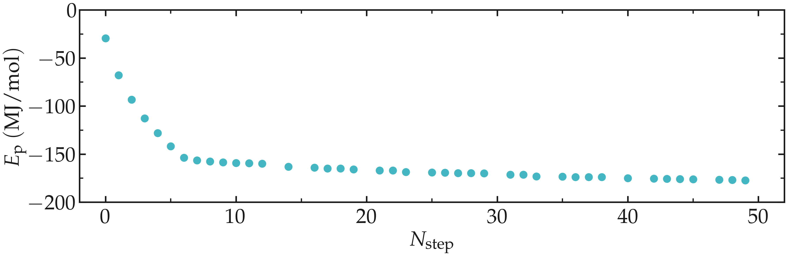
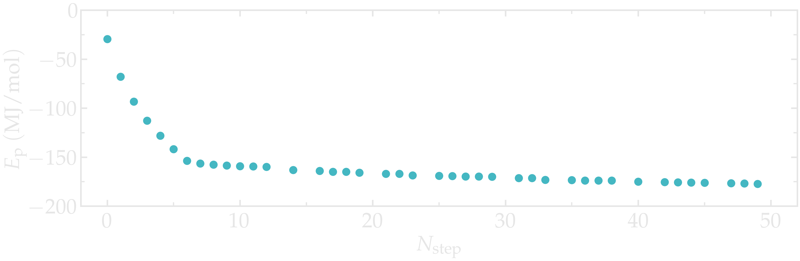
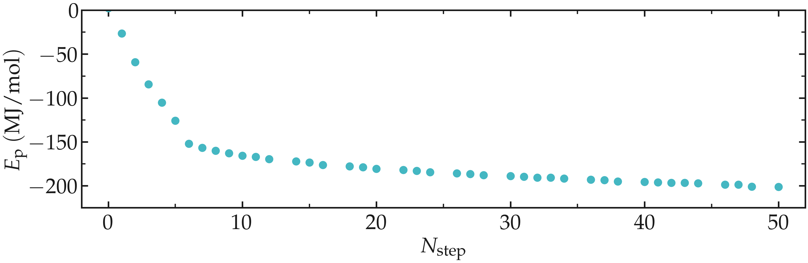
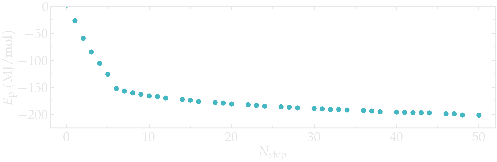
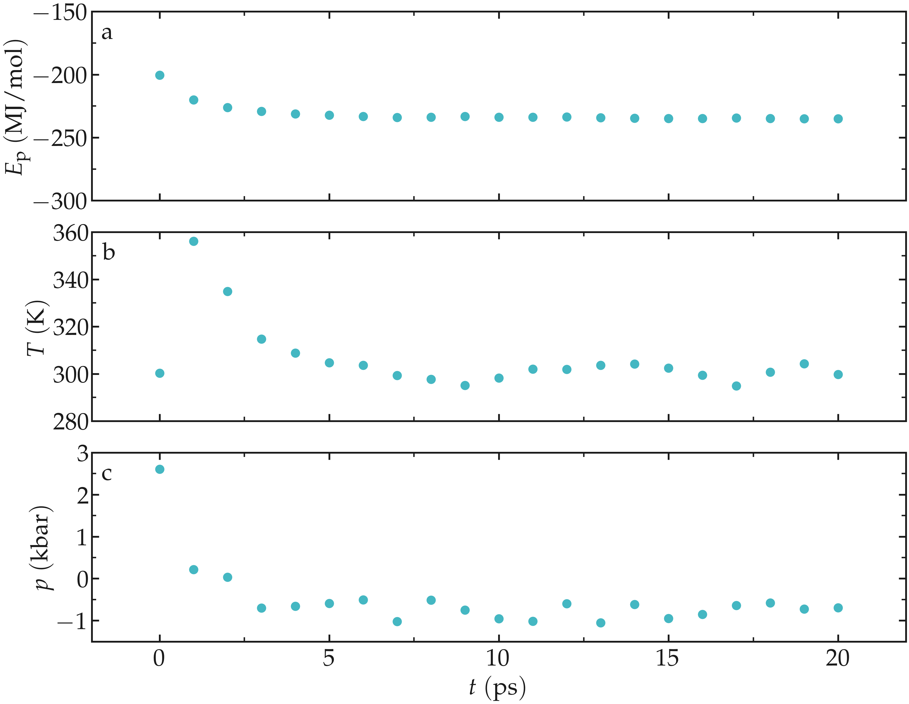

.. _protein_electrolyte-label:

Protein in electrolyte
**********************

.. container:: hatnote

    Simulating a protein solvated in water and ions

.. figure:: ../figures/level1/protein-in-electrolyte/protein-dark.webp
    :alt: Protein and Na Cl ions visualized with VMD
    :class: only-dark
    :height: 300
    :align: right

The goal of this tutorial is to use GROMACS and perform a simple
molecular dynamics simulation of a protein solvated in an electrolyte. The
protein is downloaded from the Protein Data Bank (PDB) :cite:`bankProteinDataBank`
and solvated in an electrolyte made of water molecules and Na+ Cl- ions.

This tutorial covers some of the basic uses of GROMACS, including system
preparation, force field selection, input file preparation, and data
analysis. 

.. include:: ../../non-tutorials/recommand-salt.rst
.. include:: ../../non-tutorials/needhelp.rst
.. include:: ../../non-tutorials/GROMACS2024.2.rst

Convert the PDB file
====================

Download the *.pdb* file from the |ProteinDataBank|,
or simply click |1cta.pdb|. The protein is a calcium-binding peptide from site III
of chicken troponin-C that has been determined using 1H-NMR spectroscopy
:cite:`shawDeterminationSolutionStructure`.

.. |ProteinDataBank| raw:: html

    <a href="https://www.rcsb.org/structure/1CTA" target="_blank">Protein Data Bank</a>

.. |1cta.pdb| raw:: html

    <a href="https://raw.githubusercontent.com/gromacstutorials/gromacstutorials-inputs/main/level1/protein-in-electrolyte/1cta.pdb" target="_blank">here</a>

We first need to create the *.gro* file, i.e. a GROMACS structure file,
from the *.pdb* file. This can be done using *gmx trjconv*:

.. code-block:: bash

    gmx trjconv -f 1cta.pdb -s 1cta.pdb -o 1cta.gro -center -box 5 5 5

Choose the group *System* for the centering, and the group *System* as well 
for the output. A file named *1cta.gro* is created. The generated *.gro*
file contains 666 atoms, each atom corresponding to one line:

.. code-block:: bw

    TROPONIN C SITE III - SITE III HOMODIMER
    666
        0ACE      C    1   2.662   4.131   2.701
        0ACE      O    2   2.714   4.036   2.646
        0ACE    CH3    3   2.651   4.147   2.853
    (...)
    35NH2    HN2  664   2.417   3.671   3.192
    69CA      CA  665   3.016   2.279   1.785
    70CA      CA  666   1.859   2.046   1.838
    5.00000   5.00000   5.00000

The last line is the box dimensions in nanometer, which was requested 
in the *gmx trjconv* command by the *-box 5 5 5* option. All the options
of *trjconv* can be found on the corresponding page of the GROMACS
|trjconv-documentation|.

.. |trjconv-documentation| raw:: html

    <a href="https://manual.gromacs.org/current/onlinehelp/gmx-trjconv.html" target="_blank">documentation</a>

Choose the force field
======================

Let us select the force field that will control the interactions between
the different atoms. This can be done using the *gmx pdb2gmx* command:

.. code-block:: bash

    gmx pdb2gmx -f 1cta.gro -water spce -v -ignh -o unsolvated.gro

Here, the *-ignh* option is used to ignore the hydrogen atoms that are in
the coordinate file. The *-water spce* open is used to
specify the water model; the extended simple point charge
model (spce) :cite:`berendsenMissingTermEffective1987`. 

When running *gmx pdb2gmx*, choose the *AMBER03 protein, nucleic
AMBER94* force field :cite:`duanPointchargeForceField2003`. A new *gro* file named
*unsolvated.gro* was created, as well as a topology *.top* file named
*topol.top*.

Solvate the protein
===================

The protein is now ready to be solvated. Let us first immerse it in pure
water using *gmx solvate*:

.. code-block:: bash

    gmx solvate -cs spc216.gro -cp unsolvated.gro -o solvated.gro -p topol.top

Here, *spc216.gro* is a pre-equilibrated water configuration that is provided
by GROMACS. After running *gmx solvate*, a number :math:`N = 3719` of
water molecules, or SOL (for solvent), is created in the new GRO file
named *solvated.gro* next to the protein. The number :math:`N` may slightly
differ in your case. A new line must also appear at the end of the
*topol.top* file:

.. code-block:: bash

    (...)
    [ molecules ]
    ; Compound        #mols
    Protein             1
    SOL              3719

Run an energy minimization
==========================

Although *gmx solvate* creates molecules without overlap with the
protein, it is safer to perform a short energy minimization to ensure that
the distances between the atoms are reasonable.

To do so, create a new folder named *inputs/*, and create a file named 
*mininimize.mdp* into it. Copy the following lines into *mininimize.mdp*:

.. code-block:: bw

    integrator = steep
    nsteps = 50

    nstxout = 10

    cutoff-scheme = Verlet
    nstlist = 10
    ns_type = grid

    couple-intramol = yes

    vdw-type = Cut-off
    rvdw = 1.0

    coulombtype = pme
    fourierspacing = 0.1
    pme-order = 4
    rcoulomb = 1.0

Here, the speepest-descent method is used, with a maximum number of steps
of 50 :cite:`debyeNaeherungsformelnFuerZylinderfunktionen1909`. The trajectory is printed every 10
step, as specified by the *nstxout* option. The other commands control the
interactions and cut-offs. 

Prepare the energy minimization using *gmx grompp*:

.. code-block:: bash

    gmx grompp -f inputs/mininimize.mdp -c solvated.gro -p topol.top -o min -pp min -po min -maxwarn 1
    gmx mdrun -v -deffnm min

The *-maxwarn 1* is required here, because the system is not charge neutral
and GROMACS will return a WARNING. The charge neutrality will be enforced
later on. Finally, run the simulation using *gmx mdrun*:

.. code-block:: bash

    gmx mdrun -v -deffnm min

Thanks to the steepest-descent algorithm, the potential energy of the
system decreases rapidly and becomes large and negative, which is usually
a good sign. The potential energy can be extracted using *gmx energy*:

.. code-block:: bash

    gmx energy -f min.edr -o potential-energy-minimization.xvg

and choose *Potential*. The generated *.xvg* files contain the value of the
potential energy (in kJ/mol) as a function of the simulation steps. The potential 
energy decreases from :math:`-3 \mathrm{e}-4~\text{kJ}/\text{mol}` to
:math:`-1.8 \mathrm{e}-5~\text{kJ}/\text{mol}`.

.. container:: figurelegend

    Figure: Potential energy :math:`E_\text{p}` of the system as a function of the
    number of steps :math:`N_\text{step}` during energy minimization.

Add the salt
============

Let us add some ions to the system so that the (1) total charge is 0, and (2)
that the salt concentration is :math:`c_\text{s} \approx 1~\text{mol/L}`.
This is done using the *gmx genion* command, 

.. code-block:: bash

    gmx genion -s min.tpr -p topol.top -conc 1 -neutral -o salted.gro

Select the group *SOL* as the continuous group of solvent molecules. GROMACS
will replace some of the *SOL* residues with ions.

As can be seen from the *topol.top* file, some sodium (Na+) and chloride
(Cl-) ions were added, and the number :math:`N` of water molecules is 
reduced compared to the previous step:

.. code-block:: bash

    [ molecules ]
    ; Compound        #mols
    Protein             1
    SOL         3563
    NA               81
    CL               75

Out of safety, let us run a new energy minimization starting from the 
*salted.gro* configuration. The *-maxwarn* option is not necessary
as the system is charge-neutral.

.. code-block:: bash

    gmx grompp -f inputs/mininimize.mdp -c salted.gro -p topol.top -o min-s -pp min-s -po min-s
    gmx mdrun -v -deffnm min-s

As previously, one can have a look at the potential energy using *gmx energy*:

.. code-block:: bash

    gmx energy -f min-s.edr -o potential-energy-minimization-s.xvg

.. container:: figurelegend

    Figure: Potential energy :math:`E_\text{p}` of the system as a function of the
    number of steps :math:`N_\text{step}` during energy minimization.

The system can also be visualized using VMD using:

.. code-block:: bash

    vmd min.gro min.trr

.. container:: figurelegend

    Figure: Protein solvated in water. On the left, only the water molecules that are
    near the protein are represented. On the right, the entire system is shown.
    Water molecules are represented as red and white sticks, and ions are
    represented as spheres.

Run the molecular dynamics
==========================

Create a new input file called *nvt.mdp* and placed into the *inputs/*
folder, and copy the following lines into it:

.. code-block:: bw

    integrator = md
    nsteps = 20000
    dt = 0.001

    comm_mode = linear
    comm_grps = system

    gen-vel = yes
    gen-temp = 300

    cutoff-scheme = Verlet
    nstlist = 10
    ns_type = grid

    nstxout-compressed = 1000

    vdw-type = Cut-off
    rvdw = 1.0

    couple-intramol = yes

    coulombtype = pme
    fourierspacing = 0.1
    pme-order = 4
    rcoulomb = 1.0

    constraint-algorithm = lincs
    constraints = hbonds

    tcoupl = v-rescale
    ld-seed = 48456
    tc-grps = system
    tau-t = 0.5
    ref-t = 300

Here, the *v-rescale* thermostat is used to impose a temperature
of :math:`T = 300~\text{K}`
with a characteristic time of :math:`0.5~\text{ps}`.
The *v-rescale* thermostat
corresponds to the Berendsen thermostat with an additional stochastic
term :cite:`bussiCanonicalSamplingVelocity2007`, and is known to give proper canonical ensemble.

The *LINCS* algorithm is used to constrain the hydrogen bonds, allowing us 
to use a timestep of :math:`1~\text{fs}`. Without such constraint, the fast
vibration of the hydrogen bonds would impose the use of a smaller timestep,
which makes the computation more computationally expensive.

Run the NVT simulation:

.. code-block:: bw

    gmx grompp -f inputs/nvt.mdp -c min-s.gro -p topol.top -o nvt -pp nvt -po nvt
    gmx mdrun -v -deffnm nvt

Let us observe the potential energy. Let us also observe the temperature
and the pressure of the system. Run the *gmx energy* command 3 times,
and select successively *potential*, *temperature*, and *pressure*:

.. code-block:: bash

    gmx energy -f nvt.edr -o potential-energy-nvt.xvg
    gmx energy -f nvt.edr -o temperature-nvt.xvg
    gmx energy -f nvt.edr -o pressure-nvt.xvg

.. code-block:: bw

    After an initial spike, the energy, the temperature, and the pressure
    all stabilize. For the temperature, the desired value of :math:`T = 300~\text{K}`
    is reached, and for the pressure, a negative value of about :math:`- 700~\text{bar}`
    can be observed.

.. figure:: ../figures/level1/protein-in-electrolyte/potential-energy-nvt-dark.png
    :alt: potential energy extracted using Gromacs
    :class: only-dark

.. container:: figurelegend

    Figure: Potential energy :math:`E_\text{p}` (a),
    temperature :math:`T` (b),
    and pressure :math:`p` (c) as a function of the
    time :math:`t` during the NVT molecular dynamics.

The negative pressure indicates that the volume is slightly too large. This
can be rectified by performing a short NPT simulation, during which the
volume of the box will adjust until a desired pressure is reached. Create
a new file called *npt.mdp* in the *inputs/* folder. Copy the same lines as 
in *nvt.mdp*, and add the following lines to it:

.. code-block:: bw

    pcoupl = c-rescale
    Pcoupltype = isotropic
    tau_p = 1.0
    ref_p = 1.0
    compressibility = 4.5e-5

Here, the isotropic c-rescale pressure
coupling with a target pressure of 1 bar is used.
Run it starting from the end of the previous *nvt* run: 

.. code-block:: bw

    gmx grompp -f inputs/npt.mdp -c nvt.gro -p topol.top -o npt -pp npt -po npt
    gmx mdrun -v -deffnm npt

As the simulation progresses, the volume of the box decreases and better
adjust to the fluid content of the box, as can be seen using *gmx energy*
and extracting the *volume*, and/or by extracting the *density*:

.. code-block:: bash

    gmx energy -f npt.edr -o volume-npt.xvg
    gmx energy -f npt.edr -o density-npt.xvg

.. figure:: ../figures/level1/protein-in-electrolyte/potential-energy-npt-light.png
    :alt: potential energy extracted using Gromacs
    :class: only-light

.. figure:: ../figures/level1/protein-in-electrolyte/potential-energy-npt-dark.png
    :alt: potential energy extracted using Gromacs
    :class: only-dark

.. container:: figurelegend

    Figure: Box volume :math:`V` (a) and
    density :math:`\rho` (b) as a function of the
    time :math:`t` during the NPT molecular dynamics.

.. include:: ../../non-tutorials/accessfile.rst