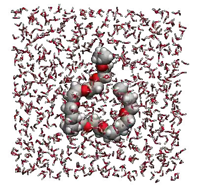
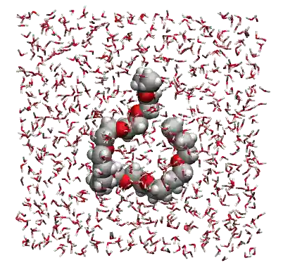
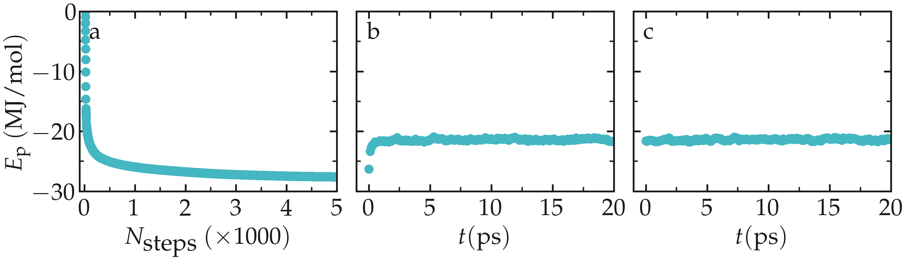
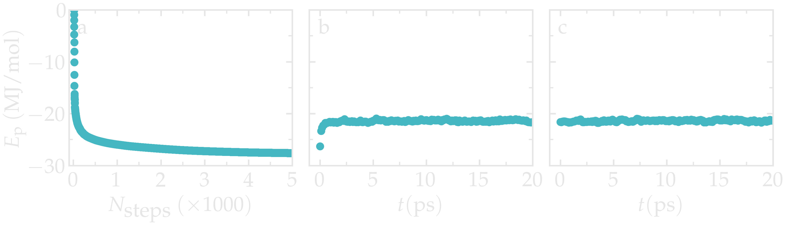
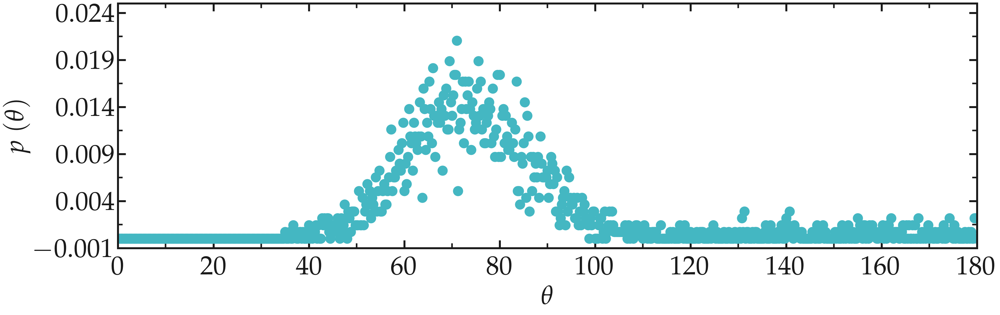
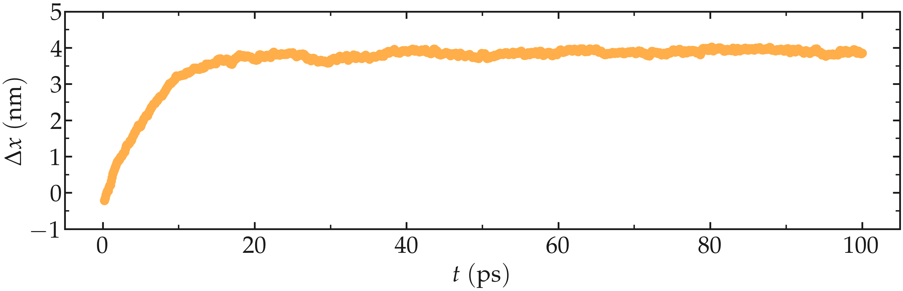
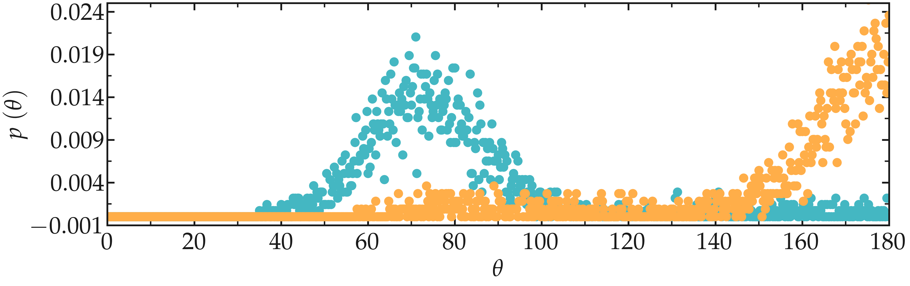
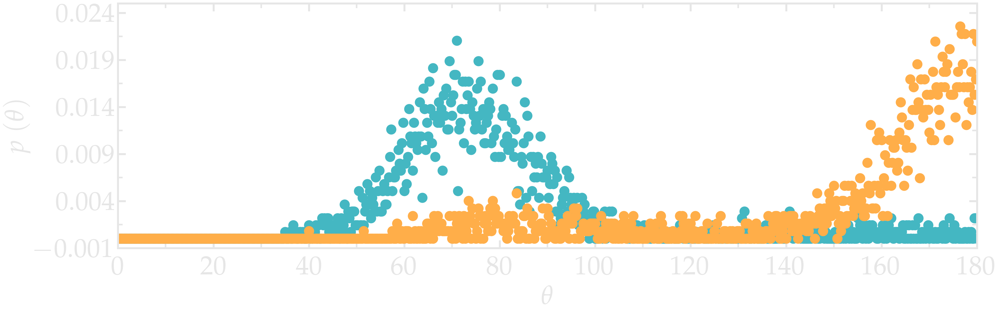

.. _stretching-polymer-label:

Stretching a polymer
********************

.. container:: hatnote

    Solvating and stretching a small polymer molecule

The goal of this tutorial is to use GROMACS and solvate a small
hydrophilic polymer in a reservoir of water. 

An all-atom description is used for both polymer and water. The polymer is
PolyEthylene Glycol (PEG). Once the system is properly
equilibrated at the desired temperature and pressure, a force is applied
to both ends of the polymer. The evolution of the polymer length
is measured, and the energetics of the system is measured.

.. 
    (GROMOS 54A7 force
    field :cite:`schmid2011definition`)
    (SPC flexible model :cite:`wu2006flexible`)

    This tutorial was inspired by a |Liese2017| by Liese and coworkers, in which
    molecular dynamics simulations are
    compared with force spectroscopy experiments :cite:`liese2017hydration`.

.. |Liese2017| raw:: html

   <a href="https://doi.org/10.1021/acsnano.6b07071" target="_blank">publication</a>

.. include:: ../../non-tutorials/recommand-salt.rst
.. include:: ../../non-tutorials/needhelp.rst
.. include:: ../../non-tutorials/GROMACS2024.2.rst

Prepare the PEG molecule
========================

Download the *peg.gro* file for the PEG molecule by clicking |download_H2O.data|.
The *peg.gro* file can be visualized using vmd, by typing in a terminal:

.. |download_H2O.data| raw:: html

   <a href="https://raw.githubusercontent.com/gromacstutorials/gromacstutorials-inputs/main/level2/stretching-a-polymer/cubic-box/peg.gro" target="_blank">here</a> 

.. code-block:: bash

    vmd peg.gro

.. figure:: ../figures/level2/stretching-a-polymer/light-PEG.png
   :alt: PEG polymer for molecular dynamics simulation in GROMACS
   :class: only-light
   :width: 500

.. figure:: ../figures/level2/stretching-a-polymer/dark-PEG.png
   :alt: PEG polymer for molecular dynamics simulation in GROMACS
   :class: only-dark
   :width: 500

.. container:: figurelegend

    Figure: The PEG molecule is a polymer chain made of carbon atoms (in gray),
    oxygen atoms (in red), and hydrogen atoms (in white). See
    the corresponding |video_peg_youtube|.

.. |video_peg_youtube| raw:: html

   <a href="https://www.youtube.com/watch?v=8ldIHP175TI&t=9s" target="_blank">video</a>

Save *peg.gro* in a new folder. Next to *peg.gro* create an empty
file named *topol.top*, and copy the following lines in it:

..  code-block:: bw

    [ defaults ]
    ; nbfunc	comb-rule	gen-pairs	fudgeLJ	fudgeQQ
      1         1           no          1.0     1.0

    ; Include forcefield parameters
    #include "ff/charmm35r.itp"
    #include "ff/peg.itp"
    #include "ff/tip3p.itp

    [ system ]
    ; Name
      PEG

    [ molecules ]
    ; Compound        #mols
      PEG             1

Next to *conf.gro* and *topol.top*, create a folder named *ff/*, and copy
the following 3 *.itp* files into it: |download_charmm35r.itp|, |download_peg.itp|,
and |download_tip3p.itp|. 

.. |download_charmm35r.itp| raw:: html

   <a href="https://raw.githubusercontent.com/gromacstutorials/gromacstutorials-inputs/main/level2/stretching-a-polymer/cubic-box/ff/charmm35r.itp" target="_blank">charmm35r.itp</a>
   
.. |download_peg.itp| raw:: html

   <a href="https://raw.githubusercontent.com/gromacstutorials/gromacstutorials-inputs/main/level2/stretching-a-polymer/cubic-box/ff/peg.itp" target="_blank">peg.itp</a>

.. |download_tip3p.itp| raw:: html

    <a href="https://raw.githubusercontent.com/gromacstutorials/gromacstutorials-inputs/main/level2/stretching-a-polymer/cubic-box/ff/tip3p.itp" target="_blank">tip3p.itp</a>

These 3 files contain the parameters for the PEG and the water molecules
with oxygen (OW) and hydrogen (HW) atoms.

Create an *inputs/* folder next to *ff/*, and create a new empty file
called *em.mdp*. Copy the following lines into it:

..  code-block:: bw

    integrator = steep
    emtol = 10
    emstep = 0.0001
    nsteps = 5000

    nstenergy = 1000
    nstxout = 100

    cutoff-scheme = Verlet
    coulombtype = PME
    rcoulomb = 1
    rvdw = 1
    pbc = xyz

Most of these commands have been seen in previous tutorials. The most
important command is *integrator = steep*, which set the algorithm
used by GROMACS as the steepest-descent,
which moves the atoms following the direction of the largest forces
until one of the stopping criteria is reached :cite:`debyeNaeherungsformelnFuerZylinderfunktionen1909`.

Run the energy minimization using GROMACS by typing in a terminal:

..  code-block:: bash

    gmx grompp -f inputs/em.mdp -c peg.gro -p topol.top -o em-peg
    gmx mdrun -deffnm em-peg -v -nt 8

The *-nt 8* option limits the number of threads that GROMACS uses. Adjust
the number to your computer. 

After the simulation is over, open the trajectory file with VMD by typing
in a terminal:

..  code-block:: bash

    vmd peg.gro em-peg.trr

From VMD, the PEG molecule can be seen moving a little by the
steepest-descent algorithm. 

Before adding the water, let us reshape the box and recenter the PEG molecule
in the box. As a first step, let us use a cubic box of
lateral size :math:`2.6~\text{nm}`.

..  code-block:: bash

    gmx trjconv -f em-peg.gro -s em-peg.tpr -o peg-recentered.gro -center -pbc mol -box 2.6 2.6 2.6

Select *system* for both centering and output. The newly created *gro*
file named *peg-recentered.gro* will be used as a starting point
for the next step of the tutorial.

Solvate the PEG molecule
========================

Let us add the water molecules to the system by using *gmx solvate*:

..  code-block:: bash

    gmx solvate -cp peg-recentered.gro -cs spc216.gro -o peg-solvated.gro -p topol.top

Here *spc216.gro* is a default GROMACS file containing a pre-equilibrated
water reservoir.

The newly created file *peg-solvated.gro* contains the water molecules,
and a a new line in was added to the topology file *topol.top*:

..  code-block:: bw

    [ molecules ]
    ; Compound        #mols
    PEG               1 
    SOL               546

We can apply the same energy minimization to the newly created solvated
system. Simply add the following line to *em.mdp*:

..  code-block:: bw

    define = -DFLEXIBLE

And then launch the energy minimization again using:

..  code-block:: bash

    gmx grompp -f inputs/em.mdp -c peg-solvated.gro -p topol.top -o em
    gmx mdrun -deffnm em -v -nt 8

The *define = -DFLEXIBLE* option triggers the following *if* condition
within the *tip3p.itp* file:

..  code-block:: bw

    #ifdef FLEXIBLE
    [ bonds ]
    ; i     j       funct   length  force.c.
    1       2       1       0.09572 502416.0 0.09572        502416.0 
    1       3       1       0.09572 502416.0 0.09572        502416.0 
    
    [ angles ]
    ; i      j      k       funct   angle   force.c.
    2        1      3       1       104.52  628.02  104.52  628.02
    
With this *if* condition the water molecules 
behave as flexible. This is better because rigid molecules and 
energy minimization usually don't go along well. For the next molecular
dynamics steps, rigid water molecules will be used by not including
the *define = -DFLEXIBLE* command in the inputs.

Equilibrate the PEG-water system
================================

Let use equilibrate the system in two steps: first a NVT simulation,
with constant number of particles, constant volume, and imposed temperature,
and second a NPT simulation with imposed pressure. 

Within the *inputs/* folder, create a new input named *nvt-peg-h2o.mdp*,
and copy the following lines into it:

..  code-block:: bw

    integrator = md 
    dt = 0.002
    nsteps = 10000

    nstenergy = 500
    nstlog = 500
    nstxout-compressed = 500

    constraint-algorithm = lincs
    constraints = hbonds
    continuation = no

    coulombtype = pme
    rcoulomb = 1.0
    rlist = 1.0

    vdwtype = Cut-off 
    rvdw = 1.0

    tcoupl = v-rescale
    tau_t = 0.1 0.1
    ref_t = 300 300
    tc_grps = PEG Water

    gen-vel = yes
    gen-temp = 300
    gen-seed = 65823

    comm-mode = linear
    comm-grps = PEG

Most of these commands have already been seen. In addition to the conventional
*md* leap-frog algorithm integrator, long-range Coulomb and short-range
van der Waals interactions, the LINCS constraint algorithm is used to maintain
the hydrogen bonds as rigid. An initial temperature of :math:`300~K` is given
to the system by the *gen-* commands, and the PEG is maintained in the center
of the box by the *comm-mode* and *comm-grps* commands.

Launch the NVT simulation using:

..  code-block:: bash

    gmx grompp -f inputs/nvt-peg-h2o.mdp -c em.gro -p topol.top -o nvt -maxwarn 1
    gmx mdrun -deffnm nvt -v -nt 8

The *maxwarn 1* option is used to avoid a GROMACS WARNING related to the
centering of the PEG in the box. 

Let us follow-up with the NPT equilibration. Duplicate the *nvt-peg-h2o.mdp*
file into a new input file named *npt-peg-h2o.mdp*. Within *npt-peg-h2o.mdp*,
Within the *npt-peg-h2o.mdp*, delete the lines related to the creation
of velocity as its better to keep the velocities generated during the
NVT run:

..  code-block:: bw

    gen_vel = yes
    gen-temp = 300
    gen-seed = 65823

In addition to the removal the previous 3 lines, add the following lines 
to *npt-peg-h2o.mdp* to specify the isotropic barostat with imposed pressure
of :math:`1~\text{bar}`:

..  code-block:: bw

    pcoupl = c-rescale
    pcoupltype = isotropic
    tau-p = 0.5
    ref-p = 1.0
    compressibility = 4.5e-5

Run the NPT simulation, using the final state of the NVT simulation
*nvt.gro* as starting configuration:

..  code-block:: bash

    ${gmx} grompp -f inputs/npt-peg-h2o.mdp -c nvt.gro -p topol.top -o npt -maxwarn 1
    ${gmx} mdrun -deffnm npt -v -nt 8

Let us observe the evolution of the potential energy of the system during the
3 successive equilibration steps, i.e. the *em*, *nvt*, and *npt* steps,
using the *gmx energy* command as follow:

..  code-block:: bash

    gmx energy -f em.edr -o energy-em.xvg
    gmx energy -f nvt.edr -o energy-nvt.xvg
    gmx energy -f npt.edr -o energy-npt.xvg

For each of the 3 *gmx energy* commands, select *potential*.

.. container:: figurelegend

    Figure: Evolution of the potential energy during the 3 equilibration steps,
    respectively the energy minimization (a), the NVT step (b), and the NPT
    step (c). 

Let us launch a longer simulation, and extract the angle distribution
between the different atoms of the PEG molecules. This angle
distribution will be used later as a benchmark to probe the effect of
of the stretching on the PEG structure.

Create a new input named *production-peg-h2o.mdp*, and copy the following
lines into it:

..  code-block:: bw

    integrator = md 
    dt = 0.002
    nsteps = 50000

    nstenergy = 100
    nstlog = 100
    nstxout-compressed = 100

    constraint-algorithm = lincs
    constraints = hbonds
    continuation = no

    coulombtype = pme
    rcoulomb = 1.0
    rlist = 1.0

    vdwtype = Cut-off 
    rvdw = 1.0

    tcoupl = v-rescale
    tau_t = 0.1 0.1
    ref_t = 300 300
    tc_grps = PEG Water

    comm-mode = linear
    comm-grps = PEG

This script resembles the *nvt-peg-h2o.mdp* input, but the duration and
output frequency is different, and without the *gen-vel* commands. 

Run it using:

..  code-block:: bash

    gmx grompp -f inputs/production-peg-h2o.mdp -c npt.gro -p topol.top -o production -maxwarn 1
    gmx mdrun -deffnm production -v -nt 8

First, create an index file called *angle.ndx* using the *gmx mk_angndx*
command:

..  code-block:: bash

    gmx mk_angndx -s production.tpr -hyd no

The *angle.ndx* file generated contains groups with all the atoms
involved by an angle constraint, with the exception of the hydrogen
atoms due to the use of *-hyd no*. The atom ids selected in the groups
can be seen from the *index.ndx* file:

..  code-block:: bw

    [ Theta=109.7_795.49 ]
        2     5     7    10    12    14    17    19    21    24    26    28
        31    33    35    38    40    42    45    47    49    52    54    56
        59    61    63    66    68    70    73    75    77    80    82    84

Here, each number corresponds to the atom index, as can be seen from the 
initial *peg.gro* file. For instance, the atom of *id 2* is a carbon atom,
and the atom with *id 5* is an oxygen:

..  code-block:: bw

    PEG in water
    86
        1PEG      H    1   2.032   1.593   1.545  0.6568  2.5734  1.2192
        1PEG      C    2   1.929   1.614   1.508  0.1558 -0.2184  0.8547
        1PEG     H1    3   1.902   1.721   1.523 -3.6848 -0.3932 -3.0658
        1PEG     H2    4   1.921   1.588   1.400 -1.5891  1.4960  0.5057
        1PEG      O    5   1.831   1.544   1.576  0.0564 -0.5300 -0.6094
        1PEG     H3    6   1.676   1.665   1.494 -2.6585 -0.5997  0.3128
        1PEG     C1    7   1.699   1.559   1.519  0.6996  0.0066  0.2900
        1PEG     H4    8   1.699   1.500   1.425  4.2893  1.6837 -0.9462
    (...)

Then, extract the angle distribution from the *production.xtc*
file using *gmx angle*:

..  code-block:: bash

    gmx angle -n angle.ndx  -f production.xtc -od angle-distribution.xvg -binwidth 0.25

Select 1 for the O-C-C-O dihedral.

.. figure:: ../figures/level2/stretching-a-polymer/dihedral-distribution-dark.png
    :alt: Angular distribution from molecular dynamics simulation in GROMACS
    :class: only-dark

.. container:: figurelegend

    Figure: Angular distribution for the O-C-C-O dihedral of the PEG molecules.

Stretch on the polymer
======================

Create a new folder named *elongated-box/* next to *cubic-box/*, and copy
*ff/*, *inputs/*, *em-peg.gro*, and em-peg.tpr from *cubic-box/*
into *elongated-box/*:

To leave space for the stretched PEG molecule, let us create an
elongated box of length :math:`6~\text{nm}`
along the *x* direction:

..  code-block:: bash

    gmx trjconv -f em-peg.gro -s em-peg.tpr -o peg-elongated.gro -center -pbc mol -box 6 2.6 2.6 

Select *system* for both centering and output.

Then, follow the exact same steps as previously to solvate and equilibrate
the system:

..  code-block:: bash

    gmx solvate -cp peg-elongated.gro -cs spc216.gro -o peg-solvated.gro -p topol.top

    gmx grompp -f inputs/em.mdp -c peg-solvated.gro -p topol.top -o em -maxwarn 1
    gmx mdrun -deffnm em -v -nt 8

    gmx grompp -f inputs/nvt-peg-h2o.mdp -c em.gro -p topol.top -o nvt -maxwarn 1
    gmx mdrun -deffnm nvt -v -nt 8

    gmx grompp -f inputs/npt-peg-h2o.mdp -c nvt.gro -p topol.top -o npt -maxwarn 1
    gmx mdrun -deffnm npt -v -nt 8

The index file
--------------

To apply a forcing to the ends of the PEG, one needs to create atom groups.
Specificaly, we want to create two groups, each containing a single oxygen
atom from the edges of the PEG molecules (with ID 82 and 5). In GROMACS,
this can be done using and index file *.ndx*. Create a new index file
named *index.ndx* using the *gmx make_ndx* command:

..  code-block:: bash

    gmx make_ndx -f nvt.gro -o index.ndx
    
When prompted, type the following 4 lines to create 2 additional groups: 

..  code-block:: bash

    a 82
    a 5
    name 6 End1
    name 7 End2

Then, type *q* for quitting. The index file *index.ndx*
contains 2 additional groups named *End1* and *End2*:

..  code-block:: bw

    (...)
    [ PEG ]
    1    2    3    4    5    6    7    8    9   10   11   12   13   14   15
    16   17   18   19   20   21   22   23   24   25   26   27   28   29   30
    31   32   33   34   35   36   37   38   39   40   41   42   43   44   45
    46   47   48   49   50   51   52   53   54   55   56   57   58   59   60
    61   62   63   64   65   66   67   68   69   70   71   72   73   74   75
    76   77   78   79   80   81   82   83   84   85   86
    [ End1 ]
    82
    [ End2 ]
    5

The input file
--------------

Let us create an input file for the stretching of the PEG molecule.

Create a new input file named *stretching-peg-h2o.mdp* within *inputs/*,
and copy the following lines in it:

..  code-block:: bw

    integrator = md 
    dt = 0.002
    nsteps = 50000

    nstenergy = 100
    nstlog = 100
    nstxout-compressed = 100

    constraint-algorithm = lincs
    constraints = hbonds
    continuation = no

    coulombtype = pme
    rcoulomb = 1.0
    rlist = 1.0

    vdwtype = Cut-off 
    rvdw = 1.0

    tcoupl = v-rescale
    tau_t = 0.1 0.1
    ref_t = 300 300
    tc_grps = PEG Water

So far, the script is similar to the previously created *production-peg-h2o.mdp*
file, but without the *comm-mode* commands. To apply the constant forcing to
the *End1* and *End2* groups, add the following lines to *production-peg-h2o.mdp*:

..  code-block:: bw

    pull = yes
    pull-coord1-type = constant-force
    pull-ncoords = 1
    pull-ngroups = 2
    pull-group1-name = End1
    pull-group2-name = End2
    pull-coord1-groups = 1 2
    pull-coord1-geometry = direction-periodic
    pull-coord1-dim = Y N N
    pull-coord1-vec = 1 0 0
    pull-coord1-k = 200
    pull-coord1-start = yes
    pull-print-com = yes

The force constant is requested along the *x* direction only (Y N N),
with a force constant :math:`k = 200~\text{kJ}~\text{mol}^{-1}~\text{nm}^{-1}`. 

Launch the simulation using the *-n index.ndx* option for the *gmx grompp*
command to refer to the previously created index file, so that GROMACS
finds the *End1* and *End2* groups.

..  code-block:: bash

    gmx grompp -f inputs/stretching-peg-h2o.mdp -c npt.gro -p topol.top -o stretching -n index.ndx
    gmx mdrun -deffnm stretching -v -nt 8

Two data files named *stretching_pullf.xvg* and *stretching_pullx.xvg*
are created during the simulation, and contain respectively the
force and distance between the 2 groups *End1* and *End2* as a function
of time.

.. figure:: ../figures/level2/stretching-a-polymer/pull-position-dark.png
    :alt: Pull position from molecular dynamics simulation in GROMACS
    :class: only-dark

.. container:: figurelegend

    Figure: Distance between the two pulled groups *End1* and *End2* along the
    *x* direction, :math:`\Delta x`,
    as a function of time :math:`t`.

It can be seen from the evolution of the distance between the groups,
:math:`\Delta x`, that the system reaches its equilibrium state after
approximately 20 pico-seconds.

Let us probe the effect of the stretching on the structure of the PEG
by remeasuring the dihedral angle values:

..  code-block:: bash

    gmx mk_angndx -s stretching.tpr -hyd no -type dihedral
    gmx angle -n angle.ndx  -f stretching-centered.xtc -od dihedral-distribution.xvg -binwidth 0.25 -type dihedral -b 20 

Select 1 for the O-C-C-O dihedral. Here the option *-b 20* is used to disregard
the first 20 pico-seconds of the simulation during which the PEG has not 
reach is final length. 

.. container:: figurelegend

    Figure: Angular distribution for the O-C-C-O dihedral of the PEG molecules,
    comparing the unstretched (cyan) and stretched case (orange).

The change in dihedral angles disribution reveals a configurational change of 
the polymer induced by the forcing. This transition is called gauche-trans,
where *gauche* and *trans* refer to possible states
for the PEG monomer :cite:`binderMonteCarloMolecular1995, lieseHydrationEffectsTurn2017`.

.. figure:: ../figures/level2/stretching-a-polymer/gauche-trans.png
    :alt: Illustration of the gauche (left) and trans (right) states of the PEG polymer.

.. container:: figurelegend

    Figure: Illustration of the gauche (left) and trans (right) states of the
    PEG polymer.

.. include:: ../../non-tutorials/accessfile.rst
