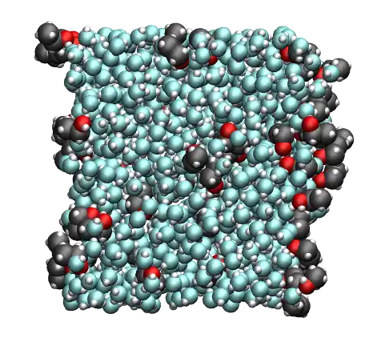
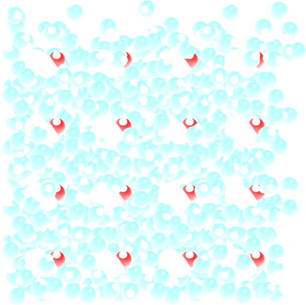
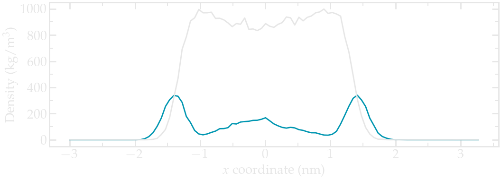
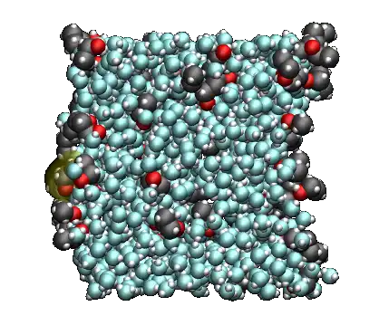
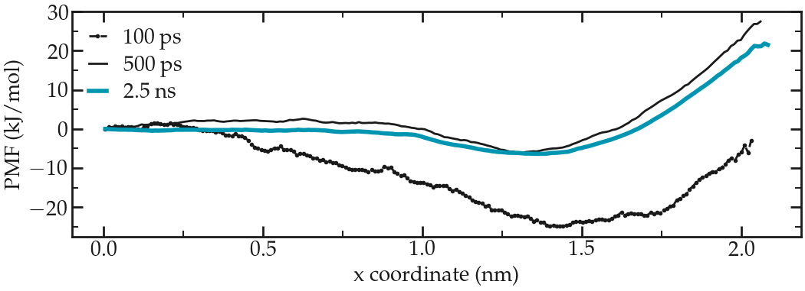

.. _ethanol-adsorption-label:

Free energy profile
*******************

.. container:: hatnote

    Free energy profile calculation using umbrella sampling and WHAM

..  container:: justify

    The objective of this tutorial is to use GROMACS to perform
    a molecular simulation, and to calculate the free energy of adsorption
    of ethanol at a liquid-vapor interface. 

..  container:: justify

    A liquid-vapor slab made of water and ethanol molecules is first
    equilibrated under ambient conditions. Then, umbrella sampling is used
    to probe the free energy profile of a chosen molecule across the 
    liquid-vapor interface.

.. include:: ../../non-tutorials/recommand-salt.rst
.. include:: ../../non-tutorials/needhelp.rst
.. include:: ../../non-tutorials/GROMACS2024.2.rst

Prepare the input files
=======================

..  container:: justify

    Create 3 folders side-by-side named respectively *preparation/*, *adsorption/*,
    and *singleposition/*. Go to *preparation/*.

..  container:: justify

    Download the configuration files for the ethanol molecule from
    the |ethanol_atb| (click on *All-Atom PDB (optimised geometry)*),
    and place the file |BIPQ_allatom_optimised_geometry.pdb| in the *preparation/* folder. 

.. |BIPQ_allatom_optimised_geometry.pdb| raw:: html

    <a href="https://raw.githubusercontent.com/gromacstutorials/gromacstutorials-inputs/main/level3/adsorption-ethanol/preparation/BIPQ_allatom_optimised_geometry.pdb" target="_blank">BIPQ_allatom_optimised_geometry.pdb</a>

.. |ethanol_atb| raw:: html

    <a href="https://atb.uq.edu.au/molecule.py?molid=902261#panel-md" target="_blank">ATB repository</a>

Create the configuration file
-----------------------------

..  container:: justify

    First, let us convert the pdb file into a gro file
    consisting of a single ethanol molecule at the center
    of a small box using the *gmx trjconv* command:

..  code-block:: bash

    gmx trjconv -f BIPQ_allatom_optimised_geometry.pdb -s BIPQ_allatom_optimised_geometry.pdb  -box 0.8 0.8 0.8 -o single_ethanol.gro -center

..  container:: justify

    Select *system* for both centering and output.

Replicate the ethanol molecule
------------------------------

..  container:: justify

    In order to create a system with several ethanol
    molecules, let us replicate the single molecule (4x4x4
    times) using *genconf*:

..  code-block:: bash

    gmx genconf -f single_ethanol.gro -o replicated_ethanol.gro -nbox 4 4 4

..  container:: justify

    If you open the *replicated_ethanol.gro* file with VMD,
    you will see the replicated ethanol molecules.

.. container:: figurelegend

    Figure: Replicated ethanol molecules with carbon atoms in
    gray, oxygen atoms in red, and hydrogen atoms in white.

Create the topology file
------------------------

..  container:: justify

    Within the *preparation/* folder, create a folder named *ff/*.

..  container:: justify

    From the same same page from the ATB repository, download the file named
    |GROMACS_G54A7FF.itp| and place within *ff/*.
    Download as well the GROMACS top file named |Gromacs4.5.x-5.x.x54a7.itp|
    containing most of the force field parameters. Finally, copy
    the |ethanol_h2o.itp| file for the water molecules in the *ff/* folder.

.. |GROMACS_G54A7FF.itp| raw:: html

    <a href="https://raw.githubusercontent.com/gromacstutorials/gromacstutorials-inputs/main/level3/adsorption-ethanol/preparation/ff/BIPQ_GROMACS_G54A7FF_allatom.itp" target="_blank">GROMACS G54A7FF All-Atom (ITP file)</a>
    
.. |Gromacs4.5.x-5.x.x54a7.itp| raw:: html

    <a href="https://atb.uq.edu.au/forcefield_files/atb_gromacs/5/gromos54a7_atb.ff.tar.gz" target="_blank">Gromacs 4.5.x-5.x.x 54a7</a>

.. |ethanol_h2o.itp| raw:: html

    <a href="https://raw.githubusercontent.com/gromacstutorials/gromacstutorials-inputs/main/level3/adsorption-ethanol/preparation/ff/h2o.itp" target="_blank">h2o.itp</a>

..  container:: justify

    Create a blank file named *topol.top* within the
    *preparation/* folder, and copy the following lines in it:

..  code-block:: bw

    #include "ff/gromos54a7_atb.ff/forcefield.itp"
    #include "ff/BIPQ_GROMACS_G54A7FF_allatom.itp"
    #include "ff/h2o.itp"

    [ system ]
    Ethanol molecules

    [ molecules ]
    BIPQ 64

Add the water
-------------

..  container:: justify

    Let us add water molecules. First download the tip4p
    water configuration file |ethanol-tip4p.gro|
    and copy it in the *preparation/* folder. Then, in
    order to add (tip4p) water molecules to both gro and
    top files, use the gmx solvate command as follow:

.. |ethanol-tip4p.gro| raw:: html

    <a href="https://raw.githubusercontent.com/gromacstutorials/gromacstutorials-inputs/main/level3/adsorption-ethanol/preparation/tip4p.gro" target="_blank">here</a>

..  code-block:: bash

    gmx solvate -cs tip4p.gro -cp replicated_ethanol.gro -o solvated.gro -p topol.top

..  container:: justify

    In my case, 858 water molecules with residue name
    *SOL* were added.

..  container:: justify

    There should be a new line *SOL 858* in the topology
    file *topol.top*:

..  code-block:: bash

    [ molecules ]
    BIPQ 64
    SOL 858

..  container:: justify

    The created *solvated.gro* file contains the positions
    of both ethanol and water molecules, it looks like that:

.. container:: figurelegend

    Figure: Replicated ethanol molecules surrounded by water (in light blue color).

..  container:: justify

    In order to create a liquid-vapor slab, let
    us increase the box size along the *x* direction to
    create a large vacuum area:

..  code-block:: bash

    gmx trjconv -f solvated.gro -s solvated.gro -box 20.0 3.2 3.2 -o solvated_vacuum.gro -center

..  container:: justify

    Select *system* for both centering and output.

..  container:: justify

    Alternatively, download the *solvated_vacuum.gro* file I
    have generated by clicking |ethanol-solvated_vacuum| and continue with
    the tutorial.

.. |ethanol-solvated_vacuum| raw:: html

    <a href="https://raw.githubusercontent.com/gromacstutorials/gromacstutorials-inputs/main/level3/adsorption-ethanol/preparation/solvated_vacuum.gro" target="_blank">here</a>

Energy minimization
===================

..  container:: justify

    Create a new folder in the preparation/' folder, call
    it 'inputs', and save the |ethanol-min.mdp|
    and the |ethanol-nvt.mdp| files into it.

.. |ethanol-min.mdp| raw:: html

    <a href="https://raw.githubusercontent.com/gromacstutorials/gromacstutorials-inputs/main/level3/adsorption-ethanol/preparation/inputs/min.mdp" target="_blank">min.mdp</a>

.. |ethanol-nvt.mdp| raw:: html

    <a href="https://raw.githubusercontent.com/gromacstutorials/gromacstutorials-inputs/main/level3/adsorption-ethanol/preparation/inputs/nvt.mdp" target="_blank">nvt.mdp</a>

..  container:: justify

    These 2 files have been seen in the previous
    tutorials. They contain the GROMACS commands, such
    as the type of solver to use, the temperature, etc.
    Apply the minimisation to the solvated box using :

..  code-block:: bash

    gmx grompp -f inputs/min.mdp -c solvated_vacuum.gro -p topol.top -o min -pp min -po min -maxwarn 1
    gmx mdrun -v -deffnm min

..  container:: justify

    Here the '-maxwarn 1' allows us to perform the
    simulation despite GROMACS' warning about some issue
    with the force field. Let us visualize the atoms' trajectories during the
    minimization step using VMD by typing:

..  code-block:: bash

    vmd solvated_vacuum.gro min.trr

..  container:: justify

    During energy minimisation, the
    molecules move until the forces between the atoms are
    reasonable.

.. container:: figurelegend

    Figure: Movie showing the motion of the atoms during the
    energy minimization. The two fluid/vacuum interfaces
    are on the left and or the right sides, respectively.

.. admonition:: Note for VMD users
    :class: info

    You can avoid having
    molecules *cut in half* by the periodic boundary
    conditions by rewriting the trajectory using:

    ..  code-block:: bash
        
        gmx trjconv -f min.trr -s min.tpr -o min_whole.trr -pbc whole

Equilibration
=============

..  container:: justify

    Starting from the minimized configuration, let us
    perform a NVT equilibration for 100 ps in order to let
    the system reaches equilibrium:

..  code-block:: bash

    gmx grompp -f inputs/nvt.mdp -c min.gro -p topol.top -o nvt -pp nvt -po nvt -maxwarn 1
    gmx mdrun -v -deffnm nvt

..  container:: justify

    When its done, extract the ethanol density profile
    along x using the following command:

..  code-block:: bash

    gmx density -f nvt.xtc -s nvt.tpr -b 50 -d X -sl 100 -o density_end_ethanol.xvg

..  container:: justify

    and choose 'non_water' for the ethanol. The '-b 50'
    keyword is used to disregard the 50 first
    picoseconds of the simulation, the '-d X' keyword to
    generate a profile along x, and the '-sl 100'
    keyword to divide the box into 100 frames. Repeat
    the procedure to extract the water profile as well.

.. admonition:: Warning: small equilibration time
    :class: info

    The current equilibration time for the
    NVT run (100 ps) is too small. Such short time was chosen to
    make the tutorial possible to follow regardless of your computational resources.
    Increase the duration to 1 nanosecond for a well equilibrated system.
    Alternatively, download the final configuration I
    have obtained after a 1 ns run by clicking |ethanol-nvt_1ns.gro|.

.. |ethanol-nvt_1ns.gro| raw:: html

    <a href="https://raw.githubusercontent.com/gromacstutorials/gromacstutorials-inputs/main/level3/adsorption-ethanol/preparation/nvt_1ns.gro" target="_blank">here</a>

..  container:: justify

    The n is :

.. container:: figurelegend

    Figure: Water (blue) and ethanol (gray) density profiles along the :math:`x` axis.
    These density profiles were obtained during the last 500 picosecond of a
    1 nanosecond long run.

..  container:: justify

    The density profiles show an excess of
    ethanol at the 2 interfaces, which is commonly observed :cite:`stewart2003molecular`.
    There is also a local maxima in the water density near center of the fluid
    layer (near :math:`x = 3~\text{nm}`), and two depletion areas in between the center
    of the fluid layer and the two interfaces.

Imposed forcing
===============

..  container:: justify

    To calculate the free energy profile across the liquid/vapor interface,
    one needs to impose an additional harmonic potential to one ethanol
    molecule and force it to explore the box along the :math:`x` axis..

..  container:: justify

    As a test, let us first apply the protocol to force the ethanol molecule
    to remain in one given single position. All the remaining
    positions will be calculated in the next part of this tutorial.

..  container:: justify

    Within *singleposition/*, create a folder named
    *inputs/*, and copy |ethanol-min.mdp-2|, |ethanol-nvt.mdp-2|
    and |ethanol-pro.mdp-2| in it.

.. |ethanol-min.mdp-2| raw:: html

    <a href="https://raw.githubusercontent.com/gromacstutorials/gromacstutorials-inputs/main/level3/adsorption-ethanol/singleposition/inputs/min.mdp" target="_blank">min.mdp</a>

.. |ethanol-nvt.mdp-2| raw:: html

    <a href="https://raw.githubusercontent.com/gromacstutorials/gromacstutorials-inputs/main/level3/adsorption-ethanol/singleposition/inputs/nvt.mdp" target="_blank">nvt.mdp</a>

.. |ethanol-pro.mdp-2| raw:: html

    <a href="https://raw.githubusercontent.com/gromacstutorials/gromacstutorials-inputs/main/level3/adsorption-ethanol/singleposition/inputs/pro.mdp" target="_blank">pro.mdp</a>

..  container:: justify

    In all 3 *.mdp* files, there are the following lines:

..  code-block:: bw

    pull = yes
    pull-nstxout = 1
    pull-ncoords = 1
    pull-ngroups = 2
    pull-group1-name = ethanol_pull
    pull-group2-name = water
    pull-coord1-type = umbrella
    pull-coord1-geometry = distance
    pull-coord1-dim = Y N N 
    pull-coord1-groups = 1 2
    pull-coord1-start = no
    pull-coord1-init = 2
    pull-coord1-rate = 0.0
    pull-coord1-k = 1000

..  container:: justify

    These lines specify the additional harmonic potential to be applied
    between a group named *ethanol_pull* (still to be defined) and
    *water*. The spring constant of the harmonic
    potential is :math:`k = 1000~\text{kJ/mol/nm}^2`, and the requested
    distance between the center-of-mass of the two
    groups is :math:`2~\text{nm}` along
    the :math:`x` axis.
    
.. container:: justify

    Copy as well the previously created *topol.top* file within 
    *singleposition/*, and modify the first lines to adapt the path to the
    force field folder:

..  code-block:: bw

    #include "../preparation/ff/gromos54a7_atb.ff/forcefield.itp"
    #include "../preparation/ff/BIPQ_GROMACS_G54A7FF_allatom.itp"
    #include "../preparation/ff/h2o.itp"

..  container:: justify

    Let us create an index file:

..  code-block:: bash

    gmx make_ndx -f ../preparation/nvt.gro -o index.ndx

..  container:: justify

    Then, type:

..  code-block:: bw

    a 2
    name 6 ethanol_pull

..  container:: justify

    Press *q* to save and exit. These commands create an
    index file containing, alongside default groups, a group named *ethanol_pull*
    made of only 1 atom: the atom with index 2. This atom
    is the oxygen atom of the first ethanol molecule in
    the list.
    
..  container:: justify

    You can ensure that the atom of
    index 2 is indeed an oxygen of an ethanol molecule by
    looking at the top of the *nvt.gro* (or *nvt_1ns.gro*) file:

..  code-block:: bw

    Ethanol molecules in water
    4008
        1BIPQ    H6    1   1.679   0.322   1.427 -1.2291 -2.8028 -0.6705
        1BIPQ    O1    2   1.617   0.317   1.501 -0.1421 -0.1303  0.4816
        1BIPQ    C2    3   1.549   0.441   1.496 -0.4726 -0.1734  0.4272
        1BIPQ    H4    4   1.453   0.450   1.548 -0.2059 -0.1001  0.9069
        1BIPQ    H5    5   1.529   0.454   1.390 -0.7133  0.0381  0.4988
        1BIPQ    C1    6   1.641   0.548   1.542  0.1500 -0.4454 -0.2006
        1BIPQ    H1    7   1.600   0.646   1.516  0.5688 -0.5292 -1.1624
        1BIPQ    H2    8   1.734   0.549   1.486 -1.4595  1.2268 -2.9589
        1BIPQ    H3    9   1.652   0.548   1.651 -2.4175  0.8229  0.1142
    (...)

..  container:: justify

    Run all 3 inputs successively using GROMACS:

..  code-block:: bash

    gmx grompp -f inputs/min.mdp -c ../preparation/nvt_1ns.gro -p topol.top -o min -pp min -po min -maxwarn 1 -n index.ndx
    gmx mdrun -v -deffnm min
    gmx grompp -f inputs/nvt.mdp -c min.gro -p topol.top -o nvt -pp nvt -po nvt -maxwarn 1 -n index.ndx 
    gmx mdrun -v -deffnm nvt
    gmx grompp -f inputs/pro.mdp -c nvt.gro -p topol.top -o pro -pp pro -po pro -maxwarn 1 -n index.ndx 
    gmx mdrun -v -deffnm pro

..  container:: justify

    During minimisation, the ethanol molecule is separated
    from the rest of the fluid until the distance between
    the center-of-mass of the 2 groups is 2 nm.

..  container:: figurelegend

    Figure: Ethanol molecule being pulled from the rest of the
    fluid during minimisation and nvt equilibration.

..  container:: justify

    Then, during the production run, the average distance
    between the 2 groups is measured over time.

..  container:: figurelegend

    Figure: Probability distribution of the distance between the
    two center-of-mass. Short (50 ps) and long (1.5 ns)
    runs are compared.

..  container:: justify

    Here, a longer run has been added for comparison.
    If you have the computational resources, feel free to run longer
    production runs than 50 ps.

..  container:: justify

    Note that the distribution is not centered around :math:`x = 2~\text{nm}`.
    This is expected as the interactions between the pulled ethanol molecule and the
    rest of the fluid are shifting away the average position of the 
    ethanol molecule from the center of harmonic potential.

Free energy profile calculation
===============================

..  container:: justify

    Let us replicate the previous calculation for 30 distances,
    from :math:`x = 0` (i.e. the center of the
    liquid slab) to :math:`x = 4~\text{nm}` (far within the vacuum phase).
    Within the folder called *adsorption/*, create an *inputs/* folder, and copy
    |ethanol-min.mdp-3|, |ethanol-nvt.mdp-3|, and |ethanol-pro.mdp-3|, in it.

.. |ethanol-min.mdp-3| raw:: html

    <a href="https://raw.githubusercontent.com/gromacstutorials/gromacstutorials-inputs/main/level3/adsorption-ethanol/adsorption/inputs/min.mdp" target="_blank">min.mdp</a>

.. |ethanol-nvt.mdp-3| raw:: html

    <a href="https://raw.githubusercontent.com/gromacstutorials/gromacstutorials-inputs/main/level3/adsorption-ethanol/adsorption/inputs/nvt.mdp" target="_blank">nvt.mdp</a>

.. |ethanol-pro.mdp-3| raw:: html

    <a href="https://raw.githubusercontent.com/gromacstutorials/gromacstutorials-inputs/main/level3/adsorption-ethanol/adsorption/inputs/pro.mdp" target="_blank">pro.mdp</a>

..  container:: justify

    The only difference with the previous input scripts is the command:

..  code-block:: bash

    pull-coord1-init = to_be_replaced

..  container:: justify

    Here, the keyword *to_be_replaced* is to be systematically replaced by the
    right number using the bash script below. 
    
..  container:: justify

    Create a new bash script called *run.sh* with *adsorption/*, and copy
    the following lines in it:

..  code-block:: bash

    #!/bin/bash

    set -e

    for ((i = 0 ; i < 30 ; i++)); do
            x=$(echo "0.13*$(($i+1))" | bc);
            sed 's/to_be_replaced/'$x'/g' inputs/min.mdp > min.mdp
            gmx grompp -f min.mdp -c ../preparation/nvt_1ns.gro -p topol.top -o min.$i -pp min.$i -po min.$i -maxwarn 1 -n index.ndx
            gmx mdrun -v -deffnm min.$i

            sed 's/to_be_replaced/'$x'/g' inputs/nvt.mdp > nvt.mdp
            gmx grompp -f nvt.mdp -c min.$i.gro -p topol.top -o nvt.$i -pp nvt.$i -po nvt.$i -maxwarn 1 -n index.ndx
            gmx mdrun -v -deffnm nvt.$i

            sed 's/to_be_replaced/'$x'/g' inputs/pull.mdp > pull.mdp
            gmx grompp -f pull.mdp -c nvt.$i.gro -p topol.top -o pull.$i -pp pull.$i -po pull.$i -maxwarn 1 -n index.ndx
            gmx mdrun -v -deffnm pull.$i
    done

..  container:: justify

    Copy the previously created index file and topology
    file within the *adsorption/* folder, and execute
    the bash script.

..  container:: justify

    When the simulation is done, create 2 files
    by typing in the terminal (credit to the |gaseri_site|):

.. |gaseri_site| raw:: html

    <a href="https://gaseri.org/en/tutorials/gromacs/5-umbrella/#simulation" target="_blank">gaseri site</a>

..  code-block:: bash

    ls prd.*.tpr > tpr.dat
    ls pullf-prd.*.xvg > pullf.dat

..  container:: justify

    Finally, perform the analysis using the *gmx wham* command
    of GROMACS:

..  code-block:: bash

    gmx wham -it tpr.dat -if pullf.dat

..  container:: justify

    A file named *profile.xvg* has been created. It
    contains a potential of mean force (PMF).

..  container:: figurelegend

    Figure: PMF for the ethanol molecule across the interface
    between a water/ethanol liquid slab and vapor.

..  container:: justify

    The durations 100 ps used in this tutorial
    are too short to obtain a smooth and reliable PMF curve. Increase
    the duration of the production runs to a few
    nanoseconds for reasonable results.

..  container:: justify

    The PMF shows a plateau inside the bulk liquid (:math:`x<1~\text{nm}`),
    a minimum at the interface (:math:`x=1.5~\text{nm}`), and increase in the
    vapor phase (:math:`x>1.5~\text{nm}`). The minimum at the interface indicate that
    ethanol favorably adsorb at the liquid/vapor interface, which is
    consistent with the density profile. 
    
..  container:: justify

    The PMF also indicates that, once adsorbed,
    the ethanol molecule requires an energy of about :math:`5~\text{kJ/mol}`
    to re-enter the liquid phase (see blue curve), which is about
    :math:`2.2~k_\text{B} T`.
    
..  container:: justify

    Finally, the PMF shows that it is energetically costly for the
    ethanol molecule to fully desorb and go into the
    vacuum phase as the energy barrier to overcome is at
    least :math:`25~\text{kJ/mol}`. Consistently, when performing unbiased MD
    simulation, it is relatively rare to observe an ethanol molecule exploring the vapor phase.

.. include:: ../../non-tutorials/accessfile.rst
