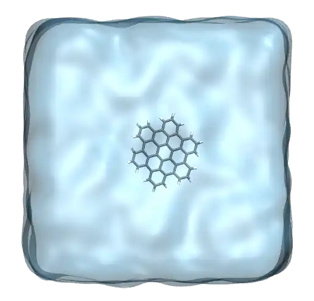
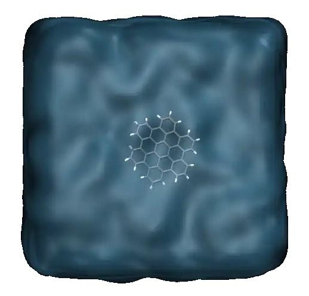
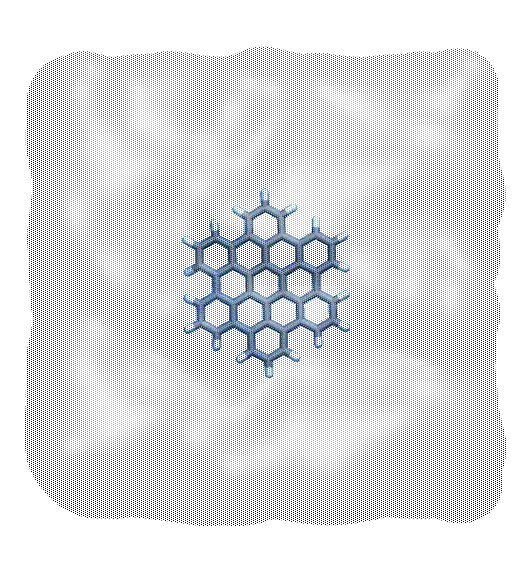

.. _solvation-energy-label:

Solvation energy
****************

.. container:: hatnote

    Calculating the free energy of solvation of a graphene-like molecule

..  container:: justify

    The objective of this tutorial is to use GROMACS
    to perform a molecular simulation of a large molecule in water. 
    By progressively switching off the interactions between the molecule and
    water, the free energy of solvation will be calculated. 

..  container:: justify

    The large and flat molecule used here is a graphene-like and
    discoid molecule named hexabenzocoronene (HBC) of
    formula :math:`\text{C}_{42}\text{H}_{18}`. The TIP4P/epsilon
    model is used for the water :cite:`fuentes2014non`.

.. include:: ../../non-tutorials/recommand-salt.rst
.. include:: ../../non-tutorials/needhelp.rst
.. include:: ../../non-tutorials/GROMACS2024.2.rst

Input files
===========

..  container:: justify

    Create two folders side-by side. Name the two folders *preparation/* and
    *solvation/*, and go to *preparation/*.

..  container:: justify

    Download the configuration files for the HBC molecule
    by clicking |FJEW_allatom_optimised_geometry.pdb|, and save it in
    the *preparation/* folder. The molecule 
    was downloaded from the |atb-HBC| on the automated topology builder
    (ATB) :cite:`malde2011automated`.

.. |FJEW_allatom_optimised_geometry.pdb| raw:: html

    <a href="https://raw.githubusercontent.com/gromacstutorials/gromacstutorials-inputs/main/level3/solvation-energy/preparation/FJEW_allatom_optimised_geometry.pdb" target="_blank">this page</a>

.. |atb-HBC| raw:: html

   <a href="https://atb.uq.edu.au/molecule.py?molid=151371#panel-md" target="_blank">atb</a>

Create the configuration file
-----------------------------

..  container:: justify

    First, let us convert the *.pdb* file into a *.gro* file
    within a cubic box of lateral size 3 nanometers using the *gmx trjconv*
    command. Type the following command in a terminal:

..  code-block:: bw

    gmx trjconv -f FJEW_allatom_optimised_geometry.pdb -s FJEW_allatom_optimised_geometry.pdb -o hbc.gro -box 3 3 3 -center  

..  container:: justify

    Select *system* for both centering and output.

.. figure:: ../figures/level3/solvation-energy/hbc-light.png
    :alt: Gromacs initial configuration of HBC graphene molecule
    :class: only-light
    :height: 250
    :align: center

.. figure:: ../figures/level3/solvation-energy/hbc-dark.png
    :alt: Gromacs initial configuration of HBC graphene molecule
    :class: only-dark
    :height: 250
    :align: center

..  container:: figurelegend

    Figure: HBC molecule as seen with VMD with carbon atoms in gray and hydrogen
    atoms in white. The honeycomb structure of the HBC is similar  to that
    of graphene.

..  container:: justify

    Alternatively, you can download the |solvation-hbc.gro| I have generated,
    and continue with the tutorial.

.. |solvation-hbc.gro| raw:: html

    <a href="https://raw.githubusercontent.com/gromacstutorials/gromacstutorials-inputs/main/level3/solvation-energy/preparation/hbc.gro" target="_blank">hbc.gro</a>

Create the topology file
------------------------

..  container:: justify

    Create a folder named *ff/* within the *preparation/* folder.
    Copy the force field parameters from the following *zip* file by 
    clicking |ff-itp.zip|. Both *FJEW_GROMACS_G54A7FF_allatom.itp* file
    and *gromos54a7_atb.ff/* folder were downloaded from the |atb-HBC|.

.. |ff-itp.zip| raw:: html

    <a href="https://raw.githubusercontent.com/gromacstutorials/gromacstutorials-inputs/main/level3/solvation-energy/preparation/ff-itp.zip" target="_blank">here</a>

..  container:: justify

    Then, let us write the topology (*top*) file by simply
    creating a blank file named *topol.top* within the
    *preparation/* folder. Copy the following lines into *topol.top*:

..  code-block:: bw

    #include "ff/gromos54a7_atb.ff/forcefield.itp"
    #include "ff/FJEW_GROMACS_G54A7FF_allatom.itp"

    [ system ]
    Single HBC molecule

    [ molecules ]
    FJEW 1

Solvate the HBC in water
------------------------

..  container:: justify

    Let us add water molecules to the system. First, download the tip4p
    water configuration (*.gro*) file |tip4p.gro|,
    and copy it in the *preparation/* folder. This is a fourth point water
    model with additional massless site where the charge of the
    oxygen atom is placed. Then, in
    order to add tip4p water molecules to both *.gro* and
    *.top* file, use the *gmx solvate* command as follows:

.. |tip4p.gro| raw:: html

    <a href="https://raw.githubusercontent.com/gromacstutorials/gromacstutorials-inputs/main/level3/solvation-energy/preparation/tip4p.gro" target="_blank">here</a>

..  code-block:: bw

    gmx solvate -cs tip4p.gro -cp hbc.gro -o solvated.gro -p topol.top

..  container:: justify

    The new *solvated.gro* file contains all *8804* atoms from the HBC
    molecule (called FJEW) and the water molecules. A new line
    *SOL 887* also appeared in the topology *.top* file:

..  code-block:: bw

    [ molecules ]
    FJEW 1
    SOL 887

..  container:: justify

    Alternatively, you can download the *solvated.gro* file I have generated by
    clicking |solvated.gro|, and continue with the tutorial.

.. |solvated.gro| raw:: html

    <a href="https://raw.githubusercontent.com/gromacstutorials/gromacstutorials-inputs/main/level3/solvation-energy/preparation/solvated.gro" target="_blank">here</a>

..  container:: justify

    Finally, save the topology file for the water, the |h2o.itp| file, in
    the *ff/* folder and add the *#include "ff/h2o.itp"* line to the *topol.top*
    file:

.. |h2o.itp| raw:: html

    <a href="https://raw.githubusercontent.com/gromacstutorials/gromacstutorials-inputs/main/level3/solvation-energy/preparation/ff/h2o.itp" target="_blank">h2o.itp</a>

..  code-block:: bw

    #include "ff/gromos54a7_atb.ff/forcefield.itp"
    #include "ff/FJEW_GROMACS_G54A7FF_allatom.itp"
    #include "ff/h2o.itp"

System equilibration
====================

..  container:: justify

    The system is now ready for the simulations. Let us first equilibrate it
    before measuring the solvation energy of the HBC molecule. 

Energy minimization
-------------------

..  container:: justify

    Create an *inputs/* folder inside the *preparation/* folder,
    and create a new blank file called
    *min.mdp* in it. Copy the following lines into *min.mdp*:

..  code-block:: bw

    integrator = steep
    nsteps = 50

    nstxout = 10

    cutoff-scheme = Verlet
    nstlist = 10
    ns_type = grid

    couple-intramol=yes

    vdw-type = Cut-off
    rvdw = 1.2

    coulombtype = pme
    fourierspacing = 0.1
    pme-order = 4
    rcoulomb = 1.2

    constraint-algorithm = lincs
    constraints = hbonds

..  container:: justify

    All these lines have been seen in the previous
    tutorials. In short, with this input script, GROMACS will perform a
    steepest descent by updating the atom positions
    according to the largest forces directions, until
    the energy and maximum force reach a reasonable value. 
    
..  container:: justify

    Apply the minimization to the solvated box using *gmx grompp* and *gmx mdrun*:

..  code-block:: bash

    gmx grompp -f inputs/min.mdp -c solvated.gro -p topol.top -o min -pp min -po min -maxwarn 1
    gmx mdrun -v -deffnm min

..  container:: justify

    Here, the *-maxwarn 1* option is used to ignore a WARNING from GROMACS
    about some issue with the force field. For this tutorial, we can safely
    ignore this WARNING.

..  container:: justify

    Let us visualize the atom trajectories during the
    minimization step using VMD by typing:

..  code-block:: bash

    vmd solvate.gro min.trr

.. figure:: ../figures/level3/solvation-energy/minimize-light.png
    :alt: Gromacs HBC (graphene) molecule after minimization in water
    :class: only-light
    :height: 400
    :align: center

.. figure:: ../figures/level3/solvation-energy/minimize-dark.png
    :alt: Gromacs HBC (graphene) molecule after minimization in water
    :class: only-dark
    :height: 400
    :align: center

.. container:: figurelegend

    Figure: The system after energy minimization showing the HBC molecule in water.
    The water is represented as a transparent field. 

NVT and NPT equilibration 
-------------------------

..  container:: justify

    Let us perform successively a NVT and a NPT relaxation steps. Copy the |solvation-nvt.mdp|
    and the |solvation-npt.mdp| files into the inputs folder, and run them both using:

.. |solvation-nvt.mdp| raw:: html

    <a href="https://raw.githubusercontent.com/gromacstutorials/gromacstutorials-inputs/main/level3/solvation-energy/preparation/inputs/nvt.mdp" target="_blank">nvt.mdp</a>

.. |solvation-npt.mdp| raw:: html

    <a href="https://raw.githubusercontent.com/gromacstutorials/gromacstutorials-inputs/main/level3/solvation-energy/preparation/inputs/npt.mdp" target="_blank">npt.mdp</a>

..  code-block:: bash

    gmx grompp -f inputs/nvt.mdp -c min.gro -p topol.top -o nvt -pp nvt -po nvt -maxwarn 1
    gmx mdrun -v -deffnm nvt
    gmx grompp -f inputs/npt.mdp -c nvt.gro -p topol.top -o npt -pp npt -po npt -maxwarn 1
    gmx mdrun -v -deffnm npt

.. figure:: ../figures/level3/solvation-energy/nvtnpt-dark.webp
    :alt: Gromacs HBC (graphene) molecule during NVT and NPT equilibration
    :class: only-dark
    :height: 400
    :align: center

.. container:: figurelegend

    Figure: Movie showing the motion of the atoms during the
    NVT and NPT equilibration steps. For clarity, the
    water molecules are represented as a continuum field.

Solvation energy measurement
============================

Files preparation
-----------------

..  container:: justify

    The equilibration of the system is complete. Let us perform the solvation
    free energy calculation, for which 21 independent
    simulations will be performed.
     
..  admonition:: About free energy calculation
    :class: info
     
    The interactions between the HBC molecule and the water
    are progressively turned-off, thus effectively
    mimicking the HBC molecule moving from bulk water
    to vacuum. Then, the free energy difference between the fully solvated
    and the fully decoupled configurations is measured.

..  container:: justify

    Within the *solvation/* folder, create an *inputs/*
    folders, and copy the following input file into it:
    |equilibration.mdp|.

.. |equilibration.mdp| raw:: html

    <a href="https://raw.githubusercontent.com/gromacstutorials/gromacstutorials-inputs/main/level3/solvation-energy/solvation/inputs/equilibration.mdp" target="_blank">equilibration.mdp</a>

..  container:: justify

    This input file starts similarly as the inputs previously used in this
    tutorial, with the exception of the integrator. Instead of the *md*
    integrator, a *sd* for stochastic dynamics integrator:

..  code-block:: bw

    integrator = sd
    nsteps = 20000
    dt = 0.001

..  container:: justify

    This stochastic integrator creates a Langevin dynamics by adding a friction
    and a noise term to Newton equations of motion. The *sd* integrator also
    serves as a thermostat, therefore *tcoupl* is set to *No*:

..  code-block:: bw

    tcoupl = No
    ld-seed = 48456
    tc-grps = Water non-Water
    tau-t = 0.5 0.5
    ref-t = 300 300

..  container:: justify

    A stochastic integrator can be a better option for free energy measurements,
    as it generates a better sampling, while also imposing a strong control
    of the temperature. This is particularly useful when the molecules are
    completely decoupled.

..  container:: justify

    The rest of the input deals with the progressive decoupling of the HBC molecule
    from the water:

..  code-block:: bw

    free_energy = yes
    vdw-lambdas = 0.0 0.1 0.2 0.3 0.4 0.5 0.6 0.7 0.8 0.9 1.0 1.0 1.0 1.0 1.0 1.0 1.0 1.0 1.0 1.0 1.0
    coul-lambdas = 0.0 0.0 0.0 0.0 0.0 0.0 0.0 0.0 0.0 0.0 0.0 0.1 0.2 0.3 0.4 0.5 0.6 0.7 0.8 0.9 1.0

..  container:: justify

    The *vdw-lambdas* is used to turn-off (when *vdw-lambdas = 0*) or 
    turn-on (when *vdw-lambdas = 1*) the van der Waals interactions, 
    and the *coul-lambdas* is used to turn-off/turn-on the Coulomb interactions.

..  container:: justify

    Here, there are 21 possible states, from *vdw-lambdas = coul-lambdas = 0.0*,
    where the HBC molecule is fully decoupled from the water, to 
    *vdw-lambdas = coul-lambdas = 1.0*, where the HBC molecule is fully coupled
    to the water. All the other state correspond to situation where the HBC
    molecule is partially coupled with the water. 

..  container:: justify

    The *sc-alpha* and *sc-power* options are used to turn-on a soft core
    repulsion between the HBC and the water molecules. This is necessary
    to avoid overlap between the decoupled atoms.

..  container:: justify

    The *init-lambda-state* is an integer that specifies which values of
    *vdw-lambdas* and *coul-lambdas* is used. When *init-lambda-state*, 
    then *vdw-lambdas = coul-lambdas = 0.0*. 21 one independent simulations
    will be performed, each with a different value of init-lambda-state:

..  code-block:: bw

    init-lambda-state =  0

..  container:: justify

    The *couple-lambda0* and *couple-lambda1* are used to specify that indeed
    interaction are turn-off when the *lambdas* are 0, and turn-on when the
    *lambdas* as 1:

..  code-block:: bw

    couple-lambda0 = none
    couple-lambda1 = vdw-q

..  container:: justify

    The parameter *nstdhdl* controls the frequency at
    which information are being printed in a *.xvg* file during
    the production run.

..  code-block:: bw

    nstdhdl = 0

..  container:: justify

    For the equilibration, there is no need of printing information. For
    the production runs, a value :math:`>0` will be used for nstdhdl.

..  container:: justify

    The 2 last lines impose that lambda points will be written out,
    and which molecule will be used for calculating solvation free energies:

..  code-block:: bw

    calc_lambda_neighbors = -1
    couple-moltype = FJEW

..  container:: justify

    Let us create a second input file almost identical to *equilibration.mdp*.
    Duplicate *equilibration.mdp*, name the duplicated file *production.mdp*.
    Within *production.mdp*, simply change *nstdhdl* from 0 to 100, so that 
    information about the state of the system will be printed by GROMACS
    every 100 step during the production runs.

..  container:: justify

    Finally, copy the previous *topol.top* file from the *preparation/* folder into
    *solvation/* folder. In oder to avoid duplicating the force field
    folder *ff/*, modify the path to the *.itp* files as follow: 

..  code-block:: bw

    #include "../preparation/ff/gromos54a7_atb.ff/forcefield.itp"
    #include "../preparation/ff/FJEW_GROMACS_G54A7FF_allatom.itp"
    #include "../preparation/ff/h2o.itp"

    [ system ]
    Single HBC molecule in water

    [ molecules ]
    FJEW 1
    SOL 887

Perform a 21-step loop
----------------------

..  container:: justify

    We need to a total of 2 x 21 simulations, 2 simulations per value of
    *init-lambda-state*. This can be done using a small bash script 
    with the *sed* (for *stream editor*) command.

..  container:: justify

    Create a new bash file fine within the 'solvation/'
    folder, call it *local-run.sh* can copy the
    following lines in it:

..  code-block:: bw

    #/bin/bash
    set -e 

    # create folder for analysis
    mkdir -p dhdl

    # loop on the 21 lambda state
    for state in $(seq 0 20)
    do
        # create folder for the lambda state
        DIRNAME=lambdastate${state}
        mkdir -p $DIRNAME

        # update the value of init-lambda-state
        newline='init-lambda-state = '$state
        linetoreplace=$(cat inputs/equilibration.mdp | grep init-lambda-state)
        sed -i '/'"$linetoreplace"'/c\'"$newline" inputs/equilibration.mdp
        linetoreplace=$(cat inputs/production.mdp | grep init-lambda-state)
        sed -i '/'"$linetoreplace"'/c\'"$newline" inputs/production.mdp

        gmx grompp -f inputs/equilibration.mdp -c ../preparation/npt.gro -p topol.top -o equilibration -pp equilibration -po equilibration -maxwarn 1
        gmx mdrun -v -deffnm equilibration -nt 4

        gmx grompp -f inputs/production.mdp -c equilibration.gro -p topol.top -o production -pp production -po production -maxwarn 1
        gmx mdrun -v -deffnm production -nt 4

        mv production.* $DIRNAME
        mv equilibration.* $DIRNAME  

        # create links for the analysis
        cd dhdl/
            ln -sf ../$DIRNAME/production.xvg md$state.xvg
        cd ..
    done

..  container:: justify

    Within this bash script, the variable *state* increases from 0 to 20 in a 
    for loop. At eash step of the loop, a folder *lambdastateX* is created,
    where *X* goes from 0 to 20. Then, the *sed* command is used twice to
    update the value of *init-lambda-state* in both *equilibration.mdp*
    and *production.mdp*.

..  container:: justify

    Then, GROMACS is used to run the *equilibration.mdp* script, and then
    the *production.mdp* script. When the simulations are done, the generated
    files are moved into the *lambdastateX* folder. Finally the *ln* command
    creates a link toward the *production.xvg* file within the *dhdl/* folder.

..  container:: justify

    Execute the bash script by typing:

..  code-block:: bash

    bash createfolders.sh

..  container:: justify

    Completing the 2 x 21 simulations may take a while, depending on your
    computer. When the simulation is complete, go the dhdl folder, and
    call the *gmx bar* command:

..  code-block:: bash

    gmx bar -f *.xvg

..  container:: justify

    The value of the solvation energy is printed in the terminal.
    In my case, I see:

..  code-block:: bash

    DG -64.62 +/- 6.35

..  container:: justify

    This indicate that the solvation energy is of :math:`-64.6 \pm 6.3`~kJ/mol.
    Note however that the present simulations are too short to give a
    reliable result. To accurately measure the solvation
    energy of a molecule, you should use much longer equilibration,
    typically one nanosecond, as well as much longer production runs,
    typically several nanoseconds.

.. include:: ../../non-tutorials/accessfile.rst
