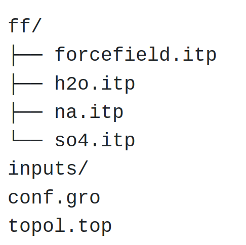
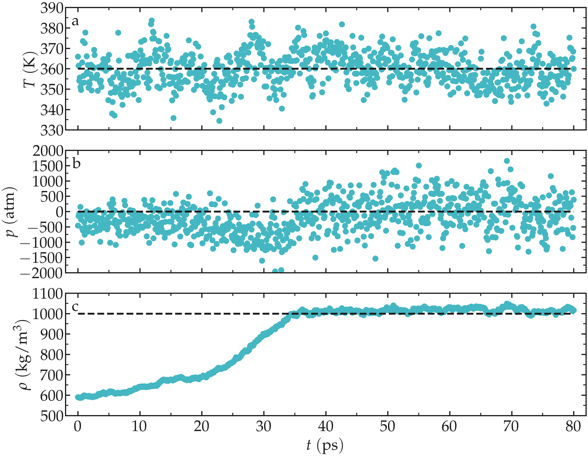

.. _bulk-solution-label:

Bulk salt solution
******************

.. container:: hatnote

    The very basics of GROMACS through a simple example

.. figure:: ../figures/level1/bulk-solution/video-solution-white.webp
    :alt: Water solution of SO\ :sub:`4`\ :sup:`2-` and Na\ :sup:`+` ions visualized with VMD
    :class: only-light
    :height: 250
    :align: right

.. figure:: ../figures/level1/bulk-solution/video-solution-dark.webp
    :alt: Water solution of SO\ :sub:`4`\ :sup:`2-` and Na\ :sup:`+` ions visualized with VMD
    :class: only-dark
    :height: 250
    :align: right

The objective of this tutorial is to use the open-source code GROMACS
:cite:`van2005gromacs` to perform a molecular dynamics simulation. The
system consists of a bulk solution of water mixed with sodium
(Na\ :sup:`+`) and sulfate (SO\ :sub:`4`\ :sup:`2-`) ions.

This tutorial demonstrates how to set up a simulation box, solvate it
with water, and add ions. It also introduces key components of molecular
dynamics simulations, including energy minimization, thermostating, and
*NVT* and *NpT* equilibrations. The resulting trajectory is analyzed
using GROMACS utilities to extract properties such as the radial distribution
function (RDF) and mean squared displacement (MSD). Trajectories are
visualized using VMD :cite:`humphrey1996vmd`.

.. include:: ../../non-tutorials/needhelp.rst
.. include:: ../../non-tutorials/GROMACS2024.2.rst

The input files
===============

In order to run the present simulation using GROMACS,
we need the 3 following files (or sets of files):

- 1) A **configuration file** (.gro) containing the
  initial positions of the atoms and the box
  dimensions.
- 2) A **topology file** (.top) specifying the
  location of the force field files (.itp).
- 3) An **input file** (.mdp) containing the
  parameters of the simulation (e.g. temperature, timestep).

The specificity of the present tutorial is that both configuration
and topology files were prepared with homemade Python scripts, see
:ref:`create-conf-label`. In principle, it is also possible to
prepare the system using GROMACS functionalities, such as 
*gmx pdb2gmx*, *gmx trjconv*, or *gmx solvate*. This will be done
in the next tutorial, :ref:`protein_electrolyte-label`.

1) The configuration file (.gro)
--------------------------------

For the present simulation, the initial atom
positions and box size are given in a *conf.gro* file
(Gromos87 format) that you can download by clicking |conf-SO4.gro|.
Save the *conf.gro* file in a folder. 

.. |conf-SO4.gro| raw:: html

    <a href="https://raw.githubusercontent.com/gromacstutorials/gromacstutorials-inputs/main/level1/bulk-solution/conf.gro" target="_blank">here</a>

The *conf.gro* file looks like this:

..  code-block:: bw

    Na2SO4 solution
    2846
       1  SO4   O1    1   2.608   3.089   2.389
       1  SO4   O2    2   2.562   3.181   2.150
       1  SO4   O3    3   2.388   3.217   2.339
       1  SO4   O4    4   2.425   2.980   2.241
       1  SO4   S1    5   2.496   3.117   2.280
    (...)
     719  Sol  OW1 2843   3.220   2.380   1.540
     719  Sol  HW1 2844   3.279   2.456   1.540
     719  Sol  HW2 2845   3.279   2.304   1.540
     719  Sol  MW1 2846   3.230   2.380   1.540
   3.36000   3.36000   3.36000

The first line *Na2SO4 solution* is just a comment, the second line is the
total number of atoms, and the last line is the box dimension in nanometer,
here 3.36 nm by 3.36 nm by 3.36 nm. Between the second and the
last lines, there is one line per
atom. Each line indicates, from left to right:

- the residue ID, with all the atoms from the same SO\ :sub:`4`\ :sup:`2-` ion sharing the same residue ID,
- the residue name,
- the atom name,
- the atom ID,
- the atom position: *x*, *y*, and *z* coordinates in nanometer.
    
Note that the format of a *.gro* file is fixed,
and each column is in a fixed position.

The *conf.gro* file can be visualized using VMD by
typing in the terminal:

..  code-block:: bash

     vmd conf.gro

.. figure:: ../figures/level1/bulk-solution/step0-dark.png
    :alt: Gromacs initial configuration of SO\ :sub:`4`\ :sup:`2-` and Na\ :sup:`+` ions visualized with VMD
    :class: only-dark

.. container:: figurelegend

    Figure: SO\ :sub:`4`\ :sup:`2-` ions, Na\ :sup:`+` ions, and water molecules.
    Oxygen atoms are in red, hydrogen in white, sodium in blue, and sulfur in
    yellow. For better rendering, the atom representation and colors
    were modified with respect to the default VMD representation. If 
    you want to obtain the same rendering, you can follow this 
    |vmd-tutorial| from the LAMMPS tutorials webpage to obtain a similar rendering.

.. |vmd-tutorial| raw:: html

    <a href="https://lammpstutorials.github.io/sphinx/build/html/tutorials/vmd/vmd-tutorial.html" target="_blank">VMD tutorial</a>

As can be seen using VMD, the water molecules are
arranged in a quite unrealistic and regular manner, with
all dipoles facing in the same direction, and possibly
wrong distances between some of the molecules and ions.
This will be fixed during energy minimization.

2) The topology files (.top .itp)
-------------------------------------

The topology file contains information about the
interactions of the different atoms and molecules. You
can download it by clicking |topol-SO4.top|.
Place it in the same folder as the *conf.gro* file. The
*topol.top* file looks like that:

.. |topol-SO4.top| raw:: html

    <a href="https://raw.githubusercontent.com/gromacstutorials/gromacstutorials-inputs/main/level1/bulk-solution/topol.top" target="_blank">here</a>

..  code-block:: bw

    #include "ff/forcefield.itp"
    #include "ff/h2o.itp"
    #include "ff/na.itp"
    #include "ff/so4.itp"

    [ System ]
    Na2SO4 solution

    [ Molecules ]
    SO4 6
    Na 12
    SOL 701

The 4 first lines are used to include the values of the
parameters that are given in 4 separate files located in the *ff/*
folder (see below). 
    
The rest of the *topol.top* file contains the system
name (*Na2SO4 solution*), and the list of the residues. Here there
is 6 SO\ :sub:`4`\ :sup:`2-` ions,
12 Na\ :sup:`+` ions,
and 701 water molecules. It is crucial
that the order and number of residues in the topology file 
match the order of the *conf.gro* file. If you open the *conf.gro*
file, you can see that indeed the first 30 lines beyond to the
6 SO\ :sub:`4`\ :sup:`2-` residues, the next 12 lines to the
12 Na\ :sup:`+` residues, and that the remaining lines concern the
water molecules.
    
Create a folder named *ff/* next to the *conf.gro* and the
*topol.top* files, and copy
|forcefield.itp|, |h2o.itp|, |na.itp|, and |so4.itp|
in it. These four files contain information about
the atoms (names, masses, changes, Lennard-Jones
coefficients) and residues (bond and angular
constraints) for all the species that are involved here.

.. |forcefield.itp| raw:: html

    <a href="https://raw.githubusercontent.com/gromacstutorials/gromacstutorials-inputs/main/level1/bulk-solution/ff/forcefield.itp" target="_blank">forcefield.itp</a>

.. |h2o.itp| raw:: html

    <a href="https://raw.githubusercontent.com/gromacstutorials/gromacstutorials-inputs/main/level1/bulk-solution/ff/h2o.itp" target="_blank">h2o.itp</a>

.. |na.itp| raw:: html

    <a href="https://raw.githubusercontent.com/gromacstutorials/gromacstutorials-inputs/main/level1/bulk-solution/ff/na.itp" target="_blank">na.itp</a>

.. |so4.itp| raw:: html

    <a href="https://raw.githubusercontent.com/gromacstutorials/gromacstutorials-inputs/main/level1/bulk-solution/ff/so4.itp" target="_blank">so4.itp</a>

For instance, the *forcefield.itp* file contains a line that specifies
the combination rules as *comb-rule 2*, which corresponds to
the well-known Lorentz-Berthelot rule,
where :math:`\epsilon_{ij} = \sqrt{\epsilon_{ii} \epsilon_{jj}}` and
:math:`\sigma_{ij} = (\sigma_{ii}+\sigma_{jj})/2`
:cite:`lorentz1881ueber,berthelot1898melange`:

..  code-block:: bw

    [ defaults ]
    ; nbfunc  comb-rule  gen-pairs  fudgeLJ  fudgeQQ
    1       2          no         1.0      0.833
    
The fudge parameters specify how the pair interaction between
fourth neighbors in a residue are handled, which is not relevant for
the small residues considered here. The *forcefield.itp* file also
contains the list of atoms, and their respective charge in the units of
the elementary charge :math:`e`, as well as their respective Lennard-Jones
parameters :math:`\sigma` (in nanometer)
and :math:`\epsilon` (in kJ/mol):

..  code-block:: bw

    [ atomtypes ]
    ; name  at.num  mass      charge  ptype  sigma    epsilon
    Na    11      22.9900   1.0000  A      0.23100  0.45000
    OS     8      15.9994  -1.0000  A      0.38600  0.12
    SO    16      32.0600   2.0000  A      0.35500  1.0465
    HW     1       1.0079   0.5270  A      0.00000  0.00000
    OW     8      15.9994   0.0000  A      0.31650  0.77323
    MW     0       0.0000  -1.0540  D      0.00000  0.00000

Here the *ptype* is used to differential the real atoms (A), such as 
hydrogens and oxygens, from the virtual and massless site of the
four-point water model (D).

Finally, the *h2o.itp*, *na.itp*, and *so4.itp* files contain information 
about the residues, such as their exact compositions, which pairs of
atoms are connected by bonds as well as the parameters for these bonds.
In the case of the SO\ :sub:`4`\ :sup:`2-`,
for instance, the sulfur atom forms a bond of equilibrium distance
:math:`0.152~\text{nm}`
and rigidity constant :math:`3.7656 \mathrm{e}4 ~ \text{kJ/mol/nm}^2`
with each of the four oxygen atoms:

..  code-block:: bw

    [ bonds ]
    ;  ai   aj  funct   c0         c1
        1    5    1   0.1520   3.7656e4
        2    5    1   0.1520   3.7656e4
        3    5    1   0.1520   3.7656e4
        4    5    1   0.1520   3.7656e4

3) The input file (.mdp)
------------------------

The input file contains instructions about the
simulation, such as

- the number of steps to perform,
- the thermostat to be used (e.g. Langevin :cite:`schneider1978molecular`, Berendsen :cite:`berendsen1984molecular`),
- the cut-off for the interactions,
- the integrator or algorithms (e.g. steepest-descent :cite:`debye1909naherungsformeln`, leap-frog :cite:`allen2017computer`).

In this tutorial, 4 different input files will be
written to perform respectively an energy
minimization of the salt solution, an equilibration
in the NVT ensemble (i.e. with fixed box size), an equilibration
in the NPT ensemble (i.e. with changing box size), and finally
a production run.

Input files will be placed in an *inputs/* folder
that must be created next to *ff/*. 

.. figure:: ../figures/level1/bulk-solution/gromacs_inputs-dark.png
    :alt: Gromacs files and structure folder
    :height: 200
    :class: only-dark

.. container:: figurelegend

    Figure: Structure of the folder with the *.itp*, *.gro*, and *.top*
    files.

The rest of the tutorial focuses on writing the input files and performing the
molecular dynamics simulation. 

Energy minimization
===================

It is clear from the configuration (.gro) file that the molecules and ions
are currently in a quite unphysical configuration. It would be risky to
directly start the molecular dynamics simulation as
atoms would undergo huge forces and accelerate, and the system could
eventually explode.

To bring the system into a more favorable state,
let us perform an energy minimization which
consists in moving the atoms until the forces between them are reasonable.

Open a blank file, call it *min.mdp*, and save it in the
*inputs/* folder. Copy the following lines into *min.mdp*:

..  code-block:: bw

    integrator = steep
    nsteps = 5000

These two commands specify to GROMACS that the algorithm
to be used is the |speepest-descent|
which moves the atoms following the direction of the largest forces
until one of the stopping criteria is reached :cite:`debye1909naherungsformeln`. 
The *nsteps* command specifies the maximum number of steps to perform.

.. |speepest-descent| raw:: html

    <a href="https://manual.gromacs.org/current/reference-manual/algorithms/energy-minimization.html" target="_blank">steepest-descent</a>

To visualize the trajectory of the atoms during the minimization,
let us also add the following command to the input
file:

..  code-block:: bw

    nstxout = 10

The *nstxout* parameter requests GROMACS to print the atom
positions every 10 steps in a *.trr* trajectory file that can
be read by VMD. We now have a very minimalist input script, let us try
it. From the terminal, type:

..  code-block:: bash

    gmx grompp -f inputs/min.mdp -c conf.gro -p topol.top -o min -pp min -po min
    gmx mdrun -v -deffnm min

The *grompp* command is used to preprocess the
files in order to prepare the simulation. The *grompp* command also
checks the validity of the files. By using
the *-f*, *-c*, and *-p* keywords, we specify which
input, configuration, and topology files must be
used, respectively. The other keywords *-o*, *-pp*, and *-po* are
used to specify the names of the output that will be
produced during the run. 

The *mdrun* command calls the engine
performing the computation from the preprocessed
files (which is recognized thanks to the *-deffnm* keyword). The *-v*
option enables *verbose* for more
information printed in the terminal.

If everything works, you should see something like:

..  code-block:: bw

    :-) GROMACS - gmx mdrun, 2023.2 (-:
    Executable:   /usr/bin/gmx
    Data prefix:  /usr
    (...)
    Steepest Descents converged to machine precision in 961 steps,
    but did not reach the requested Fmax < 10.
    Potential Energy  = -4.4659062e+04
    Maximum force     =  2.2164763e+02 on atom 15
    Norm of force     =  4.5976703e+01

The information printed in the terminal indicates us
that energy minimization has been performed, even
though the precision that was asked from the default
parameters were not reached. We can ignore this message,
as long as the final energy is large and negative,
the simulation will work just fine. 

The final potential energy is large and
negative, and the maximum force is as small as :math:`220 ~ \text{kJ/mol/nm}`
(about 0.4 pN). Everything seems alright.
Let us visualize the trajectories of the atoms during the
minimization step using VMD by typing in the terminal:

..  code-block:: bash

    vmd conf.gro min.trr

.. figure:: ../figures/level1/bulk-solution/solution-light.webp
    :alt: Gromacs tutorial : Movie showing the motion of the atoms during the energy minimization.
    :class: only-light
    :height: 330

.. figure:: ../figures/level1/bulk-solution/solution-dark.webp
    :alt: Gromacs tutorial : Movie showing the motion of the atoms during the energy minimization.
    :class: only-dark
    :height: 330

.. container:: figurelegend

    Figure: Movie showing the motion of the atoms during the energy minimization.

.. admonition:: Note for VMD users
    :class: info

    You can avoid having
    molecules *cut in half* by the periodic boundary
    conditions by rewriting the trajectory using:

    ..  code-block:: bash
        
        gmx trjconv -f min.trr -s min.tpr -o min_whole.trr -pbc whole

    Then, select the group of your choice for the output.

One can see that the molecules reorient themselves
into more energetically favorable positions, and that
the distances between the atoms are being
progressively homogenized.

Let us have a look at the
evolution of the potential energy of the system. To do
so, we can use the *gmx energy* command of
GROMACS. In the terminal, type:

..  code-block:: bash

    gmx energy -f min.edr -o potential-energy-minimization.xvg

Choose *potential* (in my case I have to type *5*),
then press *Enter* twice. 

Here, the portable energy file *min.edr* produced
by GROMACS during the *minimization run* is used, and the
result is saved in the *potential-energy-minimization.xvg* file.

.. figure:: ../figures/level1/bulk-solution/potential-energy-min-light.png
    :alt: Gromacs tutorial : plot of the energy versus time.
    :class: only-light

.. container:: figurelegend

    Figure: Evolution of the potential energy :math:`E_\text{p}` as a function of the
    number of steps during energy minimization.

One can see from the energy plot that
the potential energy is initially huge and positive,
which is the consequence of atoms being too close from
one another, as well as molecules being wrongly oriented.
As the minimization progresses, the potential energy
rapidly decreases and reaches a large and negative
value, which is usually the sign
that the atoms are located at appropriate distances from each other. 

Thank to the energy minimization, the system is now in a favorable state
and the molecular dynamics simulation can be started safely.

Minimalist NVT input file
=========================

Let us first perform a short (20 picoseconds)
equilibration in the NVT ensemble. In the NVT ensemble, the number of
atoms (N) and the volume (V) are maintained fixed, and the
temperature of the system (T) is adjusted using a thermostat.

Let us write a new input script called *nvt.mdp*, and save it in
the *inputs/* folder. Copy the following lines into it:

..  code-block:: bw

    integrator = md
    nsteps = 20000
    dt = 0.001

Here, the molecular dynamics (md) integrator is used, this is a leap-frog
algorithm integrating Newton equations of motion. A number of 20000 steps with
a timestep *dt* equal of :math:`0.001 ~ \text{ps}` will be performed.

Let us also ask GROMACS to print the trajectory in a compressed *xtc* file
every 1000 steps, or every 1 ps, by adding the following line to *nvt.mdp*:

..  code-block:: bw

    nstxout-compressed = 1000

Let us also control the temperature throughout the
simulation using the v-rescale thermostat, which is
the Berendsen thermostat with an additional stochastic
term :cite:`bussi2007canonical`.

..  code-block:: bw

    tcoupl = v-rescale
    ref-t = 360
    tc-grps = system
    tau-t = 0.5

The v-rescale thermostat is known to give
a proper canonical ensemble. Here, we also specified that the thermostat is
applied to the entire system using the *tc-grps* option and that the
damping constant for the thermostat, *tau-t*, is equal to 0.5 ps.

Note that the relatively high temperature of 360 K
has been chosen here to reduce the viscosity of the solution and
decrease the equilibration duration. 
    
We now have a minimalist input file for performing
the first NVT simulation. Run it by typing in the terminal:

..  code-block:: bw

    gmx grompp -f inputs/nvt.mdp -c min.gro -p topol.top -o nvt -pp nvt -po nvt
    gmx mdrun -v -deffnm nvt

Here *-c min.gro* ensures that the previously
minimized configuration is used as a starting point.

After the completion of the simulation, we can
ensure that the system temperature indeed reached
the value of 360 K by using the energy command of
GROMACS. In the terminal, type:

..  code-block:: bw

    gmx energy -f nvt.edr -o temperature-nvt-minimal.xvg

and choose *temperature*.

From the generated *temperature-nvt-minimal.xvg* file, one can see that temperature
started from 0 K, which was expected since the atoms have no velocity
during a minimization step, and reaches a temperature slightly larger than the
requested 360 K after a duration of a few picoseconds.

In general, it is better to perform a longer equilibration, but simulation
durations are kept as short as possible for these tutorials. 

.. figure:: ../figures/level1/bulk-solution/temperature-nvt-minimal-light.png
    :alt: Gromacs tutorial : temperature versus time.
    :class: only-light

.. figure:: ../figures/level1/bulk-solution/temperature-nvt-minimal-dark.png
    :alt: Gromacs tutorial : temperature versus time.
    :class: only-dark

.. container:: figurelegend

    Figure: Evolution of the temperature :math:`T` as a function of
    the time :math:`t` during the NVT equilibration. The dashed line is the
    requested temperature of 360 K.

Improving the NVT input
=======================

So far, very few commands have been placed in the
*.mdp* input file, meaning that most of the instructions
have been taken by GROMACS from the default
parameters. You can find what parameters were used
during the last nvt run by opening the new *nvt.mdp*
file that has been created in the main folder.
Exploring this new *nvt.mdp* file shows us that, for
instance, plain cut-off Coulomb interactions have
been used:

..  code-block:: bw

    (...)
    ; Method for doing electrostatics
    coulombtype = Cut-off
    (...)

For this system, computing the long-range Coulomb interactions is necessary,
because electrostatic forces between charged particles decay slowly,
as the inverse of the square of the distance between them, :math:`1/r^2`.

In addition, the thermostating of the system should be improved, given that
the temperature of the system is slightly larger than the desired temperature.
For instance, separate thermostats can be applied to the water molecules
and the ions.

Let us improve the input used for the NVT step.
First, in the *nvt.mdp* file, let us impose the calculation of long-range
electrostatic, by the use of the
long-range fast smooth particle-mesh ewald (SPME)
electrostatics with Fourier spacing of :math:`0.1~\text{nm}`, order
of 4, and cut-off of :math:`1~\text{nm}` :cite:`darden1993particle, essmann1995smooth`:

..  code-block:: bw

    coulombtype = pme
    fourierspacing = 0.1
    pme-order = 4
    rcoulomb = 1.0

Here, the cut-off *rcoulomb* separates the short-range interactions from the
long-range interactions. Long-range interactions are treated in the
reciprocal space, while short-range interactions are computed directly.

Let us also impose how the short-range van der Waals interactions
should be treated by GROMACS, as well as the cut-off *rvdw*
of :math:`1~\text{nm}`:

..  code-block:: bw

    vdw-type = Cut-off
    rvdw = 1.0

Let us use the LINCS algorithm to constrain the hydrogen
bonds :cite:`hess1997lincs`. The water
molecules will thus be treated as rigid, which is generally better given
the fast vibration of the hydrogen bonds.

..  code-block:: bw

    constraint-algorithm = lincs
    constraints = hbonds
    continuation = no

Let us also use separate temperature baths for
the water molecules and the ions. Here, the ions are included
in the default GROMACS group called *non-water*.
Within *nvt.mdp*, replace the following lines:

..  code-block:: bw

    tcoupl = v-rescale
    ref-t = 360
    tc-grps = system
    tau-t = 0.5

by:

..  code-block:: bw

    tcoupl = v-rescale
    tc-grps = Water non-Water
    tau-t = 0.5 0.5
    ref-t = 360 360

Now, the same temperature :math:`T = 360 ~ \text{K}` is imposed to the
two groups with the same characteristic time :math:`\tau = 0.5 ~ \text{ps}`.
      
Let us also specify the neighbor searching parameters:

..  code-block:: bw

    cutoff-scheme = Verlet
    nstlist = 10
    ns_type = grid

Let us give an initial kick to the atom so that the initial
total velocities give the desired temperature of 360 K instead of 0 K
as previously:

..  code-block:: bw

    gen-vel = yes
    gen-temp = 360

Finally, let us cancel the translational of the center of mass
of the system:

..  code-block:: bw

    comm_mode = linear
    comm_grps = system

Run again GROMACS using this new input script. One difference with the
previous (minimalist) NVT run is
the temperature at the beginning of the run. The final
temperature is also much closer to the desired temperature of 360 K.

.. container:: figurelegend

    Figure: Evolution of the temperature as a function of the time
    during the NVT equilibration.

Adjust the density using NPT
============================

Now that the temperature of the system is properly equilibrated,
let us continue the simulation using the
NPT ensemble, where the pressure of the system is imposed by a barostat
and the volume of the box is allowed to relax. During NPT relaxation, the
density of the fluid should converge toward its equilibrium value.
Create a new input script, call it *npt.mdp*, and
copy the following lines in it:

..  code-block:: bw

    integrator = md
    nsteps = 80000
    dt = 0.001

    comm_mode = linear
    comm_grps = system

    cutoff-scheme = Verlet
    nstlist = 10
    ns_type = grid

    nstlog = 100
    nstenergy = 100
    nstxout-compressed = 1000

    vdw-type = Cut-off
    rvdw = 1.0

    coulombtype = pme
    fourierspacing = 0.1
    pme-order = 4
    rcoulomb = 1.0

    constraint-algorithm = lincs
    constraints = hbonds

    tcoupl = v-rescale
    ld-seed = 48456
    tc-grps = Water non-Water
    tau-t = 0.5 0.5
    ref-t = 360 360

    pcoupl = C-rescale
    Pcoupltype = isotropic
    tau_p = 1.0
    ref_p = 1.0
    compressibility = 4.5e-5

The main difference with the previous NVT script is
the addition of the isotropic C-rescale pressure
coupling with a target pressure of 1 bar :cite:`bernetti2020pressure`.
Another difference is the addition of the *nstlog* and
*nstenergy* commands to control the frequency at
which information is printed in the log file and in
the energy file (*edr*). Note also the removing the
*gen-vel* commands, because the atoms already have a velocity. 
    
Run the NPT equilibration using:

..  code-block:: bash 

    gmx grompp -f inputs/npt.mdp -c nvt.gro -p topol.top -o npt -pp npt -po npt
    gmx mdrun -v -deffnm npt

Let us have a look a the temperature, the pressure, and the
volume of the box during the NPT step using the *gmx energy*
command 3 consecutive times:

..  code-block:: bash

    gmx energy -f npt.edr -o temperature-npt.xvg
    gmx energy -f npt.edr -o pressure-npt.xvg
    gmx energy -f npt.edr -o density-npt.xvg

Choose respectively *temperature*, *pressure* and *density*.
This is what I see:

.. figure:: ../figures/level1/bulk-solution/temperature-npt-dark.png
    :alt: Gromacs tutorial : NPT equilibration
    :class: only-dark

..  container:: figurelegend

    Figure: Evolution of the temperature :math:`T` (a),
    pressure :math:`p` (b),
    and fluid density :math:`\rho` (c) as a
    function of the time during the NPT equilibration.

The results show that the temperature remains well
controlled during the NPT run, and
that the fluid density was initially too small,
i.e. :math:`\rho \approx 600\,\mathrm{kg}/\mathrm{m}^3`.
Due to the change in volume induced by the barostat, the fluid density 
gently reaches its equilibrium value of about :math:`1000\,\mathrm{kg}/\mathrm{m}^3`
after approximately 40 pico-seconds. Once the system has reached its equilibrium
density, the pressure stabilizes itself near the desired value of 1 bar.

The pressure curve reveals large oscillations in the pressure, with the pressure alternating between large negative
values and large positive values. These large oscillations are typical in molecular dynamics, and not a source of
concern here.

Radial distribution function
============================

Let us perform a :math:`400~\text{ps}` run in the NVT ensemble, during which the atom positions will be printed every
pico-second. The trajectory will then be used to measure radial distribution functions and probe the solvation
environment of the ions. 
        
Create a new input file within the *inputs/* folder, call it *production.mdp*, and copy the following lines into it:

..  code-block:: bw 

    integrator = md
    nsteps = 400000
    dt = 0.001

    comm_mode = linear
    comm_grps = system

    cutoff-scheme = Verlet
    nstlist = 10
    ns_type = grid

    nstlog = 100
    nstenergy = 100
    nstxout-compressed = 1000

    vdw-type = Cut-off
    rvdw = 1.0

    coulombtype = pme
    fourierspacing = 0.1
    pme-order = 4
    rcoulomb = 1.0

    constraint-algorithm = lincs
    constraints = hbonds

    tcoupl = v-rescale
    ld-seed = 48456
    tc-grps = Water non-Water
    tau-t = 0.5 0.5
    ref_t = 360 360

Run it using:

..  code-block:: bash 

    gmx grompp -f inputs/production.mdp -c npt.gro -p topol.top -o production -pp production -po production
    gmx mdrun -v -deffnm production

When the simulation is completed, let us compute the radial
distribution functions between :math:`\text{Na}^+` and
:math:`\text{H}_2\text{O}`, 
:math:`\text{SO}_4^{2-}` and 
:math:`\text{H}_2\text{O}`,
as well as in between :math:`\text{H}_2\text{O}` molecules.
This can be done using the *gmx rdf* command as follows:
    
..  code-block:: bash 

    gmx rdf -f production.xtc -s production.tpr -o na-sol-rdf.xvg

Selecting the sodium ions, and then the water. Repeat the same operation for 
the sulfate and water, and for the water and water. For the water-water
RDF, it is better to exclude the intra-molecular contribution using
the *-excl* option, as follows:

..  code-block:: bash 

    gmx rdf -f production.xtc -s production.tpr -o sol-sol-rdf.xvg -excl
    
.. figure:: ../figures/level1/bulk-solution/rdf-production-light.png
    :alt: Gromacs tutorial RDF radial distribution function
    :class: only-light

.. container:: figurelegend

    Figure: Radial distribution functions (RDF) as calculated between sodium
    and water, between sulfate and water, and finally between water and water.

The radial distribution functions highlight the typical distance between
the different species of the fluid. For instance, it can be seen that
there is a strong hydration layer of water around sodium ions at a typical
distance of :math:`2.4 ~ \text{Å}` from the center of the sodium ion.

Mean square displacement
========================

To probe the system dynamics, let us compute the mean square
displacement for all 3 species.  For the sulfate ion, type:

..  code-block:: bash 

    gmx msd -f production.xtc -s production.tpr -o so4-msd.xvg

Select the :math:`\text{SO}_4^{2-}` ions (in my case, it is done by typing
*2*), and then press *ctrl D*. Repeat the same operation for the sodium
ions and for the water molecules.

The slope of the MSD in the limit of long times gives an estimate of the diffusion
coefficient, following :math:`D = \text{MSD} / 2 d t`,
where :math:`d = 3` is the dimension of the system. Here,
I find a value of :math:`1.4 \mathrm{e}-5 ~ \text{cm}^2/\text{s}` for the
diffusion coefficient of the sulfur ions. 
    
Repeat the same for :math:`\text{Na}^+` and water. 

For sodium, I find a value of :math:`1.6 \mathrm{e}-5 ~ \text{cm}^2/\text{s}`
for the diffusion coefficient,
and for water :math:`5.3 \mathrm{e}-5 ~ \text{cm}^2/\text{s}`.
For comparison, the experimental diffusion coefficient of *pure* water at 
temperature :math:`T = 360~\text{K}`
is :math:`7.3 \mathrm{e}-5 ~ \text{cm}^2/\text{s}` :cite:`simpson1958diffusion`.
In the presence of ions, the diffusion coefficient of water is expected to
be reduced.

.. container:: figurelegend

    Figure: Mean square displacement (msd) for the three species. The dashed line
    highlight the proportionality between msd and time :math:`t` which is expected
    at long times, when the system reaches the diffusive regime.

.. admonition:: About diffusion coefficient measurement in molecular simulations
    :class: info

    In principle, diffusion coefficients obtained from the MSD in a
    finite-sized box must be corrected, but this is beyond the scope of
    the present tutorial :cite:`loche2021transferable`.

.. include:: ../../non-tutorials/accessfile.rst
