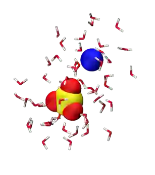
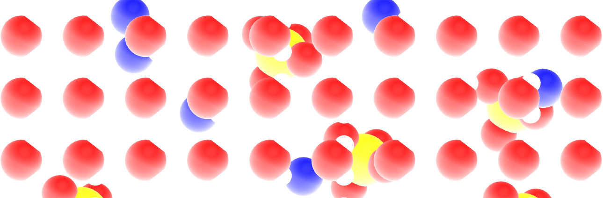
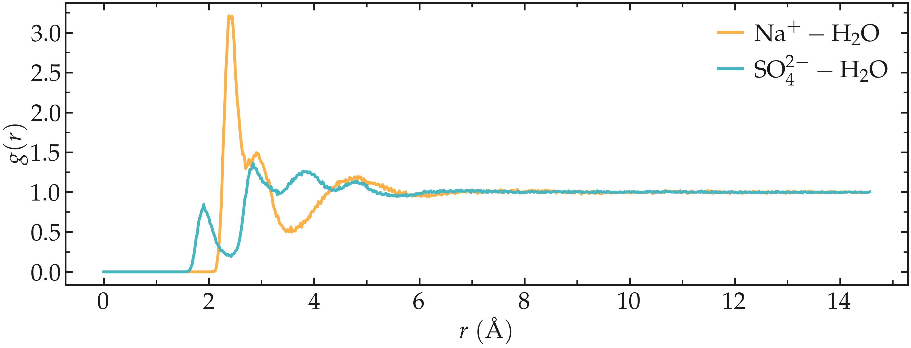

.. _bulk-solution-label:

Bulk salt solution
******************

.. container:: hatnote

    The very basics of GROMACS through a simple example

.. figure:: figures/video-solution-white.webp
    :alt: Water solution of SO\ :sub:`4`\ :sup:`2-` and Na\ :sup:`+` ions visualized with VMD
    :class: only-light
    :height: 250
    :align: right



The objective of this tutorial is to use the open-source code GROMACS
:cite:`van2005gromacs` to perform a molecular dynamics simulation. The
system consists of a bulk solution of water mixed with sodium
(:math:`\text{Na}_+`) and sulfate (:math:`\text{SO}_4^{2-}`) ions.

This tutorial guides you through setting up a simulation box,
adding species to it, and then solvating them with water.
It also introduces key components of molecular
dynamics simulations, including energy minimization, thermostating, and
both :math:`NVT` and :math:`NpT` equilibration steps. The resulting trajectory
is analyzed using GROMACS utilities, radial distribution functions are
extracted, and the trajectories are visualized using VMD :cite:`humphrey1996vmd`.

.. include:: ../../non-tutorials/needhelp.rst
.. include:: ../../non-tutorials/GROMACS2024.2.rst

..
    The input files
    ===============
    In order to run the present simulation using GROMACS, we need to
    prepare the following three files (or sets of files):

    - 1) A **configuration file** (**.gro**) containing the initial positions of
    the atoms and the box dimensions.

    - 2) A **topology file** (**.top**) specifying the location of the force
    field files (**.itp**) and the number of residues in the simulation.

    - 3) An **input file** (**.mdp**) containing the simulation parameters
    (e.g., imposed temperature, timestep, and cut-off values).

    ..
        The specificity of the present tutorial is that both configuration
        and topology files were prepared with homemade Python scripts, see
        :ref:`create-conf-label`. In principle, it is also possible to
        prepare the system using GROMACS functionalities, such as 
        *gmx pdb2gmx*, *gmx trjconv*, or *gmx solvate*. This will be done
        in the next tutorial, :ref:`protein_electrolyte-label`.

Populating the box
==================

Let us create the simulation box by placing the ions and molecules into it. To do  
so, we start from an empty box. In a dedicated folder, create an empty file  
called |empty.gro|, and copy the following lines into it:

..  code-block:: bw

    Cubic box
    0
    3.50000   3.50000   3.50000

.. |empty.gro| raw:: html

    <a href="https://raw.githubusercontent.com/gromacstutorials/gromacstutorials-inputs/main/tutorial1/empty.gro" target="_blank">empty.gro</a>

The first line, *Cubic box*, is a comment; the second line indicates the total
number of atoms (0); and the last line defines the box dimensions in
nanometers -- in this case, 3.5 by 3.5 by :math:`3.5~\text{nm}`. This **.gro** file
is written in |Gromos87| format.

.. |Gromos87| raw:: html

    <a href="https://manual.gromacs.org/archive/5.0.4/online/gro.html" target="_blank">Gromos87</a>

Let us populate this empty box with :math:`\text{SO}_4^{2-}` ions first. To do so,
the GROMACS command named ``insert-molecules`` is used, for which one needs to
provide a template for the ion. Within the same folder as **empty.gro**, create a
new file named |so4.gro|, and copy the following lines into it:

..  code-block:: bw

    SO4 ion
    5
        1  SO4   O1    1   0.608   1.089   0.389
        1  SO4   O2    2   0.562   1.181   0.150
        1  SO4   O3    3   0.388   1.217   0.339
        1  SO4   O4    4   0.425   0.980   0.241
        1  SO4   S1    5   0.496   1.117   0.280
    1.00000   1.00000   1.00000

.. |so4.gro| raw:: html

    <a href="https://raw.githubusercontent.com/gromacstutorials/gromacstutorials-inputs/main/tutorial1/so4.gro" target="_blank">so4.gro</a>

This topology file for the SO\ :sub:`4`\ :sup:`2-` ion is written in the same
format as **empty.gro**. It contains 5 atoms named ``O1``, ``O2``, ``O3``, ``O4``,
and ``S1``, all grouped in a residue called ``SO4``. Then, let us call the 
``insert-molecules`` command by typing in the terminal:

..  code-block:: bw

    gmx insert-molecules -ci so4.gro -f empty.gro -o conf.gro -nmol 6 -radius 0.5

Here, the ``insert-molecules`` command of GROMACS uses **empty.gro** as an input (flag ``-f``),
and create a new **.gro** file named **conf.gro** (flag ``-o``) with 6 ions in it (flag ``-nmol``).
The ``-radius 0.5`` option is used to prevent ions for being inserted closer than
:math:`0.5~\text{nm}` from each others. The output should indicate that the 
insertion were successful:

..  code-block:: bw

    Added 6 molecules (out of 6 requested)
    Writing generated configuration to conf.gro

Looking at the generated the **conf.gro** file, it contains
30 atoms corresponding to the 6 ions:

..  code-block:: bw

    Cubic box
    30
        1SO4     O1    1   2.231   2.698   0.397
        1SO4     O2    2   2.008   2.825   0.356
        1SO4     O3    3   2.009   2.566   0.370
        1SO4     O4    4   2.115   2.685   0.165
        1SO4     S1    5   2.091   2.693   0.322
        (...)
        6SO4     O1   26   1.147   3.194   0.656
        6SO4     O2   27   1.107   3.341   0.446
        6SO4     O3   28   1.349   3.274   0.514
        6SO4     O4   29   1.216   3.444   0.658
        6SO4     S1   30   1.205   3.313   0.568
    3.50000   3.50000   3.50000

Between the second and the
last lines, there is one line per
atom. Each line indicates, from left to right:

- the residue ID, with all the atoms from the same
  SO\ :sub:`4`\ :sup:`2-` ion sharing the same residue ID,
- the residue name,
- the atom name,
- the atom ID,
- the atom position: :math:`x`, :math:`y`, and :math:`z` coordinates in nanometer.
    
The format of a **.gro** file is fixed, and each column is in a
fixed position. The generated **conf.gro** file can be visualized
using VMD by typing in the terminal:

.. code-block:: bash

    vmd conf.gro

Then, download the |na.gro| template for the Na\ :sup:`+` ion
and add 12 ions using the same command:

..  code-block:: bw

    gmx insert-molecules -ci na.gro -f conf.gro -o conf.gro -nmol 12 -radius 0.5

.. |na.gro| raw:: html

    <a href="https://raw.githubusercontent.com/gromacstutorials/gromacstutorials-inputs/main/tutorial1/na.gro" target="_blank">na.gro</a>

Here, importantly, the same **conf.gro** file is used as input (``-f``) and
output (``-o``), so the 12 ions will be added to the same file. Finally,
download the |h2o.gro| template for the :math:`\text{H}_2\text{O}` molecule
and add 800 molecules using the same command:

..  code-block:: bw

    gmx insert-molecules -ci h2o.gro -f conf.gro -o conf.gro -nmol 800 -radius 0.14

.. |h2o.gro| raw:: html

    <a href="https://raw.githubusercontent.com/gromacstutorials/gromacstutorials-inputs/main/tutorial1/h2o.gro" target="_blank">h2o.gro</a>

The final **conf.gro** file contains :

..  code-block:: bw

    Cubic box
    3242
        1SO4     O1    1   2.660   2.778   1.461
        1SO4     O2    2   2.869   2.640   1.392
        1SO4     O3    3   2.686   2.533   1.540
        1SO4     O4    4   2.840   2.717   1.638
        1SO4     S1    5   2.763   2.667   1.507
        (...)
    818Sol    OW1 3239   1.130   0.170   2.960
    818Sol    HW1 3240   1.155   0.134   3.058
    818Sol    HW2 3241   1.039   0.132   2.918
    818Sol    MW1 3242   1.130   0.170   2.960
    3.50000   3.50000   3.50000

.. figure:: ../figures/level1/bulk-solution/step0-light.png
    :alt: Gromacs initial configuration of SO\ :sub:`4`\ :sup:`2-` and Na\ :sup:`+` ions visualized with VMD
    :class: only-light



.. container:: figurelegend

    Figure: SO\ :sub:`4`\ :sup:`2-` ions, Na\ :sup:`+` ions, and water molecules.
    Oxygen atoms are in red, hydrogen in white, sodium in blue, and sulfur in
    yellow. For better rendering, the atom representation and colors
    were modified with respect to the default VMD representation.

As can be seen using VMD, the water molecules are
arranged in a quite unrealistic and regular manner.
This will need to be fixed during energy minimization.

2) Choose the potential
-----------------------

Information concerning the interactions of the different
atoms and molecules are provided in the topology files (**.top** and **.itp**).
The |topol-SO4.top| file must be placed in the same folder as the **conf.gro**
file. It contains the following lines:

.. |topol-SO4.top| raw:: html

    <a href="https://raw.githubusercontent.com/gromacstutorials/gromacstutorials-inputs/main/tutorial1/bulk-solution/topol.top" target="_blank">topol.top</a>

..  code-block:: bw

    #include "ff/forcefield.itp"
    #include "ff/h2o.itp"
    #include "ff/na.itp"
    #include "ff/so4.itp"

    [ System ]
    Na2SO4 solution

    [ Molecules ]
    SO4 6
    Na 12
    SOL 700

The 4 first lines are used to include the values of the
parameters that are given in 4 separate file (**forcefield.itp**,
**h2o.itp**, **na.itp**, **so4.itp**) located in the **ff/**
folder (see below). 
    
The rest of the **topol.top** file contains the system
name (here, *Na2SO4 solution*), and the list of the residues. Here, there
are 6 SO\ :sub:`4`\ :sup:`2-` ions, 12 Na\ :sup:`+` ions,
and 700 water molecules.

.. admonition:: About topol.top
    :class: info

    It is crucial that the order and number of residues in the
    topology file match the order of the **conf.gro** file.
    
Create a folder named **ff/** next to the **conf.gro** and the
**topol.top** files, and copy the four following files into it:

- |forcefield.itp|
- |h2o.itp|
- |na.itp|
- |so4.itp|

These four files contain information about the atoms (names,
masses, changes, Lennard-Jones coefficients) and residues (bond
and angular constraints) for all the species that are involved here.

.. |forcefield.itp| raw:: html

    <a href="https://raw.githubusercontent.com/gromacstutorials/gromacstutorials-inputs/main/level1/bulk-solution/ff/forcefield.itp" target="_blank">forcefield.itp</a>

.. |h2o.itp| raw:: html

    <a href="https://raw.githubusercontent.com/gromacstutorials/gromacstutorials-inputs/main/level1/bulk-solution/ff/h2o.itp" target="_blank">h2o.itp</a>

.. |na.itp| raw:: html

    <a href="https://raw.githubusercontent.com/gromacstutorials/gromacstutorials-inputs/main/level1/bulk-solution/ff/na.itp" target="_blank">na.itp</a>

.. |so4.itp| raw:: html

    <a href="https://raw.githubusercontent.com/gromacstutorials/gromacstutorials-inputs/main/level1/bulk-solution/ff/so4.itp" target="_blank">so4.itp</a>

More specifically, the **forcefield.itp** file contains a line that specifies
the combination rules as ``comb-rule 2``, which corresponds to the well-known
Lorentz-Berthelot rule, where :math:`\epsilon_{ij} = \sqrt{\epsilon_{ii} \epsilon_{jj}}` and
:math:`\sigma_{ij} = (\sigma_{ii}+\sigma_{jj})/2`
:cite:`lorentz1881ueber,berthelot1898melange`:

..  code-block:: bw

    [ defaults ]
    ; nbfunc  comb-rule  gen-pairs  fudgeLJ  fudgeQQ
    1       2          no         1.0      0.833
    
The ``fudge`` parameters specify how the pair interaction between
fourth neighbors in a residue are handled, which is not relevant for
the small residues considered here. The **forcefield.itp** file also
contains the list of atoms, and their respective charge in the units of
the elementary charge :math:`e`, as well as their respective Lennard-Jones
parameters :math:`\sigma` (in nanometer) and :math:`\epsilon` (in kJ/mol):

..  code-block:: bw

    [ atomtypes ]
    ; name  at.num  mass      charge  ptype  sigma    epsilon
    Na    11      22.9900   1.0000  A      0.23100  0.45000
    OS     8      15.9994  -1.0000  A      0.38600  0.12
    SO    16      32.0600   2.0000  A      0.35500  1.0465
    HW     1       1.0079   0.5270  A      0.00000  0.00000
    OW     8      15.9994   0.0000  A      0.31650  0.77323
    MW     0       0.0000  -1.0540  D      0.00000  0.00000

Here, ``ptype`` is used to differential the real atoms (A), such as 
hydrogens and oxygens, from the virtual and massless site of the
four-point water model (D).

Finally, the **h2o.itp**, **na.itp**, and **so4.itp** files contain information 
about the residues, such as their exact compositions, which pairs of
atoms are connected by bonds as well as the parameters for these bonds.
In the case of the SO\ :sub:`4`\ :sup:`2-`,
for instance, the sulfur atom forms a bond of equilibrium distance
:math:`0.152~\text{nm}`
and rigidity constant :math:`3.7656 \mathrm{e}4 ~ \text{kJ/mol/nm}^2`
with each of the four oxygen atoms:

..  code-block:: bw

    [ bonds ]
    ;  ai   aj  funct   c0         c1
        1    5    1   0.1520   3.7656e4
        2    5    1   0.1520   3.7656e4
        3    5    1   0.1520   3.7656e4
        4    5    1   0.1520   3.7656e4

3) The input file (.mdp)
------------------------

The input file contains instructions about the
simulation, such as

- the number of steps to perform,
- the thermostat to be used (e.g. Langevin :cite:`schneider1978molecular`, Berendsen :cite:`berendsen1984molecular`),
- the cut-off for the interactions,
- the integrator or algorithms (e.g. steepest-descent :cite:`debye1909naherungsformeln`, leap-frog :cite:`allen2017computer`).

In this tutorial, 4 different input files will be
written to perform respectively an energy
minimization of the salt solution, an equilibration
in the NVT ensemble (i.e. with fixed box size), an equilibration
in the NPT ensemble (i.e. with changing box size), and finally
a production run.

Input files will be placed in an *inputs/* folder
that must be created next to **ff/**. 


The rest of the tutorial focuses on writing the input files and performing the
molecular dynamics simulation. 

Energy minimization
===================

It is clear from the configuration (**.gro**) file that the molecules and ions
are currently in a quite unphysical configuration. It would be risky to
directly start the molecular dynamics simulation as atoms would undergo huge
forces and accelerate, and the system could eventually explode.

To bring the system into a more favorable state, let us perform an energy
minimization which consists in moving the atoms until the forces between
them are reasonable.

Open a blank file, call it **min.mdp**, and save it in a new folder named
**inputs/**, and located alongside **ff/** and **topol.top**:

.. figure:: ../figures/level1/bulk-solution/gromacs_inputs-light.png
    :alt: Gromacs files and structure folder
    :height: 200
    :class: only-light


.. container:: figurelegend

    Figure: Structure of the folder with the **.itp**, **.gro**, and **.top** files.

Copy the following lines into **min.mdp**:

..  code-block:: bw

    integrator = steep
    nsteps = 5000

These two lines are GROMACS commands. The ``integrator``` specifies
to GROMACS that the algorithm to be used is the |speepest-descent|
which moves the atoms following the direction of the largest forces
until one of the stopping criteria is reached :cite:`debye1909naherungsformeln`. 
The ``nsteps`` command specifies the maximum number of steps to perform,
here 5000.

.. |speepest-descent| raw:: html

    <a href="https://manual.gromacs.org/current/reference-manual/algorithms/energy-minimization.html" target="_blank">steepest-descent</a>

To visualize the trajectory of the atoms during the minimization,
let us also add the following command to the input file:

..  code-block:: bw

    nstxout = 10

The ``nstxout`` command requests GROMACS to print the atom
positions every 10 steps. The trajectory will be printed in 
a compressed **.trr** trajectory file that can be read by VMD
or Ovito.

Let us run that input script using GROMACS. From the terminal, type:

..  code-block:: bash

    gmx grompp -f inputs/min.mdp -c conf.gro -o min -pp min -po min
    gmx mdrun -v -deffnm min

The ``grompp`` command is used to preprocess the files in order to
prepare the simulation. This command also checks the validity of the
files. By using the ``-f`` and ``-c`` keywords, we specify which
input file must be used, and well as the initial configuration, i.e.
the initial positions of the atoms. The other keywords ``-o``, ``-pp``, and ``-po`` are
used to specify the names of the output that will be produced during the run. 

The ``mdrun`` command calls the engine
performing the computation from the preprocessed
files, which is recognized thanks to the ``-deffnm`` keyword. The ``-v``
option enables *verbose* so that more information is printed in the terminal.

If everything works, informations must be printed in the terminal,
including :

..  code-block:: bw

    Steepest Descents converged to machine precision in 534 steps,
    but did not reach the requested Fmax < 10.
    Potential Energy  = -4.9832715e+04
    Maximum force     =  4.4285486e+02 on atom 30
    Norm of force     =  4.6696228e+01

The information printed in the terminal indicates us
that energy minimization has been performed, even
though the precision that was asked from the default
parameters were not reached. We can ignore this message,
as long as the final energy is large and negative,
the simulation will work just fine. 

To appreaciate the effect of the energy minimization, compare the
potential energy of the system and the maximum force at the first 
and last steps:

..  code-block:: bw

    (...)
    Step=    0, Dmax= 1.0e-02 nm, Epot= -2.29663e+03 Fmax= 1.07264e+04, atom= 29
    (...)
    Step=  533, Dmax= 1.3e-06 nm, Epot= -4.98327e+04 Fmax= 2.23955e+02, atom= 816
    (...)

As can be seen, the maximum force has been reduced by orders of magnitudes,
down to :math:`224 ~ \text{kJ/mol/nm}` (about 0.4 pN).
During the exectution of GROMACS, the following 7 files must have
been created: **min.edr**, **min.gro**, **min.log**, **min.mdp**,
**min.top**, **min.tpr**, **min.trr**.

Let us visualize the trajectories of the atoms during the
minimization step using VMD by typing in the terminal:

..  code-block:: bash

    vmd conf.gro min.trr

.. figure:: figures/solution-light.webp
    :alt: Gromacs tutorial : Movie showing the motion of the atoms during the energy minimization.
    :class: only-light
    :height: 330

.. figure:: figures/solution-dark.webp
    :alt: Gromacs tutorial : Movie showing the motion of the atoms during the energy minimization.
    :class: only-dark
    :height: 330

.. container:: figurelegend

    Figure: Movie showing the motion of the atoms during the energy minimization.

You can avoid having molecules and ions being cut by the periodic boundary
conditions by rewriting the trajectory using:

..  code-block:: bash
    
    gmx trjconv -f min.trr -s min.tpr -o min_whole.trr -pbc whole

Then, select ``0`` as the group of your choice for the output,
and reoppen the modified trajectory using VMD:

..  code-block:: bash

    vmd conf.gro min.trr

From the trajectory vizualisation, one can see that the molecules
reorient themselves into more energetically favorable positions, and that
the distances between the atoms are being progressively homogenized.

Let us have a look at the evolution of the potential energy
of the system. To do so, we can use the ``gmx energy`` command of
GROMACS. In the terminal, type:

..  code-block:: bash

    gmx energy -f min.edr -o min-Ep.xvg

Choose ``potential`` by typing ``5`` (the number may differ in your case),
then press ``Enter`` twice. 

Here, the portable energy file **min.edr** produced
by GROMACS during the minimization run is used, and the
result is saved a **.xvg** file named **min-Ep.xvg**. **.xvg** files
can be oppened with the Grace software (or equivalent) :cite:`grace`:

..  code-block:: bash

    xmgrace min-pe.xvg


.. figure:: figures/min-Ep-dm.png
    :alt: Gromacs tutorial : plot of the energy versus time.
    :class: only-dark

.. container:: figurelegend

    Figure: Evolution of the potential energy, :math:`E_\text{p}`, as a function of the
    number of steps during energy minimization.

One can see from the energy plot that the potential energy is initially quite large,
which is the expected consequence of atoms being too close from
one another, as well as molecules being randomly oriented in space.
As the minimization progresses, the potential energy
rapidly decreases and reaches a large and negative
value, which is usually the sign that the atoms are located at appropriate
distances from each other. The system is now in a favorable state
and the molecular dynamics simulation can be started.

Molecular dynamics (:math:`NVT`)
================================

Let us first perform a short (20 picoseconds)
equilibration in the :math:`NVT` ensemble. In the :math:`NVT` ensemble,
the number of atoms (:math:`N`) and the volume (:math:`V`) are maintained
fixed, and the temperature of the system (:math:`T`) is adjusted using
a thermostat.

Let us create a new input script called **nvt.mdp**, and save it in
the **inputs/** folder. Copy the following lines into it:

..  code-block:: bw

    integrator = md
    nsteps = 20000
    dt = 0.001

Here, the molecular dynamics (md) integrator is used, which is a leap-frog
algorithm integrating Newton equations of motion. A number of 20000 steps with
a timestep ``dt`` equal of :math:`0.001 ~ \text{ps}` will be performed.

Let us cancel the translational of the center of mass
of the system:

..  code-block:: bw

    comm_mode = linear
    comm_grps = system

Let us give an initial kick to the atom so that the initial
total velocities give the desired temperature of :math:`360~\text{K}`:

..  code-block:: bw

    gen-vel = yes
    gen-temp = 360

Let us also specify the neighbor searching parameters:

..  code-block:: bw

    cutoff-scheme = Verlet
    nstlist = 10
    ns_type = grid

Let us also ask GROMACS to print the trajectory in a compressed **.xtc** file
every 1000 steps, or every 1 ps, by adding the following line to **nvt.mdp**:

..  code-block:: bw

    nstlog = 100
    nstenergy = 100
    nstxout-compressed = 1000

Here, we also request gromacs to print thermodynamic information
in the log file and in the energy file **.edr** every 100 steps.

Let us impose the calculation of long-range
electrostatic, by the use of the long-range fast smooth particle-mesh ewald (SPME)
electrostatics with Fourier spacing of :math:`0.1~\text{nm}`, order
of 4, and cut-off of :math:`1~\text{nm}` :cite:`darden1993particle, essmann1995smooth`.
Let us also impose how the short-range van der Waals interactions
should be treated by GROMACS, as well as the cut-off ``rvdw`` of :math:`1~\text{nm}`:

..  code-block:: bw

    vdw-type = Cut-off
    rvdw = 1.0

    coulombtype = pme
    fourierspacing = 0.1
    pme-order = 4
    rcoulomb = 1.0

For this system, computing the long-range Coulomb interactions is necessary,
because electrostatic forces between charged particles decay slowly,
as the inverse of the square of the distance between them, :math:`1/r^2`.

Here, the cut-off *rcoulomb* separates the short-range interactions from the
long-range interactions. Long-range interactions are treated in the
reciprocal space, while short-range interactions are computed directly.

Let us use the LINCS algorithm to constrain the hydrogen
bonds :cite:`hess1997lincs`. The water
molecules will thus be treated as rigid, which is generally better given
the fast vibration of the hydrogen bonds.

..  code-block:: bw

    constraint-algorithm = lincs
    constraints = hbonds
    continuation = no

Let us also control the temperature throughout the
simulation using the so-called ``v-rescale`` thermostat, which is
a Berendsen thermostat with an additional stochastic term :cite:`bussi2007canonical`:

..  code-block:: bw

    tcoupl = v-rescale
    ld-seed = 48456
    tc-grps = Water non-Water
    tau-t = 0.5 0.5
    ref-t = 360 360

The ``v-rescale`` thermostat is known to give a proper canonical
ensemble. Here, we also specified that the thermostat is
applied to the entire system using the ``tc-grps`` option and that the
damping constant for the thermostat, ``tau-t``, is equal to 0.5 ps.

Here, two separate temperature baths for
the water molecules and the ions are used. Here, the ions are included
in the default GROMACS group called *non-water*.
Now, the same temperature :math:`T = 360 ~ \text{K}` is imposed to the
two groups with the same characteristic time :math:`\tau = 0.5 ~ \text{ps}`.

Note that the relatively high temperature of :math:`360~\text{K}`
has been chosen here to reduce the viscosity of the solution and
decrease the equilibration duration. 
    
We now have a minimalist input file for performing
the first :math:`NVT` simulation. Run it by typing in the terminal:

..  code-block:: bw

    gmx grompp -f inputs/nvt.mdp -c min.gro -o nvt -pp nvt -po nvt
    gmx mdrun -v -deffnm nvt

Here ``-c min.gro`` option ensures that the previously
minimized configuration is used as a starting point for the :math:`NVT` simulation.

After the completion of the simulation, we can
ensure that the system temperature indeed reached
the value of :math:`360~\text{K}` by using the energy command of
GROMACS. In the terminal, type:

..  code-block:: bw

    gmx energy -f nvt.edr -o nvt-T.xvg

and choose 10 for temperature, and then press enter twice.

From the generated **nvt-T.xvg** file, one can see that temperature
started from :math:`360~\text{K}`, as requested, then increase quicky 
due to the interaction between neighbor species. Thanks to the
thermostat that is removing the extra energy from the system,
the temperature reaches the requested temperature of
:math:`360~\text{K}` after a duration of a few picoseconds.

In general, it is better to perform a longer equilibration, but simulation
durations are kept as short as possible for these tutorials. 


.. container:: figurelegend

    Figure: Evolution of the temperature,  :math:`T`, as a function of the time,  :math:`t`
    during the :math:`NVT` molecular dynamics simulation.

Molecular dynamics (:math:`NpT`)
================================

Now that the temperature of the system is properly equilibrated,
let us continue the simulation in the
:math:`NpT` ensemble, where the pressure :math:`p` of the system
is imposed by a barostat and the volume of the box :math:`V` is
allowed to relax. During :math:`NpT` relaxation, the
density of the fluid should converge toward its equilibrium value.
Create a new input script, call it **npt.mdp**, and
copy the following lines into it:

..  code-block:: bw

    integrator = md
    nsteps = 80000
    dt = 0.001

    comm_mode = linear
    comm_grps = system

    cutoff-scheme = Verlet
    nstlist = 10
    ns_type = grid

    nstlog = 100
    nstenergy = 100
    nstxout-compressed = 1000

    vdw-type = Cut-off
    rvdw = 1.0

    coulombtype = pme
    fourierspacing = 0.1
    pme-order = 4
    rcoulomb = 1.0

    constraint-algorithm = lincs
    constraints = hbonds

    tcoupl = v-rescale
    ld-seed = 48456
    tc-grps = Water non-Water
    tau-t = 0.5 0.5
    ref-t = 360 360

So far, the differences with the previous :math:`NVT`
script are the duration of the run (the value of ``nsteps``),
and the removing of the ``gen-vel`` and ``gen-temp`` commands,
because the atoms already have a velocity.

Let us add an the isotropic C-rescale pressure
coupling with a target pressure of 1 bar :cite:`bernetti2020pressure`
by adding the following to **npt.mdp**:

..  code-block:: bw

    pcoupl = C-rescale
    Pcoupltype = isotropic
    tau_p = 1.0
    ref_p = 1.0
    compressibility = 4.5e-5
    
Run the :math:`NpT` equilibration using:

..  code-block:: bash 

    gmx grompp -f inputs/npt.mdp -c nvt.gro -o npt -pp npt -po npt
    gmx mdrun -v -deffnm npt

Let us have a look a the temperature, the pressure, and the
volume of the box during the NPT step using the ``gmx energy``
command 3 consecutive times:

..  code-block:: bash

    gmx energy -f npt.edr -o npt-T.xvg
    gmx energy -f npt.edr -o npt-p.xvg
    gmx energy -f npt.edr -o npt-rho.xvg

Choose respectively ``temperature`` (10), ``pressure`` (11) and
``density`` (16).


..  container:: figurelegend

    Figure: Evolution of the temperature, :math:`T` (a),
    pressure, :math:`p` (b), and fluid density, :math:`\rho` (c) as a
    function of the time during the :math:`NpT` equilibration.

The results show that the temperature remains well
controlled during the NPT run, and
that the fluid density was initially too small,
i.e. :math:`\rho \approx 600\,\mathrm{kg}/\mathrm{m}^3`.
Due to the change in volume induced by the barostat, the fluid density 
gently reaches its equilibrium value of about :math:`1000\,\mathrm{kg}/\mathrm{m}^3`
after approximately 40 pico-seconds. Once the system has reached its equilibrium
density, the pressure stabilizes itself near the desired value of 1 bar.

The pressure curve reveals large oscillations in the pressure, with the pressure alternating between large negative
values and large positive values. These large oscillations are typical in molecular dynamics, and not a source of
concern here.

Production run
==============

Let us perform a :math:`400~\text{ps}` run in the :math:`NVT` ensemble,
during which the atom positions will be printed every pico-second. The
trajectory will then be used to measure to probe the structure and dynamics
of the system.

Create a new input file within the **inputs/** folder, call
it **production.mdp**, and copy the following lines into it:

..  code-block:: bw 

    integrator = md
    nsteps = 400000
    dt = 0.001

    comm_mode = linear
    comm_grps = system

    cutoff-scheme = Verlet
    nstlist = 10
    ns_type = grid

    nstlog = 100
    nstenergy = 100
    nstxout-compressed = 1000

    vdw-type = Cut-off
    rvdw = 1.0

    coulombtype = pme
    fourierspacing = 0.1
    pme-order = 4
    rcoulomb = 1.0

    constraint-algorithm = lincs
    constraints = hbonds

    tcoupl = v-rescale
    ld-seed = 48456
    tc-grps = Water non-Water
    tau-t = 0.5 0.5
    ref_t = 360 360

All these commands have been seen in the previous part.
Run it with GROMACS starting from the system equilibrated
at equilibrium temperature and pressure, **npt.gro**, using:

..  code-block:: bash 

    gmx grompp -f inputs/production.mdp -c npt.gro -o production -pp production -po production
    gmx mdrun -v -deffnm production

Measurement
===========

After completing the simulation, we proceed to compute the radial distribution functions (rdf):

.. math::

   g(r) = \frac{V}{N_{\text{ref}} \rho} \frac{dN(r)}{dr},

where :math:`V` is the volume of the simulation box, :math:`N_{\text{ref}}` is
the number of reference atoms, :math:`\rho` is the average number density of
particles in the system, and :math:`\frac{dN(r)}{dr}` is the number of particles
in a spherical shell of thickness :math:`dr` around a reference particle at
a distance :math:`r`.

First, let us measure the rdf between :math:`\text{Na}^+`
ions and :math:`\text{H}_2\text{O}` molecules, as well as between :math:`\text{SO}_4^{2-}`
ions and :math:`\text{H}_2\text{O}`. This can be done using
the ``gmx rdf`` command as follows:
    
..  code-block:: bw 

    gmx rdf -f production.xtc -s production.tpr -o production-rdf-na-h2o.xvg

Then select the sodium ions as *reference* by typing 3, the water
as *selection* by typing 4, and press ``Ctrl+D``. The same can be done
for :math:`\text{SO}_4^{2-}` ions by typing:

..  code-block:: bw 

    ${gmx} rdf -f production.xtc -s production.tpr -o production-rdf-so4-h2o.xvg

and then by typing 2 and 4.

The results show...




.. container:: figurelegend

    Figure: Radial distribution functions (RDF) as calculated between sodium
    and water (:math:`\text{Na}^+ - \text{H}_2\text{O}`), between sulfate and
    water (:math:`\text{SO}_4^{2-} - \text{H}_2\text{O}`).

The main issue with the calculated rdf, is that it includes all the atoms from 
thr :math:`\text{H}_2\text{O}` molecules (including the hydrogen atoms) and all
the atoms from the :math:`\text{SO}_4^{2-}`, leading to more peaks and dephts
and a more difficult analysis. Rdfs would be easiers to interpret, if only the 
water oxygen atoms (with name ``OW1``) and :math:`\text{SO}_4^{2-}` ions 
sulfur atoms (with name ``S1``) where included in the analysis. As these groups were not
included in the original group, we have to create them ourself.

To create groups, we can use the ``gmx make_ndx`` command as follow:

..  code-block:: bw 

    gmx make_ndx -f production.tpr << EOF
    a OW1
    a S1
    q
    EOF

And then type ``a OW1`` and press enter, ``a S1`` and press enter, and then
press ``q`` to save and quit. This will create a file name **index.ndx** that
contain two more groups (named OW1 and S1) alongside the default ones:

..  code-block:: bw 

    (...)
    3223 3224 3225 3226 3227 3228 3229 3230 3231 3232 3233 3234 3235 3236 3237
    3238 3239 3240 3241 3242
    [ non-Water ]
    1    2    3    4    5    6    7    8    9   10   11   12   13   14   15
    16   17   18   19   20   21   22   23   24   25   26   27   28   29   30
    31   32   33   34   35   36   37   38   39   40   41   42
    [ OW1 ]
    43   47   51   55   59   63   67   71   75   79   83   87   91   95   99
    103  107  111  115  119  123  127  131  135  139  143  147  151  155  159
    (...)
    3163 3167 3171 3175 3179 3183 3187 3191 3195 3199 3203 3207 3211 3215 3219
    3223 3227 3231 3235 3239
    [ S1 ]
    5   10   15   20   25   30

Then, let us rerun the ``gmx rdf`` command using the **index.ndx** file, and
selecting the newly created groups:

..  code-block:: bw 

    gmx rdf -f production.xtc -s production.tpr -o production-rdf-na-OW1.xvg -n index.ndx

and select 3 and 7.

..  code-block:: bw 

    gmx rdf -f production.xtc -s production.tpr -o production-rdf-so4-OW1.xvg -n index.ndx

and select 8 and 7.


.. container:: figurelegend

    Figure: Radial distribution functions (RDF) as calculated between sodium
    and water oxygens (:math:`\text{Na}^+ - \text{OW1}`), between sulfur and
    water oxygens  (:math:`\text{S1} - \text{OW1}`), and in between water oxygens
    (:math:`\text{OW1} - \text{OW1}`),.

The radial distribution functions highlight the typical distance between
the different species of the fluid. For instance, it can be seen that
there is a strong hydration layer of water around sodium ions at a typical
distance of :math:`2.4 ~ \text{Å}` from the center of the sodium ion.

.. include:: ../../non-tutorials/accessfile.rst

..
    Mean square displacement
    ========================

    To probe the system dynamics, let us compute the mean square
    displacement for all 3 species.  For the sulfate ion, type:

    ..  code-block:: bash 

        gmx msd -f production.xtc -s production.tpr -o so4-msd.xvg

    Select the :math:`\text{SO}_4^{2-}` ions (in my case, it is done by typing
    *2*), and then press *ctrl D*. Repeat the same operation for the sodium
    ions and for the water molecules.

    The slope of the MSD in the limit of long times gives an estimate of the diffusion
    coefficient, following :math:`D = \text{MSD} / 2 d t`,
    where :math:`d = 3` is the dimension of the system. Here,
    I find a value of :math:`1.4 \mathrm{e}-5 ~ \text{cm}^2/\text{s}` for the
    diffusion coefficient of the sulfur ions. 
        
    Repeat the same for :math:`\text{Na}^+` and water. 

    For sodium, I find a value of :math:`1.6 \mathrm{e}-5 ~ \text{cm}^2/\text{s}`
    for the diffusion coefficient,
    and for water :math:`5.3 \mathrm{e}-5 ~ \text{cm}^2/\text{s}`.
    For comparison, the experimental diffusion coefficient of *pure* water at 
    temperature :math:`T = 360~\text{K}`
    is :math:`7.3 \mathrm{e}-5 ~ \text{cm}^2/\text{s}` :cite:`simpson1958diffusion`.
    In the presence of ions, the diffusion coefficient of water is expected to
    be reduced.

    .. figure:: ../figures/level1/bulk-solution/msd-production-light.png
        :alt: Gromacs tutorial : diffusion coefficient
        :class: only-light

    .. figure:: ../figures/level1/bulk-solution/msd-production-dark.png
        :alt: Gromacs tutorial : diffusion coefficient
        :class: only-dark

    .. container:: figurelegend

        Figure: Mean square displacement (msd) for the three species. The dashed line
        highlight the proportionality between msd and time :math:`t` which is expected
        at long times, when the system reaches the diffusive regime.

    .. admonition:: About diffusion coefficient measurement in molecular simulations
        :class: info

        In principle, diffusion coefficients obtained from the MSD in a
        finite-sized box must be corrected, but this is beyond the scope of
        the present tutorial :cite:`loche2021transferable`.
